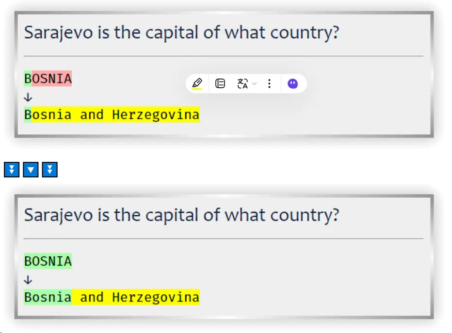

import YouTubeEmbed from '@site/src/components/YouTubeEmbed';

<!--truncate-->

## 📝 Nguồn: [Tiếng Trung Mỹ Huyền](https://www.facebook.com/groups/ankivocabulary/posts/1880421432717505/)
Template sưu tầm từ anh Trần Minh.

---

## 📚 Nội dung

Bạn nào giống mình cũng thấy phiền khi nhập đáp án, nếu không gõ đúng từng ký tự như in hoa, dấu chấm, dấu phẩy... thì hệ thống sẽ không nhận, bị báo đỏ tùm lum, nhìn rất rối mắt 😓  
Trong khi đó, mình chỉ muốn nhập đúng nội dung là được tính đúng, không cần chính xác từng dấu câu hay kiểu chữ. Tóm lại là muốn nhìn cho "thích mắt" hơn thôi!

👉 **Giải pháp:** Cài addon **SmarterTypeField – Flexible matching for {`{type:}`} field** nhé!

📺 Có video hướng dẫn để hiểu rõ hơn cách dùng nha!

---

<YouTubeEmbed videoId="yOPWwMBEKIs" />

---

### 🔧 Chức năng chính

Addon này thêm ba tuỳ chọn cho trường {`{type:}`} trong Anki:

- `ignore_case`: Bỏ qua phân biệt chữ hoa/thường.
- `ignore_accents`: Bỏ qua dấu tiếng Việt.
- `ignore_punctuations`: Bỏ qua dấu câu.

Bạn có thể dùng các tùy chọn này riêng lẻ hoặc kết hợp.

---

### ❓ FAQ

**Addon hoạt động như thế nào?**  
Addon này sẽ kiểm tra đáp án bạn nhập mà không quan tâm đến việc viết hoa, dấu tiếng Việt hay dấu câu. Ví dụ: "ÀNKI!" và "Anki" có thể được xem là giống nhau tuỳ theo tuỳ chọn. Addon chèn một đoạn script vào template thẻ có dùng {`{type:}`}, không cần chỉnh sửa code nào. Tương thích với AnkiDesktop, AnkiDroid và AnkiMobile.

**Cài xong mà không chạy thì sao?**  
- Hãy khởi động lại Anki sau khi cài addon.
- Kiểm tra mục `Back Template` của thẻ xem đã có {`{type:}`} và script tag chưa.
- Nếu đã đúng mà vẫn không hoạt động, hãy mở ticket hỗ trợ hoặc nhấn "Contact Author" trên AnkiWeb.

**Gỡ addon như thế nào?**  
Vào **Addons → SmarterTypeField → Click "delete addon"**. Addon sẽ tự xóa script khỏi các thẻ của bạn.

---

## 🔗 Tải xuống

  <a class="button button--primary" href="https://ankiweb.net/shared/info/1371444066" target="_blank">
    AnkiWeb
  </a>

