<!--truncate-->

## Giới thiệu về Enhance Main Window

Plugin **Enhance Main Window** là một công cụ mạnh mẽ cho phép bạn thêm các cột dữ liệu vào cửa sổ chính của Anki. Điều này giúp bạn có cái nhìn chi tiết hơn về từng thẻ học, bao gồm:

* Ease factor (hệ số dễ dàng)
* Lapses (số lần quên)
* Number of reviews (số lần ôn tập)
* Card type (loại thẻ)
* Deck name (tên bộ thẻ)
* Tags (nhãn)

## Nguồn gốc

Bộ template của plugin này được phát triển dựa trên mã nguồn từ [Reddit](https://www.reddit.com/r/Anki/comments/ffegh2/some_themes_for_enhance_main_window/).

Ngoài ra, Shige cũng đã phát triển một phiên bản nâng cấp với nhiều tính năng hơn: [📊Enhance main window - add many columns to home decks (Customized by Shigeඞ)](https://ankiweb.net/shared/info/911023479)

## Hướng dẫn cài đặt

1. Mở Anki
2. Vào Tools -> Addons
3. Tìm Enhance Main Windows
4. Nhấn vào Config
5. Sao chép và dán mã cấu hình
6. Nhấn Save
7. Khởi động lại Anki

## Cài đặt nhanh

- **Tải plugin trên AnkiWeb:** [Enhance Main Window (877182321)](https://ankiweb.net/shared/info/877182321)
- **Add-on code:** `877182321`

## So sánh trước và sau khi cài đặt

### Giao diện mặc định

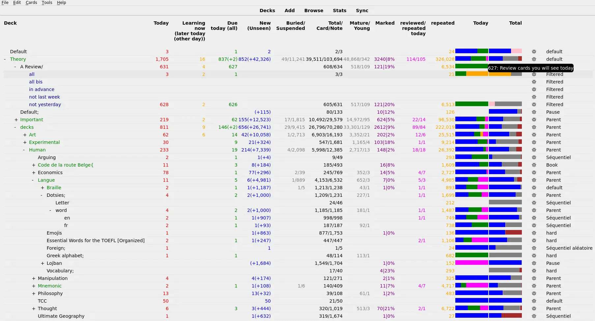

### Các theme có sẵn

#### Phiên bản Simplified

##### ICE Theme
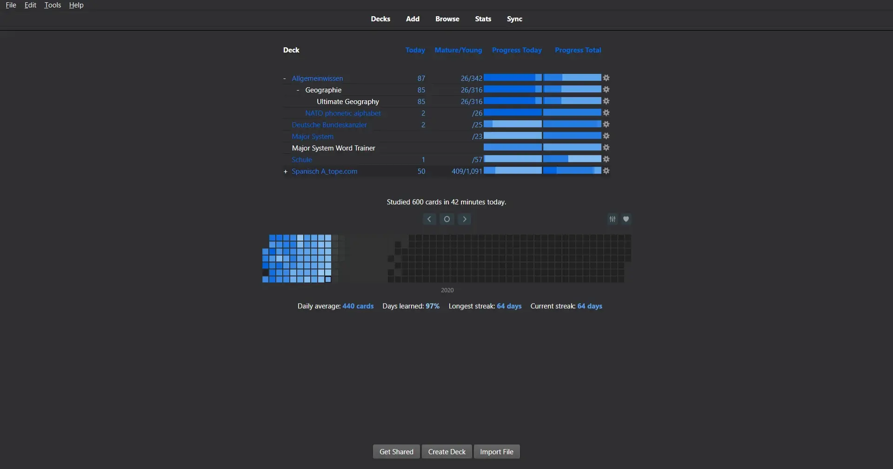

* [Tải mã nguồn](https://raw.githubusercontent.com/b3nj5m1n/enhancemainwindowthemes/master/frozen_simplified.json)
* [Tải bản sao lưu](https://drive.google.com/open?id=1vP4dG8irFIlO4AHzBrYWnA_jd38ygj8X&usp=drive_fs)

##### Flames Theme
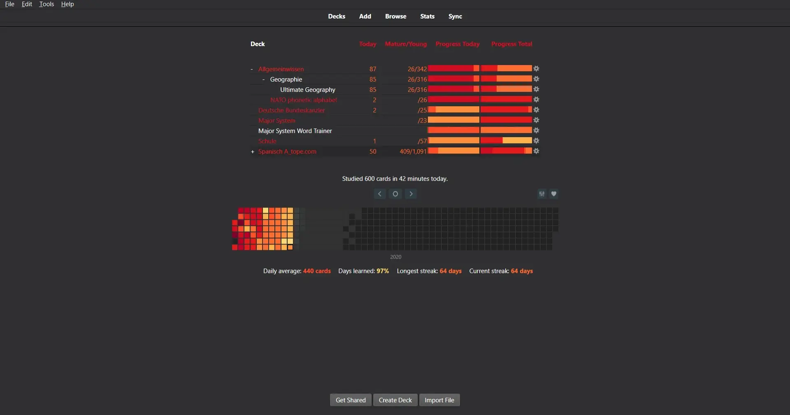

* [Tải mã nguồn](https://raw.githubusercontent.com/b3nj5m1n/enhancemainwindowthemes/master/fire_simplified.json)
* [Tải bản sao lưu](https://drive.google.com/open?id=1jy6vRxhY_UC0WTAZKk82X6irEcbHnfBr&usp=drive_fs)

##### Lime Theme
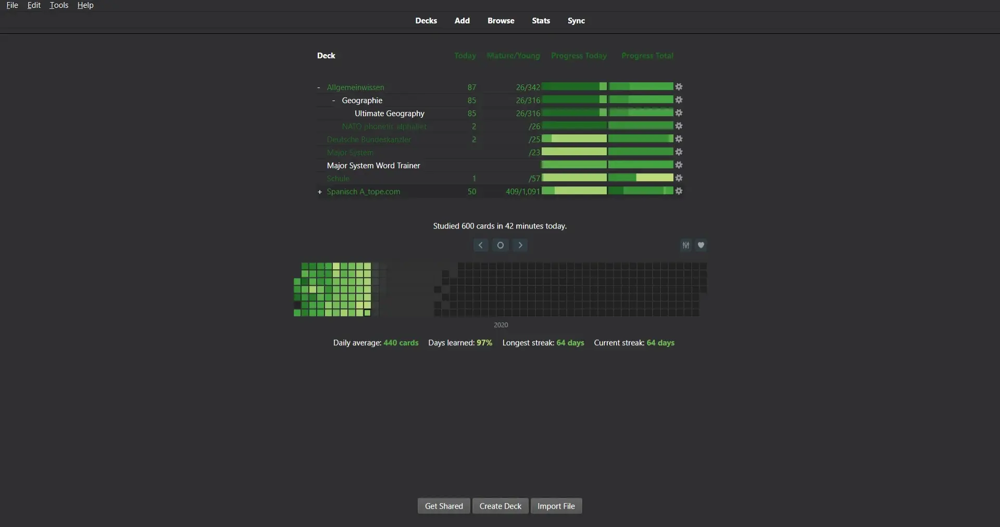

* [Tải mã nguồn](https://raw.githubusercontent.com/b3nj5m1n/enhancemainwindowthemes/master/lime_simplified.json)
* [Tải bản sao lưu](https://drive.google.com/open?id=1aMuxuIZpStcgcWEj55Vw1qDfCYHHz9xQ&usp=drive_fs)

##### Magenta Theme
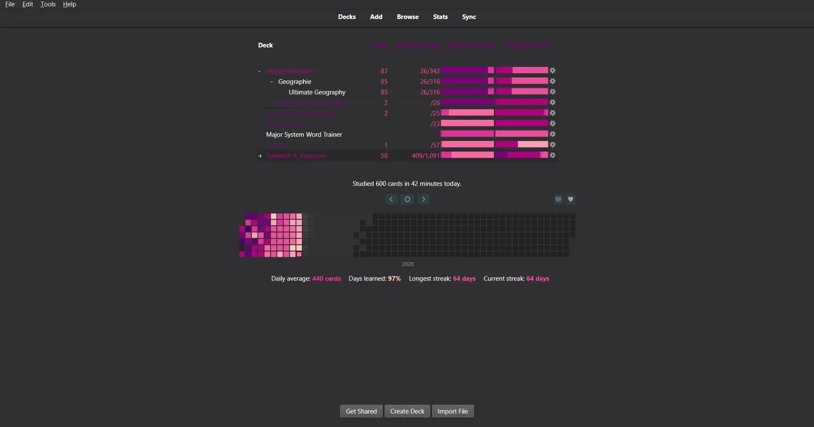

* [Tải mã nguồn](https://raw.githubusercontent.com/b3nj5m1n/enhancemainwindowthemes/master/magenta_simplified.json)
* [Tải bản sao lưu](https://drive.google.com/open?id=1QX6wy8s1pxoJC576kfSj6NY7CW7OKrUg&usp=drive_fs)

##### Pink Theme
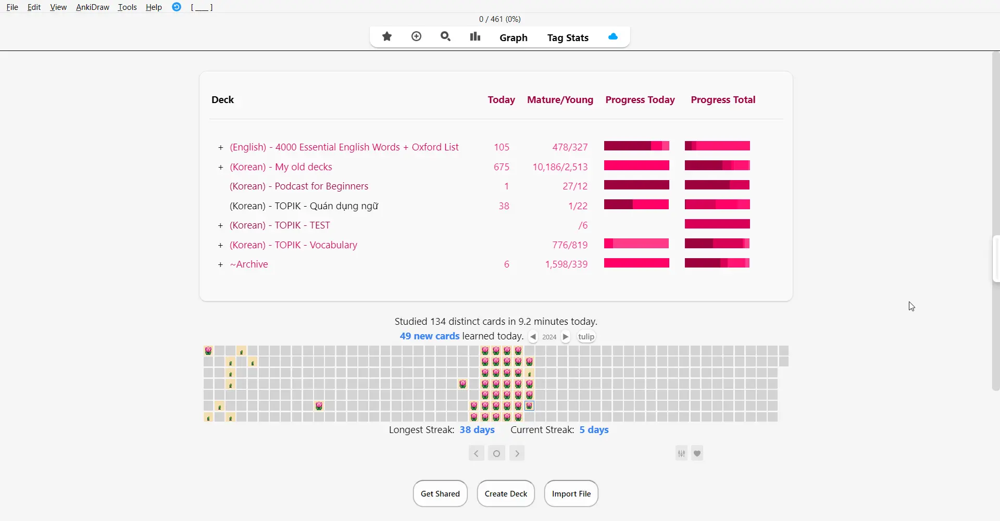

* [Tải mã nguồn](https://raw.githubusercontent.com/b3nj5m1n/enhancemainwindowthemes/master/pinky_simplified.json)
* [Tải bản sao lưu](https://drive.google.com/open?id=1JFPdp_eozFAfCtpy8XkW_uqrmFLgMXK8&usp=drive_fs)

#### Phiên bản Extended

##### ICE Theme Extended
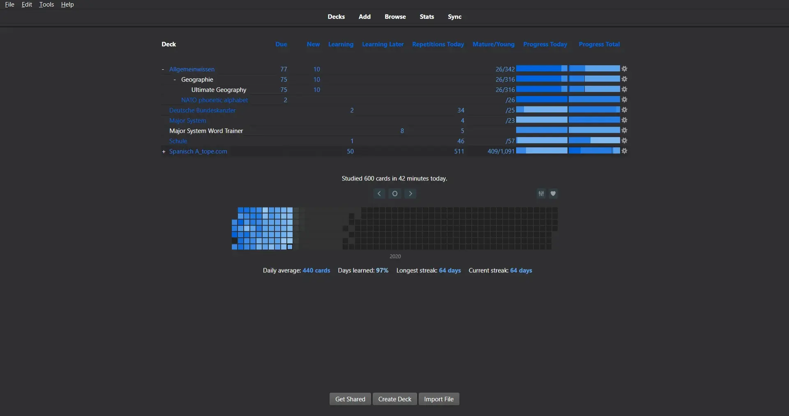

* [Tải mã nguồn](https://raw.githubusercontent.com/b3nj5m1n/enhancemainwindowthemes/master/frozen_extended.json)
* [Tải bản sao lưu](https://drive.google.com/open?id=1sU0fJzXHTxuHQTr_YXSXY5hgG_VVSgKj&usp=drive_fs)

##### Flames Theme Extended
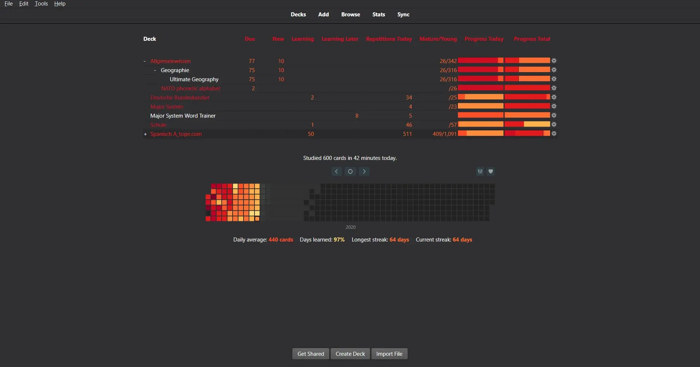

* [Tải mã nguồn](https://raw.githubusercontent.com/b3nj5m1n/enhancemainwindowthemes/master/fire_extended.json)
* [Tải bản sao lưu](https://drive.google.com/open?id=1yBLKpATSnCPSltgx0fVIPVEPKDKGyuP6&usp=drive_fs)

##### Lime Theme Extended
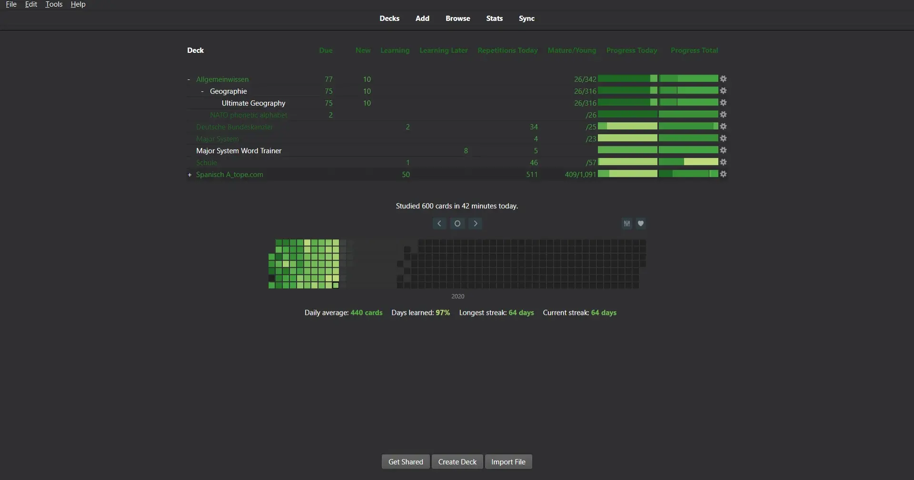

* [Tải mã nguồn](https://raw.githubusercontent.com/b3nj5m1n/enhancemainwindowthemes/master/lime_extended.json)
* [Tải bản sao lưu](https://drive.google.com/open?id=1Jx-NKogp_wQsnRfEtbvgT8hzBpZ9KDHc&usp=drive_fs)

##### Magenta Theme Extended
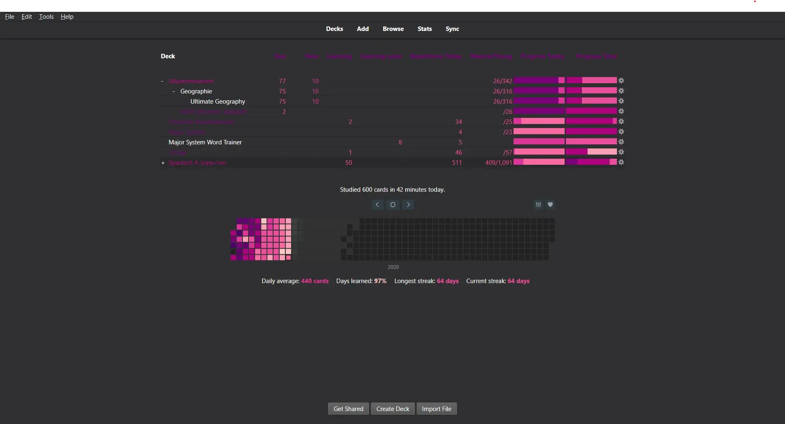

* [Tải mã nguồn](https://raw.githubusercontent.com/b3nj5m1n/enhancemainwindowthemes/master/magenta_extended.json)
* [Tải bản sao lưu](https://drive.google.com/open?id=18pmu_5yxXcvNtFyKenHknOhowzNnAI99&usp=drive_fs)

##### Pink Theme Extended
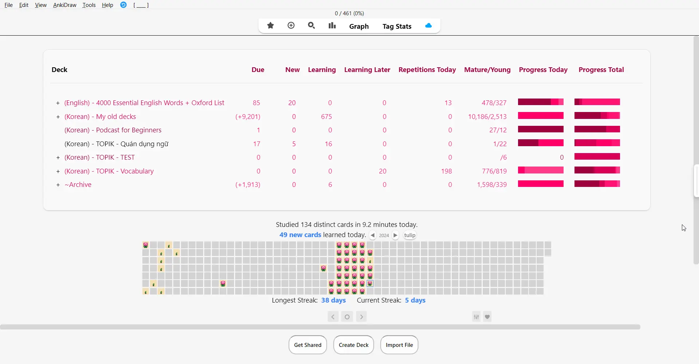

* [Tải mã nguồn](https://raw.githubusercontent.com/b3nj5m1n/enhancemainwindowthemes/master/pinky_extended.json)
* [Tải bản sao lưu](https://drive.google.com/open?id=1LXSO5VA1gB6LS3Lsy0g8wouDbULJ2Zbu&usp=drive_fs)