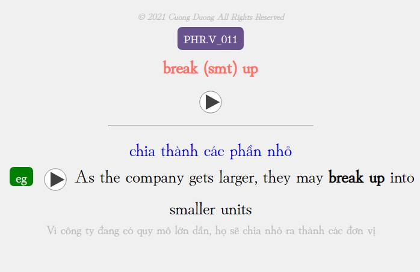
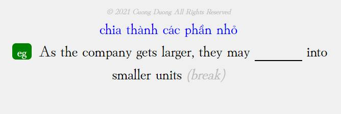

<!--truncate-->

## Nguồn: [Góc Tối](https://www.facebook.com/groups/ankivocabulary/posts/1141303989962590/)

## Nội dung

Bộ deck này gồm 100 phrasal verbs thông dụng trong tiếng Anh thương mại, được chia thành 2 phần:

- Phần 1: Nhìn cụm động từ và đoán nghĩa
- Phần 2: Điền vào chỗ trống giới từ phù hợp

Xin cảm ơn admin Lê Hoàng Phúc đã nhiệt tình hỗ trợ thu âm audio cho các câu ví dụ.

Mong rằng bộ deck này sẽ giúp các bạn học phrasal verbs một cách hiệu quả. Mọi góp ý đều được hoan nghênh để cải thiện chất lượng các bộ deck tiếp theo.

## Preview

## Tải xuống

### Ankiweb (tác giả)

  <a href="https://ankiweb.net/shared/info/1383764229">
    <button class="buttonPrimary" type="button">Tải từ Ankiweb</button>
  </a>

### Google Drive (ankivn)

  <a href="https://drive.google.com/file/d/1Bij8rAiNCBEXxug2Lt8gJEpaEb4v4K5B/view?usp=sharing">
    <button class="buttonPrimary" type="button">Tải từ Google Drive</button>
  </a>

