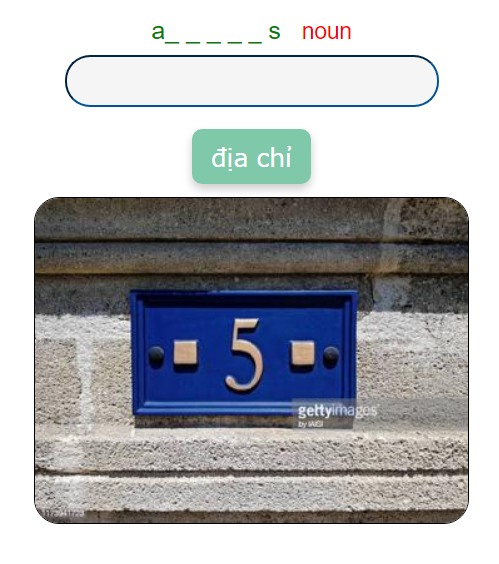

## Oxford 3000 là gì?

Oxford 3000 là danh sách 3.000 từ cốt lõi mà mọi người học tiếng Anh cần biết.

Các từ đã được chọn dựa trên tần suất của chúng trong Oxford English Corpus và sự liên quan đến người học tiếng Anh. Mỗi từ được liên kết với CEFR, hướng dẫn người học về những từ họ nên biết ở cấp độ A1-B2.

<!--truncate-->

## Oxford 5000 là gì?

Oxford 5000 là một danh sách từ cốt lõi mở rộng cho những người học tiếng Anh nâng cao.

Cũng như danh sách từ cốt lõi Oxford 3000, nó bao gồm thêm 2.000 từ phù hợp với CEFR, hướng dẫn người học nâng cao ở cấp độ B2-C1 về các từ cấp cao hữu ích nhất để học cách mở rộng vốn từ vựng của họ.

Vậy nên bộ 5000 sẽ bao gồm luôn 3000 và thêm 2000 từ cấp độ B2+ đến C1 tương đương IELTS 7.5 nhé.

---

Được biên soạn và chỉnh sửa bởi anh Huy.
Vì đây là CEFR A1 nên chỉ có 1000 từ.
Phần tiếp theo CEFR A2 đang được biên soạn.

## Phù hợp với những ai:

- Mất gốc
- Củng cố lại vốn từ căn bản  
- Không biết nên học gì
- Dịch dùng ở nhà không biết làm gì :))))

## Preview

#### Light Mode

#### Dark Mode

## Thông tin chi tiết:

- Dung lượng: 53MB
- Hỗ trợ Dark Mode
- Giao diện đẹp
- Âm thanh chuẩn Oxford
- Ví dụ minh họa dễ hiểu
- Có hình ảnh

## Tải xuống

### Google Drive (ankivn)

  <a href="https://drive.google.com/file/d/19jLE3INa__at-x6JacMJBEmEbWuwxrE3/view?usp=sharing">
    <button class="buttonPrimary" type="button">Tải từ Google Drive</button>
  </a>

## Góp ý

:::info
Nếu có bất cứ vấn đề gì hay góp ý để phát triển bộ Oxford 3000 Words vui lòng liên hệ anh Martino De Porres

Chủ biên soạn bộ Oxford 3000 Words CEFR A1.

Full name: Trần Thiên Huy

Email: lthvltk@gmail.com

Facebook: [Lê Hoàng Phúc](https://www.facebook.com/tranthien.huy.5)
