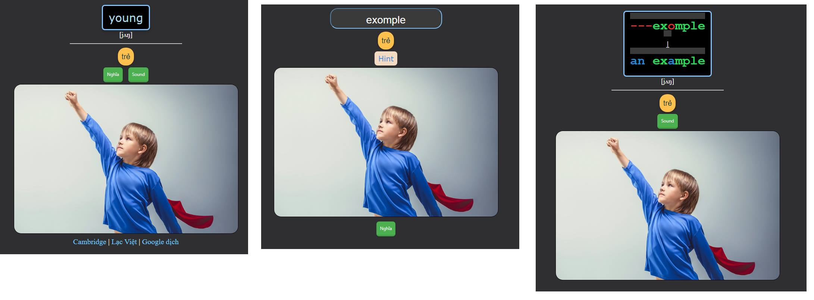

<!--truncate-->

## Nguồn

- 625 từ vựng theo Fluent Forever
- Soạn Anki bởi [Phúc Lee](/phuc-lee)

## Nội dung

Bộ thẻ anki bao gồm **625 từ vựng tiếng Anh cơ bản** được làm theo sườn của **Fluent Forever**.
Phù hợp cho người mới bắt đầu.
Thích hợp để bắt đầu học tiếng Anh.

## Preview

#### Light mode

#### Night mode

## 📗 Tải xuống

### [⬇ Link Ankiweb](https://ankiweb.net/shared/info/1768936970)

### [⬇ Google Drive (ankivn up)](https://drive.google.com/file/d/19_jk0eq3J2b9qUaRV4c-KFexnO_jyzHB/view?usp=sharing)
