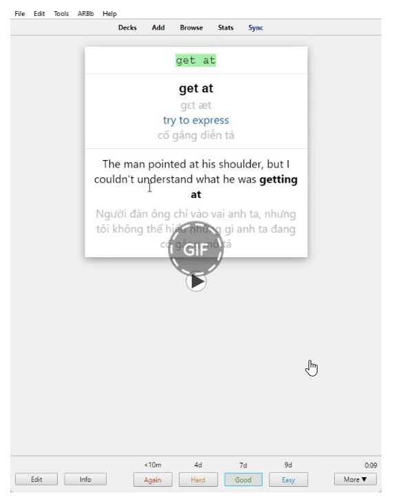

---
title: Destination B1 & B2 (with Phrasal Verb and Vietnamese)
slug: destination-b1-and-b2-with-phrasal-verb-and-vietnamese
date: 2022-08-01
description: ""
category: Tiếng Anh
domain: ankivn.com
keywords:
  - ankivn
tags:
  - deck
  - english
---

<!--truncate-->

## 📚 Nguồn: [Góc Tối](https://www.facebook.com/groups/ankivocabulary/posts/1184858722273783/)

---

## 📝 Nội dung

- **Từ vựng**
- **Phrasal verb**

Bộ từ vựng và phrasal verb được sắp xếp theo từng bài học trong sách *"Destination B1&2"*, giúp bạn dễ dàng ôn tập sau mỗi bài học.
Các từ có nhiều nghĩa được liên kết với nhau để tối ưu hiệu quả học tập.
Mỗi thẻ còn có **hint ẩn** giúp bạn dễ dàng gợi nhớ từ vựng.

**Template** được thiết kế đơn giản, đầy đủ thông tin rõ ràng, giúp bạn nâng cao hiệu suất học tập.

---

### 📖 Cách học:
1. **Nhìn nghĩa** *(tiếng Việt, định nghĩa tiếng Anh)* và đoán từ vựng.
2. **Nghe từ vựng**, viết lại đúng chính tả và đoán nghĩa.

*Cảm ơn admin [Lê Hoàng Phúc](https://www.facebook.com/tui.la.phuc747/)* đã hỗ trợ lấy **audio** từ *AwesomeTTS*, giúp bộ thẻ hoàn chỉnh hơn.

---

### ⌨️ Tính năng:
- **Ctrl + H:** Hiện Gợi ý *(Hint)*

---

### 💬 P/s:
1. Bộ thẻ này không lấy dữ liệu từ file Excel mà một bạn khác đã chia sẻ. Mong bạn không hiểu nhầm.
2. Bộ **C1&2** đã hoàn thành phần dữ liệu, nhưng chưa được chia sẻ do chưa qua thẩm định lỗi chính tả và dịch nghĩa.
3. Nếu bạn có góp ý, vui lòng chia sẻ để bộ **C1&2** được cải thiện tốt hơn.
4. Hãy vào **rate** giúp mình trên **AnkiWeb** để deck được lên top nhé!

---

### ⚠️ Lưu ý QUAN TRỌNG:
Nếu bạn thấy bộ thẻ này hữu ích và muốn ủng hộ người tạo ra nó, bạn có thể **donate** qua thông tin sau:
