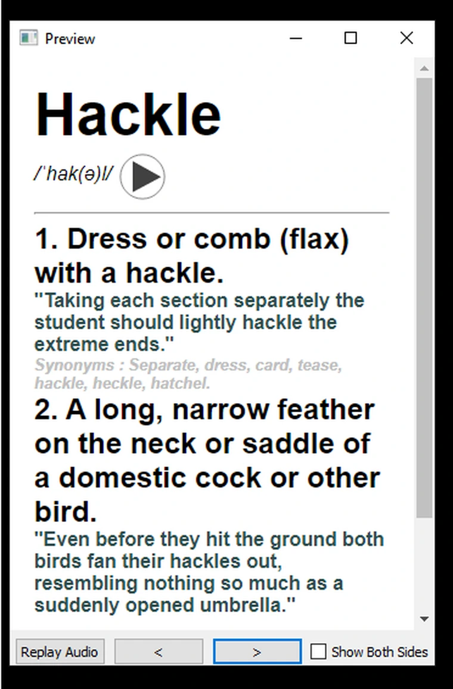

---
title: "Lifelong Learning - Advanced English Vocabulary"
slug: "lifelong-learning-advanced-english-vocabulary"
date: "2023-02-27"
description: "Bộ thẻ Anki Lifelong Learning - Advanced English Vocabulary với hơn 8.092 từ vựng nâng cao, bao gồm định nghĩa, phát âm và ví dụ minh họa."
category: Tiếng Anh
domain: ankivn.com
keywords:
  - ankivn
  - lifelong learning
  - advanced english
  - vocabulary
tags:
  - deck
  - english
---

<!--truncate-->

## 📖 **Nguồn**  
**Tác giả:** [AnkiWeb](https://ankiweb.net/shared/info/1748072575)  

---

## 📝 **Nội dung bộ thẻ**  

- **8.092 từ vựng nâng cao**, bao gồm:  
  - **6.706 từ** từ danh sách GRE và SAT.  
  - **1.373 từ** bổ sung từ quá trình đọc sách và tài liệu.  
- Định nghĩa từ điển Google cho mỗi từ.  
- Âm thanh Google WaveNet cho mỗi từ.  
- Câu ví dụ minh họa cho phần lớn các từ.  
- Từ đồng nghĩa cho phần lớn các từ.  
- Phát âm sử dụng chuẩn **Anh-Anh (British Pronunciation)**.  

---

## 📑 **Định dạng học từ vựng**  

1. **Từ → Định nghĩa:** Học qua định nghĩa từ.  
2. **Từ + Câu ví dụ → Định nghĩa:** Học từ qua câu ví dụ và định nghĩa.  
3. **Từ vựng SAT & GRE:** Có thẻ riêng cho những ai muốn học từ vựng SAT & GRE.  

---

## ⚛️ **Hướng dẫn sử dụng bộ thẻ**  

1. **Tải xuống bộ thẻ** từ liên kết bên dưới.  
2. Mở phần mềm **Anki** và chọn **File → Import** để tải bộ thẻ.  
3. Chọn chế độ học phù hợp: Ôn tập, gõ từ, hoặc học qua câu ví dụ.  

---

## 📗 **Tải xuống**

  <a href="https://ankiweb.net/shared/info/1748072575" target="_blank">
    <button class="buttonPrimary" type="button">🤖 Tải từ AnkiWeb</button>
  </a>
  <a href="https://drive.google.com/file/d/11eBVVT0Uyspl_gbYP6s9I61KK4J61-Jd/view?usp=drive_link" target="_blank">
    <button class="buttonPrimary" type="button">📝 Tải từ Google Drive</button>
  </a>

---

## 💖 **Ủng hộ tác giả**

  <a href="https://ko-fi.com/ankideckauthor" target="_blank">
    <button class="buttonPrimary" type="button" style={{ backgroundColor: '#FF5E5B', color: '#fff', fontWeight: 'bold', padding: '10px 20px', borderRadius: '8px', cursor: 'pointer' }}>
      ☕ Ủng hộ tác giả qua Ko-fi
    </button>
  </a>

---

## 💬 **Cập nhật gần đây:**  

- **07/01/2024:** Cập nhật mới nhất với các từ và sửa lỗi.  
- **03/12/2022:** Thêm 26 từ mới, sửa lỗi định nghĩa.  
- **27/08/2022:** Thêm 9 từ mới, sửa lỗi nhỏ.  

---

> **📌 Lưu ý:** Bộ thẻ có thể được cập nhật định kỳ. Hãy kiểm tra trang tải xuống thường xuyên để nhận phiên bản mới nhất.

---
