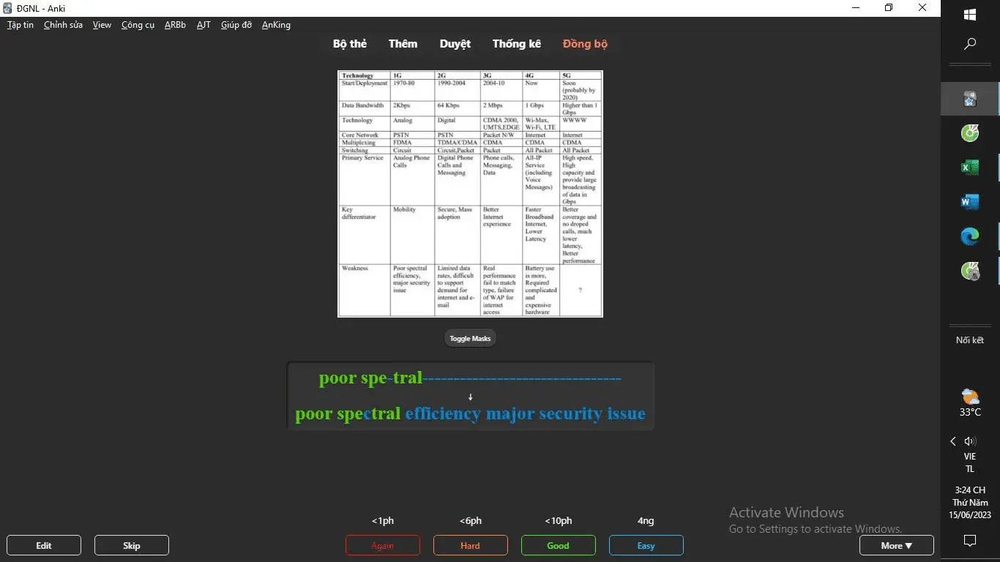

<!--truncate-->

## 📌 **Nguồn** [Hoàng Xuân](https://www.facebook.com/groups/ankivocabulary/posts/1424011565025163/?__cft__[0]=AZX5VpxeDOQxBxR1bGAfdh9UvGRa3JIT80yxjSXncTIlpva6XO0_JpaO1lFKe-SLz0sehWmOe-Pl69xwtdK6qtkiXB7EtbJRDQY78K9wduVtJmaSIqBYMqsQw9ogOxMHh3sUi2A-jcizKE_F7JGyfedd&__tn__=%2CO%2CP-R)

## Nội dung

Chào các bạn! Hôm nay mình chia sẻ bộ flashcard **"Tiếng Anh Chuyên Ngành Công Nghệ Thông Tin"**. Đây là bộ thẻ được sưu tầm và chỉnh sửa để phù hợp với nhu cầu học tập và sử dụng trong môi trường làm việc công nghệ.

### 📚 **Giới thiệu**

Bộ flashcard này cung cấp từ vựng và cấu trúc câu chuyên sâu trong lĩnh vực **Công Nghệ Thông Tin (CNTT)**. Đặc biệt, bộ này có sự kết hợp giữa:
- **Cloze (điền khuyết)**  
- **Type (gõ đáp án)**  
- **Image (hình ảnh minh họa)**  

Bên cạnh đó, addon **"Image Occlusion Enhance"** được tích hợp nhưng phần text type được để trống. Bạn có thể tùy chỉnh thêm nếu muốn.

---

---

## 📝 **Cấu Trúc Bộ Thẻ**

- **Từ vựng chuyên ngành:** Bao gồm các thuật ngữ CNTT thông dụng.  
- **Cấu trúc câu:** Các cụm từ và mẫu câu sử dụng trong giao tiếp CNTT.  
- **Ví dụ thực tế:** Mỗi thẻ kèm theo ví dụ rõ ràng và dễ hiểu.  
- **Phát âm chuẩn:** Sử dụng Text-to-Speech (TTS) giọng Anh-Mỹ.  
- **Hình ảnh minh họa:** Tăng khả năng ghi nhớ nhanh chóng.

---

## 🎯 **Lợi Ích Của Bộ Thẻ**

- Học nhanh và ghi nhớ từ vựng chuyên ngành CNTT.  
- Dễ dàng áp dụng vào công việc và học tập.  
- Hỗ trợ ôn luyện từ vựng thông qua hình ảnh và âm thanh.  
- Phù hợp cho cả người mới bắt đầu và người học nâng cao.

---

## 📗 **Tải xuống**

 
  <a href="https://drive.google.com/drive/folders/11wBI6v7WzfsTFNdAS1pvFd_BWB_T_pQh?usp=sharing" target="_blank"> 
    <button class="buttonPrimary" type="button">Google Drive</button> 
  </a> 

---

**Chúc các bạn học tập hiệu quả và thành công!** 📚✨
