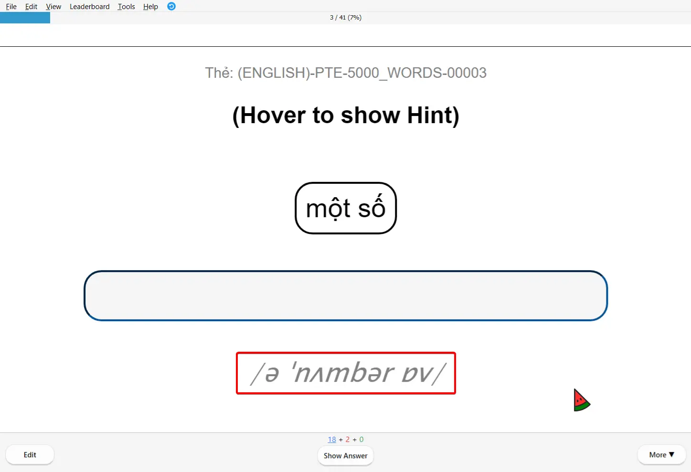

<!--truncate-->

## Nguồn: [TED-ED](https://www.ted.com/talks)

## Nội dung

### 📌 Bộ thẻ bao gồm:

✓ **1,838 từ vựng** - Tổng hợp từ vựng quan trọng từ các video TED-ED về lịch sử, thần thoại và văn học.  
✓ **3 phương pháp học** - Dictate, Voca và Supporting giúp bạn học từ vựng một cách toàn diện.  

import YouTubeEmbed from '@site/src/components/YouTubeEmbed';

<YouTubeEmbed videoId="Y8wAA358C-s" />

### 🖸 Hình ảnh bộ thẻ

## Lưu ý khi thêm thẻ

## Tải xuống

💡 **Bản 1 trong video trên là bản tải xuống chính thức.**  
🧩 **Bản 2 có âm thanh phát áo mặt trước** - Phù hợp cho những ai muốn học dễ dàng hơn bằng cách nghe trước rồi nhập đáp án. 

### 1,838 từ vựng TED-ED

 
  <a href="https://drive.google.com/file/d/11kcXbHcVzaABRrn6f_K5fFaqEn1nUFDC/view?usp=sharing"> 
    <button class="buttonPrimary" type="button">Google Drive (bản DOWNLOAD)</button> 
  </a> 

 <a href="https://drive.google.com/file/d/11kMGywWeP6Wljep4bLNfCYbI8EUT5ekx/view?usp=sharing"> <button class="buttonPrimary" type="button">Google Drive (bản 2)</button> </a> 

### Supporting Deck

 
  <a href="https://drive.google.com/file/d/11mNwT-CfgxyyN6eq5VXQ9_sVNneTM5wP/view?usp=sharing"> 
    <button class="buttonPrimary" type="button">Google Drive (bản DOWNLOAD)</button> 
  </a> 

 <a href="https://drive.google.com/file/d/11lo5znwa4XiYTmEfdRK01O4klDHxulWW/view?usp=sharing"> <button class="buttonPrimary" type="button">Google Drive (bản 2)</button> </a> 

