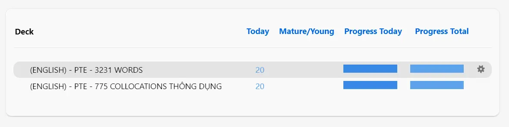
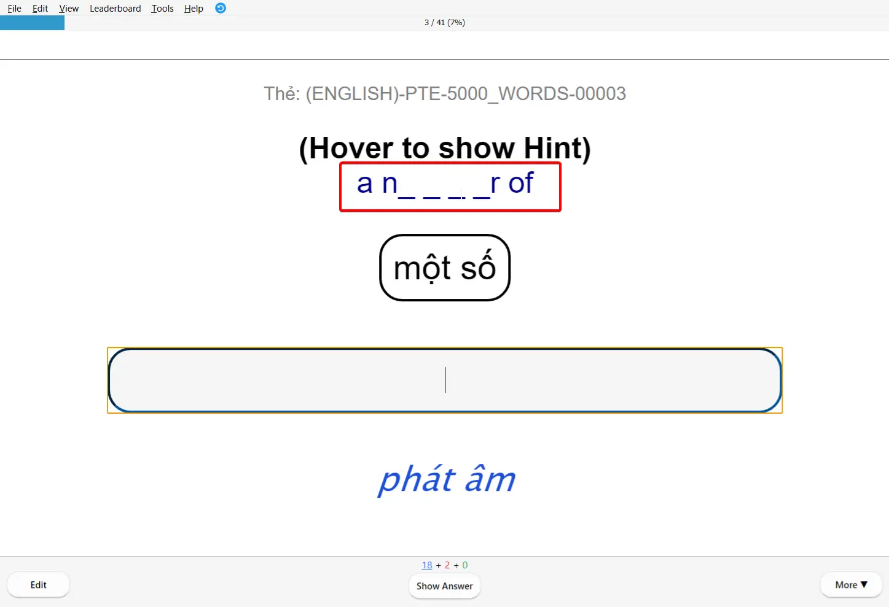
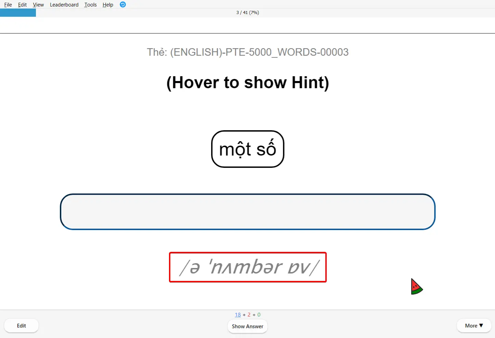
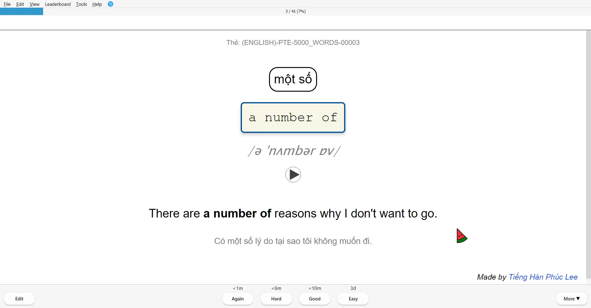

<!--truncate-->

## Nguồn: [Anki Việt Nam](https://www.facebook.com/groups/ankivocabulary)

## Nội dung

Bộ thẻ **1000 Basic English Words** cung cấp 1000 từ vựng tiếng Anh cơ bản nhất, phù hợp cho người mới bắt đầu.

### **Tính năng nổi bật:**

✅ **Từ vựng cơ bản** - 1000 từ thông dụng nhất
✅ **Hình ảnh minh họa** - Giúp ghi nhớ từ vựng dễ dàng
✅ **Âm thanh** - Phát âm chuẩn cho mỗi từ
✅ **Ví dụ** - Các câu ví dụ thực tế

## Preview

## Tải xuống

  <a href="https://drive.google.com/drive/folders/1sOqOTfqOjVKa0MIpWR_k1vXdzlGQD7Wn?usp=drive_link">
    <button class="buttonPrimary" type="button">Google Drive</button>
  </a>

