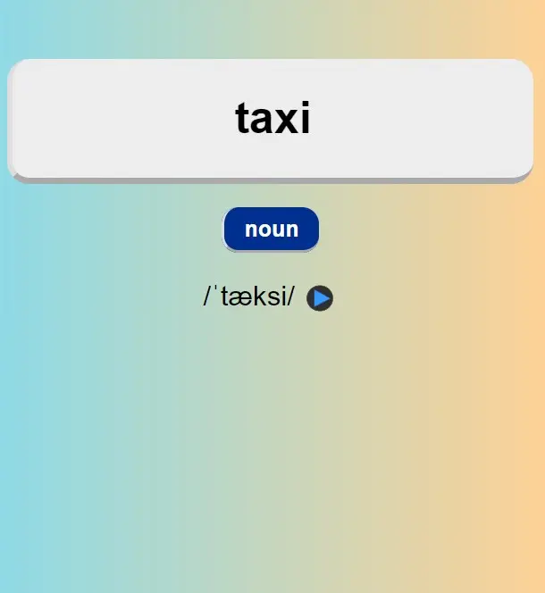
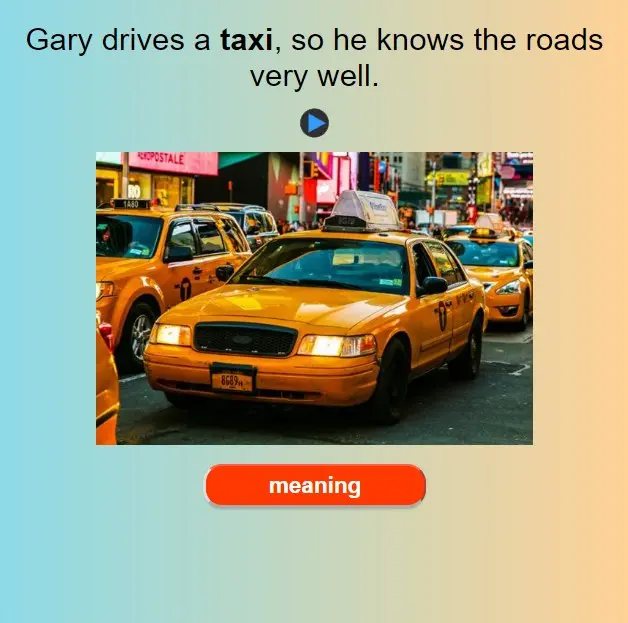
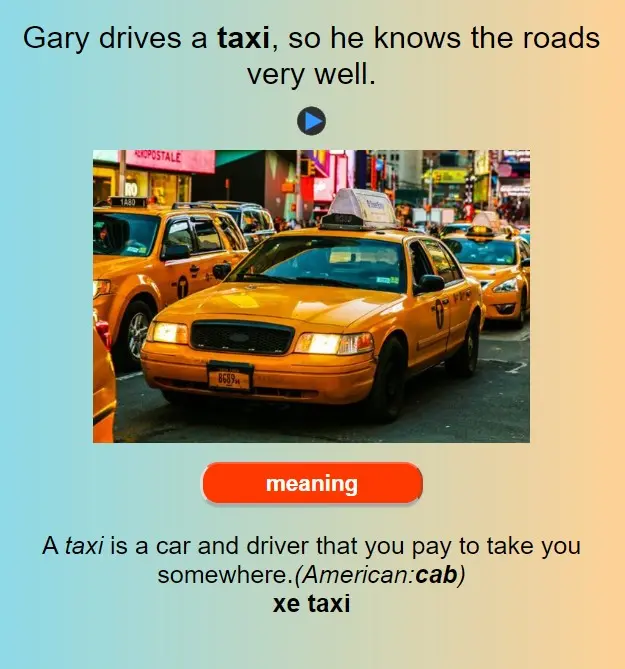

---
title: 4600 English Vocab (4000 Essential & List Oxford 3500) - Anki Việt Nam
slug: 4600-english-vocab-anki-vietnam
date: 2024-06-12
description: Public bộ thẻ ~4600 English Vocab, tổng hợp từ bộ 4000 Essential và List Oxford 3500, có đầy đủ IPA, Audio, Example và Image.
category: Tiếng Anh
tags:
  - deck
  - english
---

<!--truncate-->

## Nguồn: [Đỗ Khánh](https://www.facebook.com/groups/389845498441780/user/100001523624742/) [Nhung Nguyễn](https://www.facebook.com/groups/389845498441780/user/100008421759817/)

## Nội dung

Bộ thẻ **4600 English Vocab** giúp bạn mở rộng vốn từ vựng tiếng Anh, tổng hợp từ hai nguồn uy tín:  
- **4000 Essential English Words** - Bộ từ vựng quan trọng dành cho người học tiếng Anh.  
- **Oxford 3500** - Danh sách từ vựng cốt lõi do Oxford biên soạn.  

### 📌 Điểm nổi bật của bộ thẻ:
✓ **~4600 từ vựng chọn lọc** - Bao gồm những từ phổ biến và hữu ích nhất.  
✓ **IPA chuẩn** - Giúp phát âm chính xác ngay từ đầu.  
✓ **Audio chất lượng cao** - Luyện nghe và nói theo giọng chuẩn.  
✓ **Example thực tế** - Học từ vựng qua các ví dụ rõ ràng.  
✓ **Image trực quan** - Hình ảnh minh họa giúp nhớ từ lâu hơn.  
✓ **Tag & Subdeck theo CEFR** - Dễ dàng học theo trình độ (A1 - C2).  

📹 **Cơ chế giấu nghĩa thông minh**:  
Mặt sau của thẻ có nút **Meaning**, giúp bạn đoán nghĩa trước khi xem đáp án. Điều này rèn luyện kỹ năng suy luận và ghi nhớ từ theo ngữ cảnh, tránh học vẹt.  

Bộ thẻ được làm thủ công nên có thể còn sai sót. **Rất mong nhận được góp ý từ cộng đồng để cải thiện chất lượng!**  

## Tải xuống

 
  <a href="https://drive.google.com/file/d/1-lK9tYRbGKV1EU81NHqZqh-ofXJXmdTI/view?usp=sharing"> 
    <button class="buttonPrimary" type="button">Google Drive (ankivn)</button> 
  </a> 

