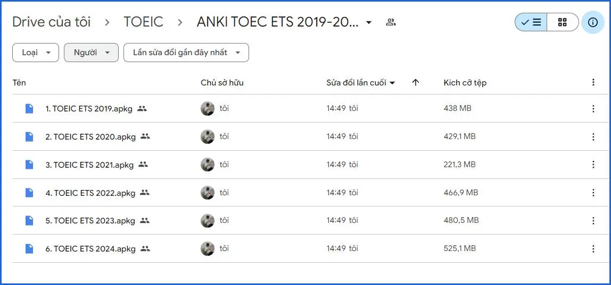

---
title: Bộ đề thi TOEIC ETS 2023
slug: bo-de-thi-toeic-ets-2023
date: 2024-07-22
description: Bộ đề thi TOEIC ETS 2023 với đầy đủ hướng dẫn, mẹo làm bài và link tải xuống.
category: Tiếng Anh
tags:
  - deck
  - english
  - toeic
---

<!--truncate-->

## Nguồn: [Phạm Văn Lượng](https://www.facebook.com/groups/ankivocabulary/posts/1663916001034717)

## Nội dung

### **📌 Các mẹo sử dụng hiệu quả:**

🔹 **Điều chỉnh tốc độ audio để phù hợp với trình độ học**  
Bạn có thể tải thêm add-on hỗ trợ tăng/giảm tốc độ audio:  
➡ [Audio Playback Controls](https://ankiweb.net/shared/info/312734862)  

🔹 **Hiển thị phần dịch nghĩa linh hoạt**  
Trong **back** của thẻ **Part 7**, bạn chỉ cần **nhấp vào câu hỏi** để hiển thị hoặc ẩn phần dịch nghĩa.  

🔹 **Bộ đề ETS đầy đủ từ 2019 đến 2024**  
Bộ thẻ đã cập nhật đầy đủ **ETS2019 - ETS2024**. Bạn có thể học thử trong **Deck ETS2023** trước khi quyết định sử dụng toàn bộ bộ đề.  

📢 **Trải nghiệm toàn bộ bộ đề với đầy đủ tính năng chuyên sâu** (**có tính phí**):  
👉 [Đăng ký tại đây](https://forms.gle/uE55mYH8nZaHkriy7)  

## Tải xuống

 
  <a href="https://drive.google.com/file/d/10U-4jaiQslxYsH0Zo64lObCLJYf2s5ws/view"> 
    <button class="buttonPrimary" type="button">Google Drive</button> 
  </a> 

