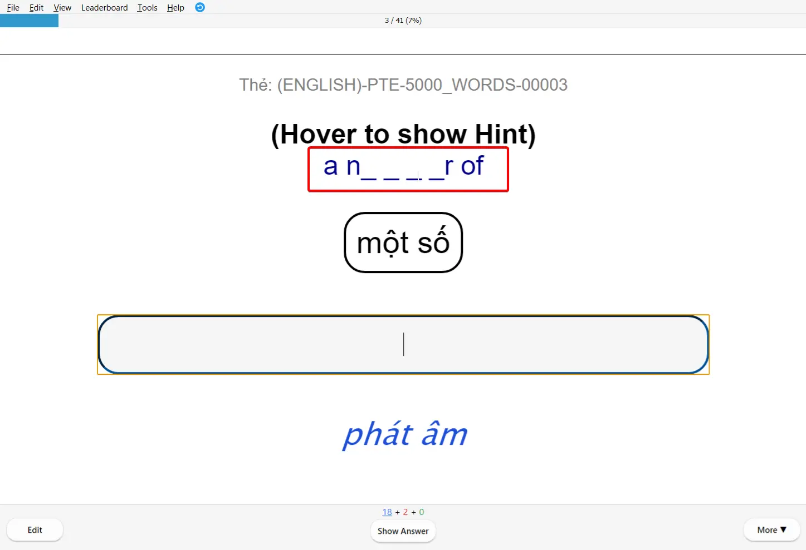

<!--truncate-->

## Nguồn: [Admin Phúc](https://www.facebook.com/groups/ankivocabulary/posts/1835202733906042/)

## Nội dung

Bộ thẻ **4000 Từ Vựng PTE** được thiết kế đặc biệt cho việc học từ vựng và collocations, giúp bạn nâng cao điểm số PTE.

### **Tính năng nổi bật:**

✅ **Collocations** - Các cụm từ thông dụng trong tiếng Anh
✅ **Ví dụ thực tế** - Minh họa cách sử dụng từ trong ngữ cảnh
✅ **Phát âm** - Audio chuẩn cho mỗi từ vựng
✅ **Hình ảnh** - Minh họa trực quan giúp ghi nhớ tốt hơn

## Preview

## Tải xuống

  <a href="https://drive.google.com/file/d/11kcXbHcVzaABRrn6f_K5fFaqEn1nUFDC/view?usp=sharing">
    <button class="buttonPrimary" type="button">3231 TỪ PTE</button>
  </a>

  <a href="https://drive.google.com/file/d/11mNwT-CfgxyyN6eq5VXQ9_sVNneTM5wP/view?usp=sharing">
    <button class="buttonPrimary" type="button">775 COLLOCATIONS THÔNG DỤNG</button>
  </a>

