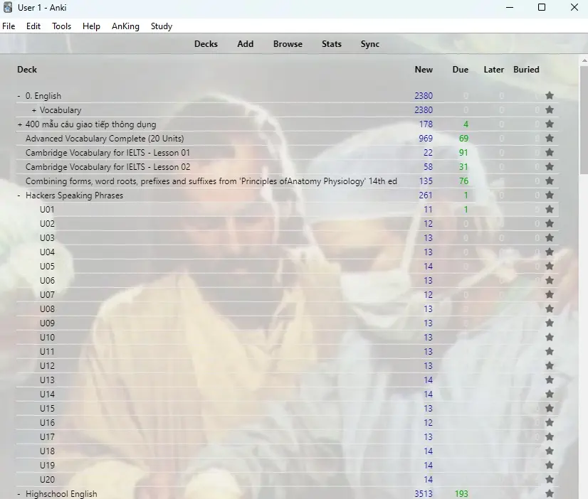
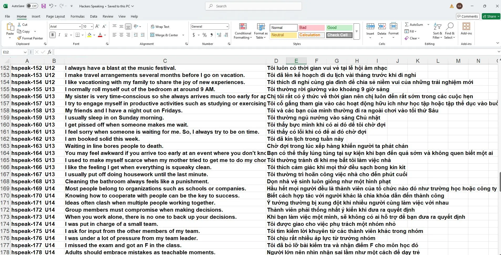

<!--truncate-->

## Nguồn: [Vivian Le](https://www.facebook.com/groups/389845498441780?multi_permalinks=1855821088510873)

---

## Nội dung

Tặng bộ Anki Speaking chuyên luyện IELTS từ bộ HACKERS IELTS.

Khả năng phản xạ và sự tự tin trong Speaking là một yếu tố giúp bạn giành ấn tượng với examiner ngay từ những câu đầu tiên. Anki là phần mềm giúp bạn boost cực kì nhanh hai kỹ năng đó. Bộ Anki này đã tích hợp các mẫu câu thông dụng (Anh - Việt) trong kì thi IELTS.

Mong sẽ có nhiều bạn hơn nữa sẽ đạt điểm cao trong kì thi này.

---

  

---

## 🔗 Tải xuống

 
  <a href="https://drive.google.com/drive/folders/1E037IMUaPBcUahMmAINjSiVMba8HPvNQ"> 
    <button class="buttonPrimary" type="button">Google Drive (tác giả)</button> 
  </a> 

