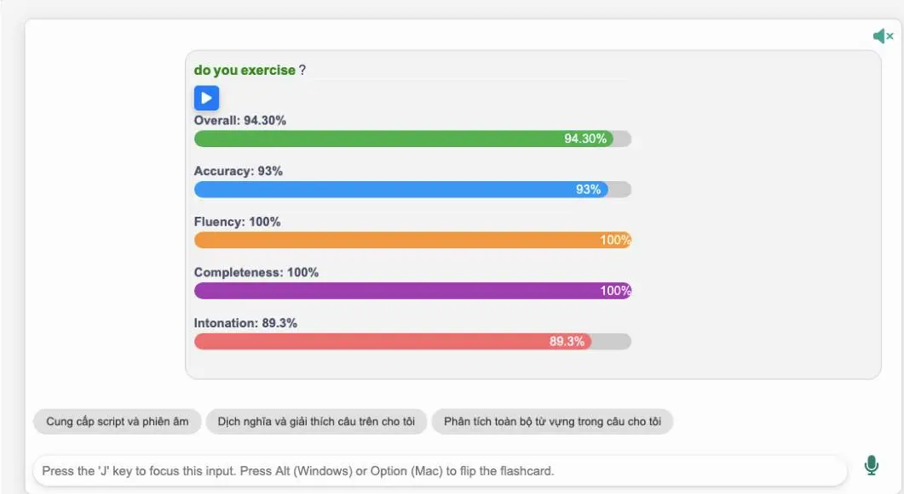
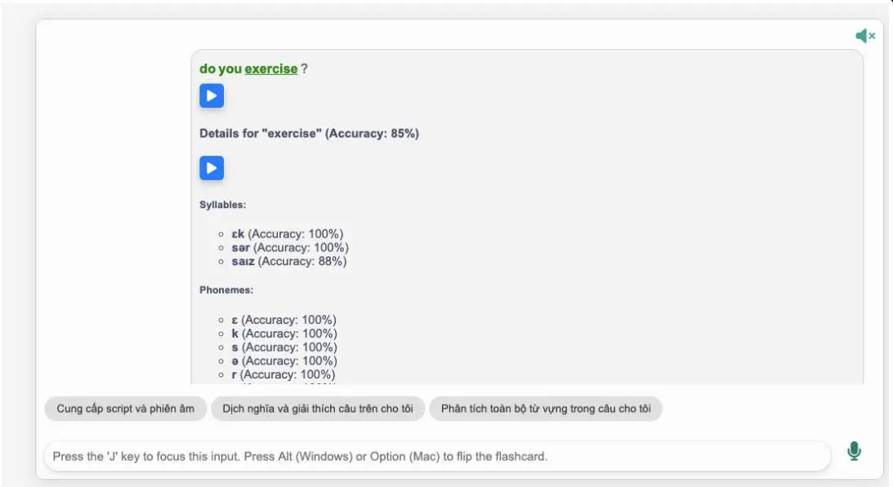
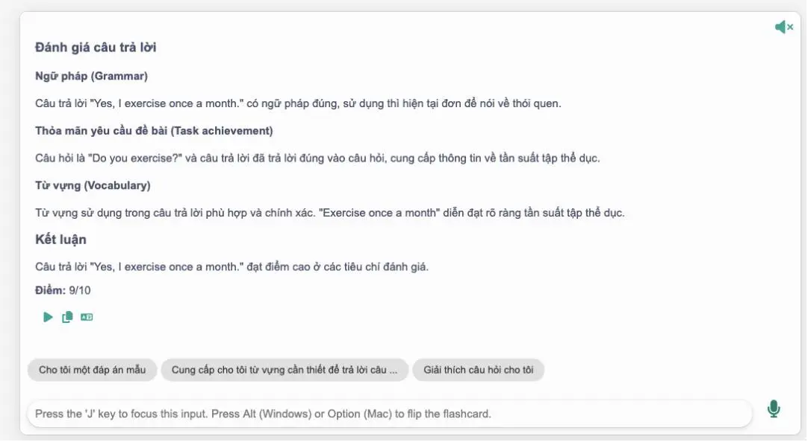

<!--truncate-->

## 📝 Nguồn: 

[Nguyễn Thiện Nghĩa](https://www.facebook.com/groups/ankivocabulary/posts/1876426923116956/)

Bộ thẻ được biên soạn dựa trên khóa học giao tiếp tiếng Anh trên Udemy — **"[The English Conversation Course | Learn to speak English](https://www.udemy.com/course/the-english-conversation-course/)!"** — khóa học với **hơn 1.000 đánh giá (4.7/5)** và **hơn 32.000 học viên đăng ký**.

---

## 📚 Nội dung

**Bộ thẻ này có gì đặc biệt?**

- Tích hợp **AI và công nghệ nhận diện giọng nói**, phân tích chính xác từng âm.
- Chuyển thể từ nội dung khóa học chất lượng, phù hợp để luyện tập thực tế hàng ngày.
- Gồm **5 cấp độ** từ A1 đến C1 với **120+ chủ đề**, hiện đã hoàn thành cấp độ **Beginner**.
- Mỗi bài học có 2 phần rõ ràng:
  - **Shadowing**: luyện nghe và lặp lại theo mẫu câu.
  - **Vận dụng**: người học thực hành với AI, được chấm điểm và phản hồi.
- Người học có thể **tra hỏi AI trực tiếp** trong mỗi flashcard như đang học với giáo viên.

> ⚠️ **Lưu ý quan trọng:**
> - Cần **cài đặt addon Langki** trước khi sử dụng:  
> 👉 Mã addon: `1400986563`  
> 👉 Hoặc tải tại: [AnkiWeb - Langki Addon](https://ankiweb.net/shared/info/1400986563)
> - Bộ thẻ hoạt động trên **desktop và AnkiWeb**, chưa hỗ trợ trên ứng dụng di động.

---

## 🔗 Tải xuống

  <a class="button button--secondary" href="https://drive.google.com/file/d/1hpSeQyuaZEk3FeAcMs92kuK7dT3s1Rgu/view" target="_blank">
    Google Drive (tác giả)
  </a>

  <a class="button button--primary" href="https://drive.google.com/open?id=1kJEN2c6XOJ9Xme8CAsiWh_jZALvuKC71&usp=drive_fs" target="_blank">
    Google Drive (ankivn)
  </a>

