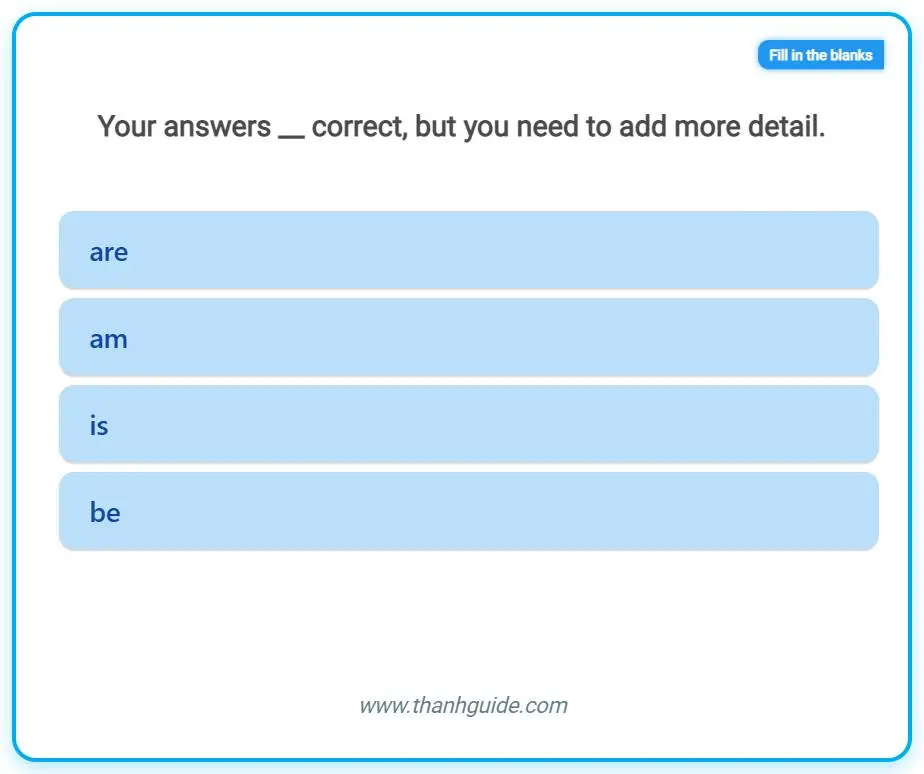
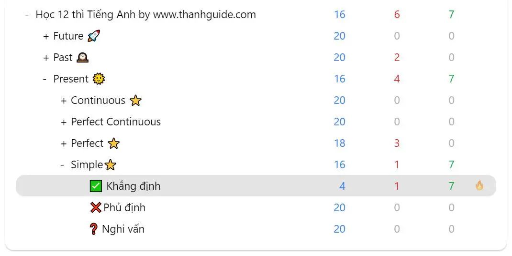
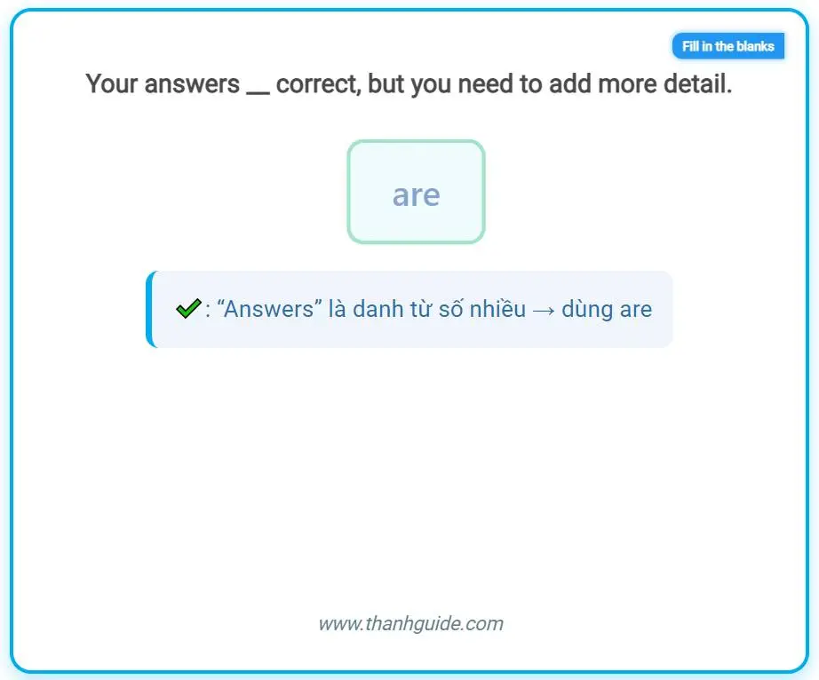
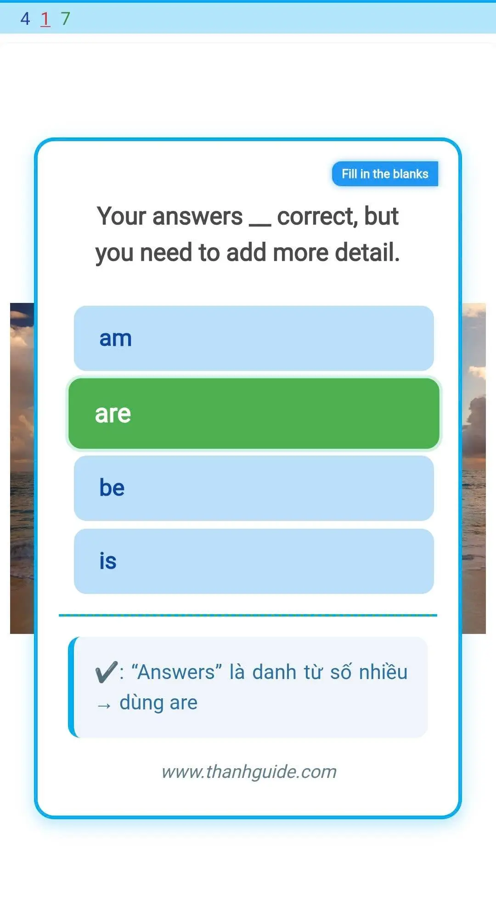
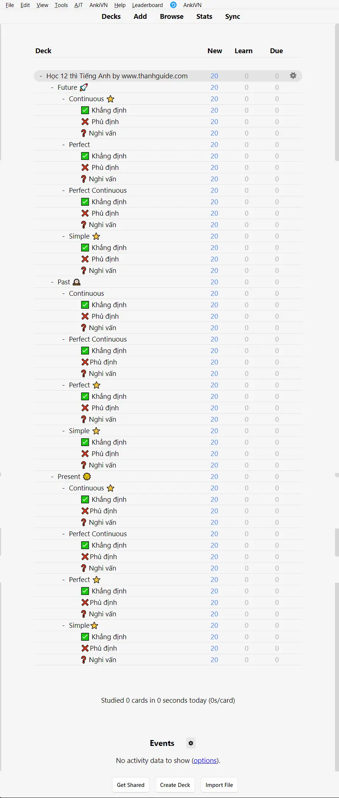

<!--truncate-->

## Nguồn: [Thanh Nguyen](https://www.facebook.com/groups/389845498441780/?)

## Nội dung

📚 **Bộ Deck Học 12 Thì Tiếng Anh (1080 thẻ)**  
- Bao gồm **12 thì tiếng Anh cơ bản**.  
- Mỗi thì có **90 câu trắc nghiệm**, kèm **giải thích chi tiết**.  
- Tổng cộng: **1080 thẻ học**.  
- Phù hợp cho:  
  - Người mới bắt đầu (Beginner).  
  - Học sinh.  
  - Người học mất gốc.  

👉 Có thể học trực tiếp trên **PC / Web / Điện thoại** với phần mềm Anki.  

💌 Nếu anh/chị thấy hữu ích có thể góp ý hoặc **donate lì xì 🧧** cho mình qua inbox: [Thanh Nguyen](https://www.facebook.com/groups/389845498441780/?)  

Xin cảm ơn và chúc mọi người học tập hiệu quả!  

## Preview

## Tải xuống

### Link tác giả

#### Anki bản mới

 <a href="https://drive.google.com/file/d/1w2265H9TNOG-uj7_pyAEEOC9sl8i-byr/view"> <button class="buttonPrimary" type="button">Google Drive (tác giả)</button> </a> 

#### Anki bản cũ hơn

 <a href="https://drive.google.com/file/d/1FdsKl5rEyCo50k8kv_dGr3xviO1zoLf1/view"> <button class="buttonPrimary" type="button">Google Drive (tác giả)</button> </a> 

### AnkiVN (reup)

 <a href="https://drive.google.com/open?id=1SR-t9mEk-UJGCB0AIfU2cVIBcnyDbG5P&usp=drive_fs"> <button class="buttonPrimary" type="button">Google Drive (anki bản mới)</button> </a> 

 <a href="https://drive.google.com/open?id=1dFvUe_dFiftI6SDTWm-FzFzHAws7vuwN&usp=drive_fs"> <button class="buttonPrimary" type="button">Google Drive (anki bản cũ)</button> </a> 
