---
### 2022-04-10-100-Really-Learn-Phrasal-Verbs-for-Business.md
---

---
title: 100 Really Learn Phrasal Verbs for Business
slug: 100-Really-Learn-Phrasal-Verbs-for-Business
date: 2022-04-10
description: Bộ thẻ Anki 100 phrasal verbs thông dụng trong tiếng Anh thương mại, giúp học từ vựng hiệu quả.
category: Tiếng Anh
domain: ankivn.com
keywords:
  - ankivn
  - phrasal verbs
  - business english
  - vocabulary
tags:
  - deck
  - english
---

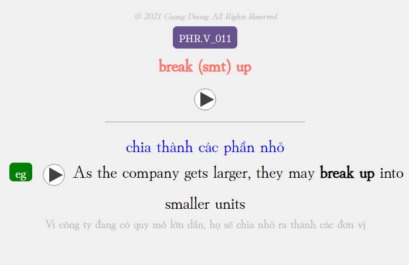

<!--truncate-->

## Nguồn: [Góc Tối](https://www.facebook.com/groups/ankivocabulary/posts/1141303989962590/)

## Nội dung

Bộ deck này gồm 100 phrasal verbs thông dụng trong tiếng Anh thương mại, được chia thành 2 phần:

- Phần 1: Nhìn cụm động từ và đoán nghĩa
- Phần 2: Điền vào chỗ trống giới từ phù hợp

Xin cảm ơn admin Lê Hoàng Phúc đã nhiệt tình hỗ trợ thu âm audio cho các câu ví dụ.

Mong rằng bộ deck này sẽ giúp các bạn học phrasal verbs một cách hiệu quả. Mọi góp ý đều được hoan nghênh để cải thiện chất lượng các bộ deck tiếp theo.

## Preview

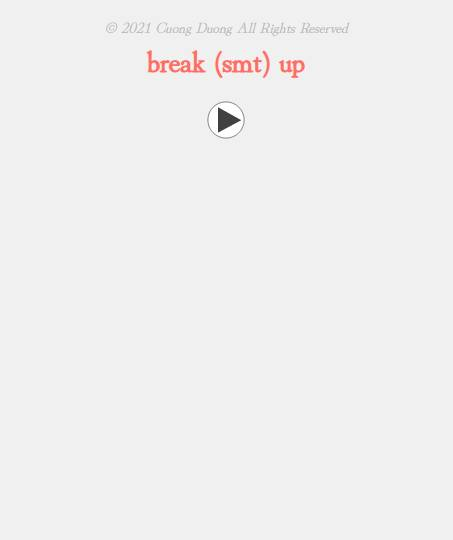

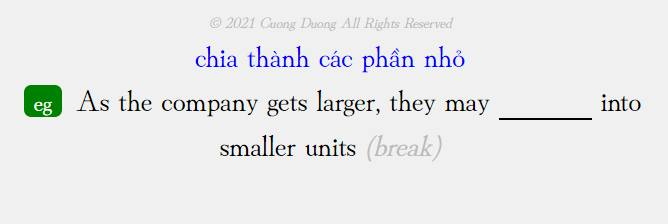

## Tải xuống

### Ankiweb (tác giả)

<div style={{display: 'flex', justifyContent: 'left', gap: '20px'}}>
  <a href="https://ankiweb.net/shared/info/1383764229">
    <button class="buttonPrimary" type="button">Tải từ Ankiweb</button>
  </a>
</div>

### Google Drive (ankivn)

<div style={{display: 'flex', justifyContent: 'left', gap: '20px'}}>
  <a href="https://drive.google.com/file/d/1Bij8rAiNCBEXxug2Lt8gJEpaEb4v4K5B/view?usp=sharing">
    <button class="buttonPrimary" type="button">Tải từ Google Drive</button>
  </a>
</div>


---
### 2022-06-22-Oxford-3000-Words-CEFR-A1.md
---

---
title: Oxford 3000 Words (CEFR A1)
slug: Oxford-3000-Words-CEFR-A1
date: 2022-06-22
description: Bộ thẻ Anki Oxford 3000 Words cấp độ CEFR A1 gồm 1000 từ vựng cơ bản, phù hợp cho người mới bắt đầu học tiếng Anh.
category: Tiếng Anh
domain: ankivn.com
keywords:
  - ankivn
  - oxford 3000
  - từ vựng
  - vocabulary
  - cefr a1
tags:
  - deck
  - english
---

## Oxford 3000 là gì?

Oxford 3000 là danh sách 3.000 từ cốt lõi mà mọi người học tiếng Anh cần biết.

Các từ đã được chọn dựa trên tần suất của chúng trong Oxford English Corpus và sự liên quan đến người học tiếng Anh. Mỗi từ được liên kết với CEFR, hướng dẫn người học về những từ họ nên biết ở cấp độ A1-B2.

<!--truncate-->

## Oxford 5000 là gì?

Oxford 5000 là một danh sách từ cốt lõi mở rộng cho những người học tiếng Anh nâng cao.

Cũng như danh sách từ cốt lõi Oxford 3000, nó bao gồm thêm 2.000 từ phù hợp với CEFR, hướng dẫn người học nâng cao ở cấp độ B2-C1 về các từ cấp cao hữu ích nhất để học cách mở rộng vốn từ vựng của họ.

Vậy nên bộ 5000 sẽ bao gồm luôn 3000 và thêm 2000 từ cấp độ B2+ đến C1 tương đương IELTS 7.5 nhé.

---

Được biên soạn và chỉnh sửa bởi anh Huy.
Vì đây là CEFR A1 nên chỉ có 1000 từ.
Phần tiếp theo CEFR A2 đang được biên soạn.

## Phù hợp với những ai:

- Mất gốc
- Củng cố lại vốn từ căn bản  
- Không biết nên học gì
- Dịch dùng ở nhà không biết làm gì :))))

## Preview

#### Light Mode


#### Dark Mode


## Thông tin chi tiết:

- Dung lượng: 53MB
- Hỗ trợ Dark Mode
- Giao diện đẹp
- Âm thanh chuẩn Oxford
- Ví dụ minh họa dễ hiểu
- Có hình ảnh

## Tải xuống

### Google Drive (ankivn)

<div style={{display: 'flex', justifyContent: 'left', gap: '20px'}}>
  <a href="https://drive.google.com/file/d/19jLE3INa__at-x6JacMJBEmEbWuwxrE3/view?usp=sharing">
    <button class="buttonPrimary" type="button">Tải từ Google Drive</button>
  </a>
</div>

## Góp ý

:::info
Nếu có bất cứ vấn đề gì hay góp ý để phát triển bộ Oxford 3000 Words vui lòng liên hệ anh Martino De Porres

Chủ biên soạn bộ Oxford 3000 Words CEFR A1.

Full name: Trần Thiên Huy

Email: lthvltk@gmail.com

Facebook: [Lê Hoàng Phúc](https://www.facebook.com/tranthien.huy.5)


---
### 2022-06-30-4000-Essential-English-Words.md
---

---
title: 4000 Essential English Words
slug: Essential-English-Words
date: 2022-06-30
description: ""
category: Tiếng Anh
domain: ankivn.com
keywords:
  - ankivn
tags:
  - deck
  - english
---

import YouTubeEmbed from '@site/src/components/YouTubeEmbed';

<YouTubeEmbed videoId="cVDvVrt5n-E" />

<!--truncate-->

## Nguồn: [AnkiWeb](https://ankiweb.net/shared/info/1125484373)

## Nội dung

Bộ thẻ này hiển thị tốt nhất trên smartphone.

Nên sử dụng bộ thẻ này cùng với sách "4000 Essential English Words 1" - Paul Nation 

Please kindly be informed that Anki and its decks can make remembering things only.
Anki and its decks are not a complete solution for mastering a foreign language.

## Làm bài tập online

[📗 Test Book 01](https://www.essentialenglish.review/4000-essential-english-words-1/)

[📗 Test Book 02](https://www.essentialenglish.review/4000-essential-english-words-2/)

[📗 Test Book 03](https://www.essentialenglish.review/4000-essential-english-words-3/)

[📗 Test Book 04](https://www.essentialenglish.review/4000-essential-english-words-4/)

[📗 Test Book 05](https://www.essentialenglish.review/4000-essential-english-words-5/)

[📗 Test Book 06](https://www.essentialenglish.review/4000-essential-english-words-6/)

## 📗 Tải xuống

### Link AnkiWeb (của tác giả)

[⬇ 4000 Essential English Words 1 - Vietnamese](https://ankiweb.net/shared/info/1125484373)

[⬇ 4000 Essential English Words 2 - Vietnamese](https://ankiweb.net/shared/info/1113932863)

[⬇ 4000 Essential English Words 3 - Vietnamese](https://ankiweb.net/shared/info/1113932863)

[⬇ 4000 Essential English Words 4 - Vietnamese](https://ankiweb.net/shared/info/887520497)

[⬇ 4000 Essential English Words 5 - Vietnamese](https://ankiweb.net/shared/info/565387055)

[⬇ 4000 Essential English Words 6 - Vietnamese](https://ankiweb.net/shared/info/441419580)

### [⬇ Google Drive (ankivn)](https://drive.google.com/drive/folders/1AJYju2x3BOC1M6DkMbmpvqn836Aw7BBp?usp=sharing)


---
### 2022-07-04-200-Common-English-Expression-English-Vietnamese.md
---

---
title: 200 Common English Expression (English - Vietnamese)
slug: 200-Common-English-Expression-English-Vietnamese
date: 2022-07-04
description: ""
category: Tiếng Anh
domain: ankivn.com
keywords:
  - ankivn
tags:
  - deck
  - english
---

import YouTubeEmbed from '@site/src/components/YouTubeEmbed';

<YouTubeEmbed videoId="9aEhaFjiWY4" />

<!--truncate-->

## Nguồn: [Góc Tối](https://www.facebook.com/groups/ankivocabulary/posts/1148220415937614/)

## Nội dung

Chia sẻ bộ thẻ 200 câu nói thường dùng trong tiếng Anh.

## 📥 Tải xuống

### [⬇ AnkiWeb (tác giả)](https://ankiweb.net/shared/info/178816235)

### [⬇ Google Drive (ankivn)](https://drive.google.com/file/d/1BQAkZ3uTlaul8vJmrqDsiRdd9zHk-DRF/view?usp=sharing)


---
### 2022-07-04-30-Chu-de-tu-vung-tieng-Anh.md
---

---
title: 30 Chủ đề từ vựng tiếng Anh
slug: Chu-de-tu-vung-tieng-Anh
date: 2022-07-04
description: "Bộ thẻ Anki 30 chủ đề từ vựng tiếng Anh thông dụng"
category: Tiếng Anh
domain: ankivn.com
keywords:
  - ankivn
tags:
  - deck
  - english
---

import YouTubeEmbed from '@site/src/components/YouTubeEmbed';

<YouTubeEmbed videoId="GpFwGoKSs3M" />

<!--truncate-->

## Nguồn

Bộ thẻ do một thành viên nữ giấu tên của group Anki Việt Nam biên soạn.

## 📥 Tải xuống

### [⬇ Google Drive (ankivn)](https://drive.google.com/file/d/1BLMf9Vbnpz8dS8d8pckAS2lJW_vm2vZ6/view?usp=sharing)


---
### 2022-07-04-LDOCE6-with-Pictures.md
---

---
title: LDOCE6 with Pictures
slug: LDOCE6-with-Pictures
date: 2022-07-04
description: ""
category: Tiếng Anh
domain: ankivn.com
keywords:
  - ankivn
tags:
  - deck
  - english
---

<!--truncate-->

## Nguồn: AnkiWeb

## Nội dung

Bộ thẻ này mọi người sẽ nhìn hình và gõ từ vựng tương ứng.

### Ưu điểm

- Âm thanh chuẩn từ điển LDOCE6
- Có hình ảnh minh họa
- Có ví dụ
- Hỗ trợ nghĩa tiếng Anh
- Hỗ trợ IPA

### Nhược điểm

- Không có nghĩa tiếng Việt

## 📗 Tải xuống

### [⬇ Google Drive (ankivn)](https://drive.google.com/drive/folders/1B8AXs1bRlMKrbyZssXXiV9iBm88I0-kF?usp=sharing)


---
### 2022-07-23-625-tu-vung-tieng-Anh-co-ban.md
---

---
title: 625 từ vựng tiếng Anh cơ bản
slug: tu-vung-tieng-anh-co-ban
date: 2022-07-23
description: "Bài viết tổng hợp 625 từ vựng tiếng Anh cơ bản."
category: Tiếng Anh
domain: ankivn.com
image: /images/Pasted-image-20241218150647.png
keywords:
  - ankivn
tags:
  - deck
  - english
---


<!--truncate-->

## Nguồn

- 625 từ vựng theo Fluent Forever
- Soạn Anki bởi [Phúc Lee](/phuc-lee)

## Nội dung

Bộ thẻ anki bao gồm **625 từ vựng tiếng Anh cơ bản** được làm theo sườn của **Fluent Forever**.
Phù hợp cho người mới bắt đầu.
Thích hợp để bắt đầu học tiếng Anh.

## Preview

#### Light mode


#### Night mode


## 📗 Tải xuống

### [⬇ Link Ankiweb](https://ankiweb.net/shared/info/1768936970)


### [⬇ Google Drive (ankivn up)](https://drive.google.com/file/d/19_jk0eq3J2b9qUaRV4c-KFexnO_jyzHB/view?usp=sharing)


---
### 2022-07-30-Outcomes-Vocabulary-Builder.md
---

---
title: "Outcomes Vocabulary Builder"
slug: Outcomes-Vocabulary-Builder
date: 2022-07-30
description: ""
category: Tiếng Anh
domain: ankivn.com
keywords:
  - ankivn
tags:
  - deck
  - english
---


<!--truncate-->

## Nguồn: [Anki Việt Nam](https://www.facebook.com/groups/ankivocabulary/posts/800385110721148/)

## Nội dung

Ở trong group đã lâu thôi thì nên có tí đóng góp cho group.

Hôm nay đẹp trời rãnh rỗi nên muốn đóng góp bộ thẻ từ bộ giáo trình Outcomes Second Edition

[www.eltoutcomes.com](https://www.eltoutcomes.com/)

Nhìn chung so với các bộ thẻ mà group đang có (3000 từ thông dụng, 4000 từ thông dụng) thì mình vẫn thấy bộ thẻ này ưu việc hơn nhiều điểm.

### Ưu điểm

- Số lượng từ vựng nhiều (hơn 5000 từ) được phân theo các level (A2-C1 tương đương IELTS 4 – 7,5)

- Bao gồm cả phrasal verbs, collocations, word family chứ không chỉ học từ riêng lẻ

- Số lượng example cho từng từ cũng nhiều hơn so với các bộ thẻ thông thường

- Audio, IPA cho từng từ

- Có thể được sử dụng song song với cả giáo trình outcomes 2nd (mình sẽ để link down giáo trình ở dưới)
Dung lượng bộ thẻ nhỏ (15mb)

### Nhược điểm

- Toàn tiếng Anh 😊

## 📗 Tải xuống

### [⬇ Giáo trình (Outcomes Second Edition)](http://frenglish.ru/outcomes.html)

### [⬇ Google Drive (ankivn)](https://drive.google.com/file/d/1H2F9BmIT_fEhZl4pEBDjQZPhEeShT4wm/view?usp=sharing)


---
### 2022-07-31-4000-essential-english-words-1-6-giao-dien-moi-chon-dap-an.md
---

---
title: 4000 Essential English Words 1-6 (giao diện mới + chọn đáp án)
slug: 4000-essential-english-words-1-6-giao-dien-moi-chon-dap-an
date: 2022-07-31
description: ""
category: Tiếng Anh
domain: ankivn.com
keywords:
  - ankivn
tags:
  - deck
  - english
---

import YouTubeEmbed from '@site/src/components/YouTubeEmbed';

<YouTubeEmbed videoId="Xq6LUMvxUTU" />

<!--truncate-->

## Nguồn: [Kiều Trinh](https://www.facebook.com/groups/ankivocabulary/posts/1215711685855153/)


## 📗 Tải xuống

### AnkiWeb (chính chủ)

#### [⬇ 4000 Essential English Words 1-3 select option](https://ankiweb.net/shared/info/1832589721)

#### [⬇ 4000 Essential English Words 4- select option](https://ankiweb.net/shared/info/2101484519)

### Google Drive (ankivn)

#### [⬇ Google Drive (ankivn)](https://drive.google.com/file/d/1Hhy81uJwp531_TpJXUheFZRpqDpW-2xm/view?usp=sharing)


---
### 2022-08-01-4000 Essential Words + Close-up Word List (Online hoá).md
---

---
title: 4000 Essential Words + Close-up Word List (Online hoá)
slug: 4000-essential-words-close-up-word-list-online-hoa
date: 2022-08-01
description: ""
category: Tiếng Anh
domain: ankivn.com
keywords:
  - ankivn
tags:
  - deck
  - english
---

<!--truncate-->

## Nguồn: [Góc Tối](https://www.facebook.com/groups/ankivocabulary/posts/1006693006757023/)

## Nội dung

### Hi các bạn 👋

Đợt trước mình có chia sẻ vài bộ deck học tiếng Anh cho group. Bạn nào chưa biết thì có thể xem lại tại đây: [Link Facebook Video](https://www.facebook.com/share/v/1EoHZxkNnA/).

Tuy nhiên, có một vấn đề nhỏ là nếu các bạn dùng các bộ deck có nhiều media (âm thanh, hình ảnh) để đồng bộ giữa máy tính và điện thoại thì sẽ rất mất thời gian đồng bộ toàn bộ dữ liệu. Mình vô tình học được một **trick khá hay** trên YouTube để **kéo toàn bộ data lên online**. Nhờ vậy, cả máy tính và điện thoại không cần phải chứa đầy data và việc đồng bộ cũng diễn ra nhanh chóng hơn.

Bạn nào muốn tìm hiểu cách tạo thẻ như thế này thì có thể xem hướng dẫn chi tiết tại đây: [Notion - Anki Tips and Tricks](https://www.notion.so/Anki-tips-and-tricks-a16f840de27c4686af52e0739f8d3ad7).

import YouTubeEmbed from '@site/src/components/YouTubeEmbed';

<YouTubeEmbed videoId="XrK5RwtMcDw" />

---

### Ưu điểm:
- Decks có dung lượng giảm đi đáng kể.
- Giải phóng tài nguyên lưu trữ trên máy tính cũng như điện thoại.
- Thời gian import và đồng bộ nhanh chóng mặt @@.

### Nhược điểm:
1. **Phải có internet** mới lấy được data khi học. Nếu không có internet thì chỉ hiển thị chữ mà thôi.
2. **Việc sửa media** (âm thanh, hình ảnh) trở nên phức tạp hơn:
   - Phụ thuộc vào người chia sẻ deck (họ lưu tài nguyên ở đâu và có cho phép bạn sửa hay không).
   - Bạn có thể sửa bằng cách thay đổi đường link (URL) của card, nhưng điều này rất mất công.
3. **Hạn chế của Anki hiện tại**:
   - Không hỗ trợ trực tiếp link audio online trong thẻ audio mặc định. (Mình phải dùng cách khác để workaround.)
   - Phím tắt (phím `r`) để lặp lại audio không hoạt động (trên máy tính phải dùng chuột, trên điện thoại thì mình chưa tìm ra cách nên đã ẩn nó).
   - Nếu không dùng JavaScript thì chỉ autoplay được 1 audio trong 1 card (autoplay nhiều audio sẽ bị đè lên nhau).

---

### Hai bộ đã giảm dung lượng:
1. **4000 Essential Words**:
   - Dung lượng giảm từ **750MB** xuống còn **2.8MB**.
2. **Close-up Wordlist**:
   - Dung lượng giảm từ **440MB** xuống còn **7.2MB**.

---

> Nếu bạn thấy nội dung này hữu ích, hãy thử áp dụng và chia sẻ trải nghiệm của bạn nhé!

## 📥 Tải xuống (Google Drive)

### [⬇ English Close-up Word List (Minimal Version)](https://drive.google.com/file/d/1HP6uyoKi3bGQlgYIuCVixL5UFAjTk3Ob/view?usp=sharing)

### [⬇ English 4000 Essential Words (Minimal Version)](https://drive.google.com/file/d/1HPB8_RyjIU0SaHEv1gjmoWXfswIGdkEi/view?usp=sharing)


---
### 2022-08-01-destination-b1-and-b2-with-phrasal-verb-and-vietnamese.md
---

---
title: Destination B1 & B2 (with Phrasal Verb and Vietnamese)
slug: destination-b1-and-b2-with-phrasal-verb-and-vietnamese
date: 2022-08-01
description: ""
category: Tiếng Anh
domain: ankivn.com
keywords:
  - ankivn
tags:
  - deck
  - english
---

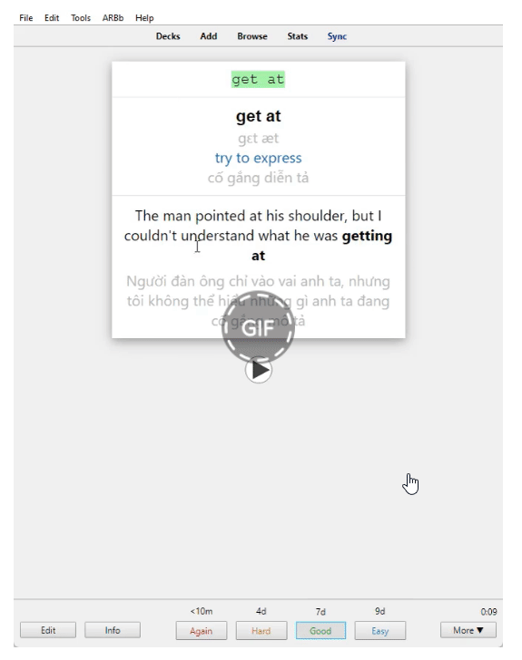

<!--truncate-->

## 📚 Nguồn: [Góc Tối](https://www.facebook.com/groups/ankivocabulary/posts/1184858722273783/)

---

## 📝 Nội dung

- **Từ vựng**
- **Phrasal verb**

Bộ từ vựng và phrasal verb được sắp xếp theo từng bài học trong sách *"Destination B1&2"*, giúp bạn dễ dàng ôn tập sau mỗi bài học.
Các từ có nhiều nghĩa được liên kết với nhau để tối ưu hiệu quả học tập.
Mỗi thẻ còn có **hint ẩn** giúp bạn dễ dàng gợi nhớ từ vựng.

**Template** được thiết kế đơn giản, đầy đủ thông tin rõ ràng, giúp bạn nâng cao hiệu suất học tập.

---

### 📖 Cách học:
1. **Nhìn nghĩa** *(tiếng Việt, định nghĩa tiếng Anh)* và đoán từ vựng.
2. **Nghe từ vựng**, viết lại đúng chính tả và đoán nghĩa.

*Cảm ơn admin [Lê Hoàng Phúc](https://www.facebook.com/tui.la.phuc747/)* đã hỗ trợ lấy **audio** từ *AwesomeTTS*, giúp bộ thẻ hoàn chỉnh hơn.

---

### ⌨️ Tính năng:
- **Ctrl + H:** Hiện Gợi ý *(Hint)*

---

### 💬 P/s:
1. Bộ thẻ này không lấy dữ liệu từ file Excel mà một bạn khác đã chia sẻ. Mong bạn không hiểu nhầm.
2. Bộ **C1&2** đã hoàn thành phần dữ liệu, nhưng chưa được chia sẻ do chưa qua thẩm định lỗi chính tả và dịch nghĩa.
3. Nếu bạn có góp ý, vui lòng chia sẻ để bộ **C1&2** được cải thiện tốt hơn.
4. Hãy vào **rate** giúp mình trên **AnkiWeb** để deck được lên top nhé!

---

### ⚠️ Lưu ý QUAN TRỌNG:
Nếu bạn thấy bộ thẻ này hữu ích và muốn ủng hộ người tạo ra nó, bạn có thể **donate** qua thông tin sau:


---
### 2022-08-20-600-essential-english-words-for-the-toeic-vietnamese.md
---

---
title: 600 Essential English Words for the TOEIC - Vietnamese
slug: 600-essential-english-words-for-the-toeic-vietnamese
date: 2022-08-20
description: ""
category: Tiếng Anh
domain: ankivn.com
keywords:
  - ankivn
tags:
  - deck
  - english
---

<!--truncate-->

## 📚 Nguồn: [AnkiWeb](https://ankiweb.net/shared/info/855860209)

## 📝 Nội dung

**600 từ vựng thiết yếu** được chọn lọc từ sách "Barron's 600 Essential English Words for the TOEIC".

### 💬 Ghi chú:

1. Bộ thẻ này phù hợp với học viên từ trình độ cơ bản đến trung cấp.
2. Sử dụng kèm với sách "Barron's 600 Essential English Words for the TOEIC" để đạt hiệu quả cao nhất.
3. Nếu có lỗi hoặc góp ý, vui lòng phản hồi để cải thiện bộ thẻ tốt hơn.

## 📥 Tải xuống:

- [⬇ **AnkiWeb (chính chủ)**](https://ankiweb.net/shared/info/855860209)
- [⬇ **Google Drive (ankivn)**](https://drive.google.com/file/d/1I-a1j4UIjZ9wrrf1b1k05aCjwQ1UBDk6/view?usp=sharing)
- [⬇ **File sách (ankivn)**](https://drive.google.com/file/d/1I5K8jk5ZKnNRDGdlfWv_pA_urEFn84Uu/view?usp=sharing)


---
### 2022-12-22-headway-5th-edition-wordlist.md
---

---
title: "📚 Headway 5th Edition Word List (A1-C1)"
slug: headway-5th-edition-wordlist-a1-c1
date: 2022-12-22
description: "Bộ deck từ vựng Headway 5th Edition với hơn 5,000 từ, hỗ trợ học từ trình độ A1 đến C1."
category: Tiếng Anh
domain: ankivn.com
keywords:
  - headway
  - vocabulary
  - english
tags:
  - deck
  - english
---


<!--truncate-->

## 📌 Nguồn:
- [Triệu Minh](https://www.facebook.com/groups/ankivocabulary/posts/1319960455430275/)

---

## 🧾 Nội dung

Bộ deck này dựa vào **Wordlist** từ giáo trình **Headway 5th Edition**, chia theo từng cấp độ như sau:

### 📋 Chi tiết từng cấp độ:
1. **Beginner** (Pre-A1 → A1): 953 từ
2. **Elementary** (A1 → A2): 683 từ
3. **Pre-Intermediate** (A2 → B1): 791 từ
4. **Intermediate** (B1 → B2): 858 từ
5. **Upper-Intermediate** (B2 → Pre-C1): 622 từ
6. **Advanced** (Pre-C1 → C1): 1227 từ

### **Tổng cộng**: **5,134 từ** 💯

---

## 🧩 Tính năng đặc biệt:
- **Audio**: Tạo bằng Awesome TTS (Youdao Dictionary – English, British).  
- **Chức năng click**: Click vào văn bản để phát âm thanh.  
- **Từ điển tích hợp**: Lạc Việt.  
- **Nghĩa tiếng Việt**: Sử dụng Google Translate.  

Nếu bạn có thời gian, rất mong bạn có thể kiểm tra và hoàn thiện hơn bộ deck này (đặc biệt là **audio**) để chia sẻ lại cho cộng đồng Ankiers. 🌟

---

## 📥 Tải xuống

### 📗 Link tải gốc Mediafire
<div style={{display: 'flex', justifyContent: 'left', gap: '20px'}}>
  <a href="https://www.mediafire.com/folder/g4kcfr21hrwrr/Headway_5th_Edition?fbclid=IwAR0569j8o-AKdshuy0baGwi4z2HPwguDsk9FAG5qOLwEkOLMyj_QyCubLtk" target="_blank">
    <button class="buttonPrimary" type="button">Mediafire</button>
  </a>
</div>

### 📗 Link mình reup lên OneDrive
<div style={{display: 'flex', justifyContent: 'left', gap: '20px'}}>
  <a href="https://1drv.ms/f/s!AnGRjCvbms2Vir0l025F1_D9gI6wPQ?e=f9mO6B" target="_blank">
    <button class="buttonPrimary" type="button">OneDrive</button>
  </a>
</div>

---

## 📸 Preview

  
  
  


---

## 💬 Lời kết

Bộ deck này phù hợp với các bạn muốn học từ vựng theo hệ thống từ cơ bản đến nâng cao. Hãy tải về và trải nghiệm! 🌟

Post Views: 1,585


---
### 2023-01-16-target-listening-with-dictation.md
---

---
title: "🎯 Target Listening with Dictation: Bộ Deck Học Nghe Đỉnh Cao"
slug: target-listening-with-dictation
date: 2023-01-16
description: "Khám phá bộ deck học nghe Target Listening with Dictation với Wordlist chi tiết và hiệu quả, hỗ trợ luyện nghe từ trình độ B1 đến Advanced."
category: Tiếng Anh
domain: ankivn.com
keywords:
  - listening
  - deck
  - target listening
tags:
  - deck
  - english
---


<!--truncate-->

## 📚 Nguồn:
- [Bài viết gốc](https://www.facebook.com/groups/ankivocabulary/posts/1336733630419624/)
- [Tác giả: Minh Triệu](https://www.facebook.com/minh.trieu.77964201/)

## 🧾 Nội dung

Bộ Deck này được phát triển dựa trên **Wordlist** từ bộ **Target Listening with Dictation**, chia theo từng cấp độ như sau:

- **Student Book 1**: 600 từ  
  FK Level: 1.0 – 5.0, CEFR Level: B1-B1+
- **Student Book 2**: 600 từ  
  FK Level: 6.0 – 8.0, CEFR Level: B1+ B2
- **Practice Tests Book 1**: 360 từ  
  FK Level: 1.0 – 5.0
- **Practice Tests Book 2**: 360 từ  
  FK Level: 6.0 – 8.0
- **Practice Tests Book 3**: 480 từ  
  Target: High-Intermediate/ Advanced
- **Practice Tests Book 4**: 606 từ  
  Target: High-Intermediate*/ Advanced

### Hình ảnh minh họa:


---

## 🎧 Audio và tính năng đặc biệt

- **Nguồn audio**: Awesome TTS (Youdao Dictionary – English, American).  
- **Chức năng click**: Click vào văn bản để phát âm thanh.  
- **Từ điển tích hợp**: Lạc Việt.

---

## 📥 Tải xuống

### 📗 Link tải gốc
<div style={{display: 'flex', justifyContent: 'left', gap: '20px'}}> 
  <a href="https://www.mediafire.com/folder/ohnv63kto83wj/Target_Listening_with_Dictation?fbclid=IwAR0seEpv4uvv5woje17igkl2ugBHNCTpWTgPRFMg86rN8ZGt-hicAlN_Nr0" target="_blank">
    <button class="buttonPrimary" type="button">Mediafire</button>
  </a>
</div>

### 📗 Link Ankivn reup

<div style={{display: 'flex', justifyContent: 'left', gap: '20px'}}> <a href="https://drive.google.com/drive/folders/11tnv55W9cjCZLGAkL7Z69GmE5d1tnntA?usp=drive_link"> <button class="buttonPrimary" type="button">Google Drive</button> </a> </div>

---

## 💬 Lời kết

Chân thành cảm ơn **Bro Cảnh Hiệu**, **Nguyễn Thiện Nghĩa** và các bạn đã hướng dẫn, góp ý để việc tạo deck Anki trở nên đơn giản và tiết kiệm thời gian hơn. 🌟

Thân chúc các bạn học tập hiệu quả! 🥳


---
### 2023-01-30-625-common-words-english.md
---

---
title: 625 Common Words English
slug: 625-common-words-english
date: 2023-01-30
description: ""
category: Tiếng Anh
domain: ankivn.com
keywords:
  - ankivn
tags:
  - deck
  - english
---

import YouTubeEmbed from '@site/src/components/YouTubeEmbed';

<YouTubeEmbed videoId="Xq6LUMvxUTU" />

<!--truncate-->

## Nguồn: [Cảnh Hiệu](https://www.facebook.com/groups/ankivocabulary/posts/1323249645101356/)

## Nội dung

1 chiếc deck tự làm theo cách học của bản thân:

- Đoán qua từ vựng
- Đoán qua hình ảnh  
- Gõ từ qua hình ảnh

Mình vừa chỉnh sửa để thẻ tự động tạo hint.

Ví dụ: beautiful → b_ _ _ _ _ _ _ l

Tải xuống:
Link (cập nhật gần nhất: 30/01/2023): Google Drive tác giả
(Lưu file sound.svg vào folder collection.media của Anki)

## 📥 Tải xuống

<div style={{display: 'flex', justifyContent: 'left', gap: '20px'}}> 
  <a href="https://drive.google.com/drive/folders/1OWl_Qd6a3q4qbmf-Trxjw27T42VdNW4w">
    <button class="buttonPrimary" type="button">Google Drive</button>
  </a>
</div>


---
### 2023-02-27-advanced-english-vocabulary.md
---

---
title: "Advanced English Vocabulary"
slug: "advanced-english-vocabulary"
date: "2023-02-27"
description: "Bộ thẻ Anki Advanced English Vocabulary bao gồm từ vựng, cụm động từ, thành ngữ, kèm định nghĩa, ngữ cảnh và hình ảnh chất lượng cao."
category: Tiếng Anh
domain: ankivn.com
keywords:
  - ankivn
  - advanced english
  - vocabulary
tags:
  - deck
  - english
---

<!--truncate-->

## 📖 **Nguồn**  
**Tác giả:** [AnkiWeb](https://ankiweb.net/shared/info/1980021227)  

---

## 📝 **Nội dung bộ thẻ**  

- **Dành cho người học nâng cao hoặc trung cấp cao.**  
- **Từ vựng, cụm động từ, thành ngữ** được tổng hợp từ nhiều nguồn:  
   - Bộ thẻ chia sẻ.  
   - Nguồn tài liệu trực tuyến.  
   - Phim ảnh, sách, ứng dụng và đời sống hàng ngày.  
- Nội dung được **chỉnh sửa và cải tiến** so với các tài liệu gốc để trở nên rõ ràng và hiệu quả hơn.  
- **Mỗi thẻ bao gồm:**  
   - Thuật ngữ và định nghĩa.  
   - Ngữ cảnh (có thể không xuất hiện ở tất cả thẻ).  
   - Hình ảnh được chọn lọc thủ công.  
   - Phát âm robot tự nhiên từ **Neospeech** (giọng Julia).  
- **Cảnh báo NSFW:** Một số nội dung có thể không phù hợp trong môi trường công sở.

---

## 📑 **Định dạng thẻ**  

1. **Forward:**  
   - **Mặt trước:** Hình ảnh và từ.  
   - **Yêu cầu:** Đưa ra định nghĩa.  
2. **Backward:**  
   - **Mặt trước:** Hình ảnh và định nghĩa.  
   - **Yêu cầu:** Nhập từ tương ứng.  
   - **Gợi ý:** Hiển thị chữ cái đầu và cuối, cùng số lượng chữ cái ở giữa.  

> **Mẹo:** Nếu bạn thấy khó khăn, bạn có thể tách hai loại thẻ và học riêng từng phần (Forward trước, Backward sau).  

---

## ⚛️ **Hướng dẫn cài đặt bộ thẻ**  

1. **Tải xuống bộ thẻ** từ liên kết bên dưới.  
2. Mở phần mềm **Anki** và chọn **File → Import** để tải bộ thẻ.  
3. Bắt đầu học với các chế độ phù hợp.  
4. **PROFIT!** 📈  

---

## 📗 **Tải xuống**

<div style={{ display: 'flex', justifyContent: 'left', gap: '20px' }}>
  <a href="https://ankiweb.net/shared/info/1980021227" target="_blank">
    <button class="buttonPrimary" type="button">🤖 Tải từ AnkiWeb</button>
  </a>
</div>

https://drive.google.com/drive/folders/1-lYSDJKSGx7MTC3PlHEwTMd9HnNPdsXT?usp=sharing

---

## 💖 **Thông điệp từ tác giả**  

- **Mục đích tạo bộ thẻ:** Cải thiện vốn từ vựng, không nhằm mục đích thương mại.  
- **Gợi ý ủng hộ:** Nếu bạn thấy bộ thẻ hữu ích, bạn có thể cân nhắc mua ứng dụng Anki trên App Store để hỗ trợ đội ngũ phát triển.  
- **Liên hệ:** Mọi vấn đề hoặc góp ý, vui lòng gửi email đến: [feppakaye@riseup.net](mailto:feppakaye@riseup.net).  

---

## 💬 **Cập nhật gần đây:**  

- **16/12/2018:**  
   - Thay thế hình ảnh không phù hợp.  
   - Cập nhật phát âm bị lỗi.  
   - Chỉnh sửa các định nghĩa không chính xác.  
   - Thay đổi giao diện thẻ dựa trên gợi ý từ người dùng.  

---

## ⚠️ **Lưu ý từ tác giả:**  

- **Quá trình xây dựng:** Bộ thẻ được xây dựng trong **hơn một năm**.  
- **Hiệu quả:** Hình ảnh minh họa giúp cải thiện trí nhớ tốt hơn rất nhiều so với các thẻ không có hình ảnh.  
- **Miễn phí sử dụng:** Tác giả chia sẻ bộ thẻ này miễn phí như một đóng góp nhỏ cho cộng đồng học tiếng Anh.  

---

> **📌 Lưu ý:** Bộ thẻ có thể được cập nhật định kỳ. Hãy kiểm tra trang tải xuống thường xuyên để nhận phiên bản mới nhất.

---


---
### 2023-02-27-bo-the-cambridge-vocabulary-for-ielts-20-lessons.md
---

---
title: Bộ thẻ Cambridge Vocabulary for IELTS 20 lessons
slug: bo-the-cambridge-vocabulary-for-ielts-20-lessons
date: 2023-02-27
description: Bộ thẻ Anki Cambridge Vocabulary for IELTS bao gồm 20 bài học từ vựng được biên soạn chi tiết và đầy đủ.
category: Tiếng Anh
domain: ankivn.com
keywords:
  - ankivn
  - cambridge
  - ielts
tags:
  - deck
  - english
---

<!--truncate-->

## 📖 **Nguồn**  
**Tác giả:** [Đạt Nguyễn](https://youtu.be/iSER0Idq-F8)  

---

## 📝 **Nội dung bộ thẻ**  

- **20 bài học từ vựng Cambridge Vocabulary for IELTS.**  
- Các từ vựng được sắp xếp khoa học và phù hợp với cấp độ học viên IELTS.  

---

## 🥇 **Hướng dẫn Video**

import YouTubeEmbed from '@site/src/components/YouTubeEmbed';

<YouTubeEmbed videoId="iSER0Idq-F8" />

---

## 📗 **Tải xuống**

<div style={{display: 'flex', justifyContent: 'left', gap: '20px'}}>
  <a href="https://drive.google.com/drive/folders/0ByVh8f6TFdtPM1dsWGRoVUNQVjA?resourcekey=0-LzzuynxLspFUtsf4qicUHA&usp=sharing" target="_blank">
    <button class="buttonPrimary" type="button">Google Drive (Đạt Nguyễn)</button>
  </a>

 <a href="https://drive.google.com/drive/folders/1-waZ66SkYaHBMPmVevUDX4iqgctgKDFV?usp=sharing" target="_blank">
    <button class="buttonPrimary" type="button">Google Drive (ankivn.com)</button>
  </a>
</div>

## Word list 

### PDF 

<iframe 
  src="https://drive.google.com/file/d/1-wIrhKwyJCsKj1uVnjw6RBtTUE6-u8ZB/preview" 
  width="100%" 
  height="600px" 
  style={{ border: 'none' }}>
</iframe>

### Word

<div style={{display: 'flex', justifyContent: 'left', gap: '20px'}}> <a href="https://docs.google.com/document/d/1-w6nIDR1KYom1u2_jYFvN7oNgmSdOYYL/edit?usp=sharing&ouid=117563252937742040116&rtpof=true&sd=true"> <button class="buttonPrimary" type="button">Google Drive</button> </a> </div>


---

### 📥 **Hướng dẫn tải xuống:**  
- **Bước 1:** Chọn nút tải xuống phù hợp.  
- **Bước 2:** Đăng nhập tài khoản Google (nếu cần).  
- **Bước 3:** Tải file về máy và thêm vào Anki.  

---

> **📌 Lưu ý:** Nếu gặp vấn đề khi tải xuống, vui lòng kiểm tra kết nối hoặc thử lại sau.

---


---
### 2023-02-27-lifelong-learning-advanced-english-vocabulary.md
---

---
title: "Lifelong Learning - Advanced English Vocabulary"
slug: "lifelong-learning-advanced-english-vocabulary"
date: "2023-02-27"
description: "Bộ thẻ Anki Lifelong Learning - Advanced English Vocabulary với hơn 8.092 từ vựng nâng cao, bao gồm định nghĩa, phát âm và ví dụ minh họa."
category: Tiếng Anh
domain: ankivn.com
keywords:
  - ankivn
  - lifelong learning
  - advanced english
  - vocabulary
tags:
  - deck
  - english
---


<!--truncate-->

## 📖 **Nguồn**  
**Tác giả:** [AnkiWeb](https://ankiweb.net/shared/info/1748072575)  

---

## 📝 **Nội dung bộ thẻ**  

- **8.092 từ vựng nâng cao**, bao gồm:  
  - **6.706 từ** từ danh sách GRE và SAT.  
  - **1.373 từ** bổ sung từ quá trình đọc sách và tài liệu.  
- Định nghĩa từ điển Google cho mỗi từ.  
- Âm thanh Google WaveNet cho mỗi từ.  
- Câu ví dụ minh họa cho phần lớn các từ.  
- Từ đồng nghĩa cho phần lớn các từ.  
- Phát âm sử dụng chuẩn **Anh-Anh (British Pronunciation)**.  

---

## 📑 **Định dạng học từ vựng**  

1. **Từ → Định nghĩa:** Học qua định nghĩa từ.  
2. **Từ + Câu ví dụ → Định nghĩa:** Học từ qua câu ví dụ và định nghĩa.  
3. **Từ vựng SAT & GRE:** Có thẻ riêng cho những ai muốn học từ vựng SAT & GRE.  

---

## ⚛️ **Hướng dẫn sử dụng bộ thẻ**  

1. **Tải xuống bộ thẻ** từ liên kết bên dưới.  
2. Mở phần mềm **Anki** và chọn **File → Import** để tải bộ thẻ.  
3. Chọn chế độ học phù hợp: Ôn tập, gõ từ, hoặc học qua câu ví dụ.  

---

## 📗 **Tải xuống**

<div style={{ display: 'flex', justifyContent: 'left', gap: '20px' }}>
  <a href="https://ankiweb.net/shared/info/1748072575" target="_blank">
    <button class="buttonPrimary" type="button">🤖 Tải từ AnkiWeb</button>
  </a>
  <a href="https://drive.google.com/file/d/11eBVVT0Uyspl_gbYP6s9I61KK4J61-Jd/view?usp=drive_link" target="_blank">
    <button class="buttonPrimary" type="button">📝 Tải từ Google Drive</button>
  </a>
</div>

---

## 💖 **Ủng hộ tác giả**

<div style={{ display: 'flex', justifyContent: 'center', marginTop: '20px', marginBottom: '20px' }}>
  <a href="https://ko-fi.com/ankideckauthor" target="_blank">
    <button class="buttonPrimary" type="button" style={{ backgroundColor: '#FF5E5B', color: '#fff', fontWeight: 'bold', padding: '10px 20px', borderRadius: '8px', cursor: 'pointer' }}>
      ☕ Ủng hộ tác giả qua Ko-fi
    </button>
  </a>
</div>

---

## 💬 **Cập nhật gần đây:**  

- **07/01/2024:** Cập nhật mới nhất với các từ và sửa lỗi.  
- **03/12/2022:** Thêm 26 từ mới, sửa lỗi định nghĩa.  
- **27/08/2022:** Thêm 9 từ mới, sửa lỗi nhỏ.  

---

> **📌 Lưu ý:** Bộ thẻ có thể được cập nhật định kỳ. Hãy kiểm tra trang tải xuống thường xuyên để nhận phiên bản mới nhất.

---


---
### 2023-03-24-anki-ted-ed-song-ngu-anh-viet-part-1-remake-ver.md
---

---
title: "Anki TED-ED Song Ngữ Anh – Việt (Part 1 – Remake ver)"
slug: "anki-ted-ed-song-ngu-anh-viet-part-1-remake-ver"
date: "2023-03-24"
description: "Bộ thẻ Anki TED-ED Song Ngữ Anh – Việt (Part 1 – Remake ver) giúp cải thiện kỹ năng nghe và từ vựng thông qua các câu chuyện TED-ED."
category: Tiếng Anh
domain: ankivn.com
keywords:
  - ankivn
  - ted-ed
  - bilingual
  - english
  - vietnamese
tags:
  - deck
  - english
---


<!--truncate-->

## 📌 **Nguồn**  
- **Tác giả:** [Anki Việt Nam](https://ankivn.com/bo-the/ngoai-ngu/tieng-anh/anki-ted-ed-song-ngu-anh-viet-part-1-remake-ver/)  
- **Facebook:** [Nhóm Anki Vocabulary](https://www.facebook.com/groups/ankivocabulary/posts/1377826669643653)  

---

## 📚 **Nội dung bộ thẻ**  

- **Dành cho người học tiếng Anh trình độ trung cấp và nâng cao.**  
- **Học thông qua video TED-ED song ngữ Anh - Việt.**  
- **Nội dung bao gồm:**  
   - Video TED-ED kèm phụ đề song ngữ.  
   - Câu hỏi ôn tập dựa trên nội dung video.  
   - Giải thích chi tiết và dễ hiểu.  
- **Tối ưu hóa trải nghiệm học:**  
   - Không cần chỉnh sửa chế độ học.  
   - Dễ dàng tải về và sử dụng ngay lập tức.  


---

## 📝 **Phương pháp học**  

1. **Dictate – Nghe chép chính tả:**  
   - **Mặt trước:** Nghe audio và điền từ vào chỗ trống.  
   - **Gợi ý:** Nghĩa tiếng Việt và định nghĩa được ẩn; di chuột xuống dưới để hiển thị nếu cần.  


2. **Voca – Gợi nhớ và đoán từ vựng:**  
   - **Mặt trước:** Dựa vào dịch nghĩa để đoán từ vựng.  
   - **Gợi ý:** Định nghĩa được ẩn; di chuột xuống để hiển thị nếu cần.  


> **Mẹo:** Nếu bạn thấy khó khăn, bạn có thể chọn một phương pháp học phù hợp và tập trung vào nó trước.  

---

## 🔄 **Hướng dẫn cài đặt bộ thẻ**  

1. **Tải xuống bộ thẻ** từ liên kết bên dưới.  
2. Mở phần mềm **Anki** và chọn **File → Import** để tải bộ thẻ.  
3. Chọn sub-deck phù hợp với phương pháp học mong muốn:  
   - **Dictate:** Luyện kỹ năng nghe và chép chính tả.  
   - **Voca:** Gợi nhớ và đoán từ vựng.  
4. **Bắt đầu học** và điều chỉnh tốc độ, số lượng thẻ học mỗi ngày theo khả năng.  

---

## 📥 **Tải xuống**

<div style={{ display: 'flex', justifyContent: 'left', gap: '20px' }}>
  <a href="https://www.mediafire.com/file/s0jxm7ta2ggb9yl/TED-ED+Part+1.apkg/file" target="_blank">
    <button class="buttonPrimary" type="button">📥 Tải từ Mediafire</button>
  </a>
  <a href="https://drive.google.com/file/d/1-nVCmumdPwBYY0i0BWqsy2WqmTeiH49u/view?usp=drive_link" target="_blank">
    <button class="buttonPrimary" type="button">📁 Tải từ Google Drive</button>
  </a>
</div>

---

## 💌 **Thông điệp từ tác giả**  

- **Mục đích tạo bộ thẻ:** Cung cấp công cụ học tiếng Anh hiệu quả qua video TED-ED.  
- **Gợi ý ủng hộ:** Nếu bạn thấy bộ thẻ hữu ích, hãy chia sẻ hoặc gửi lời động viên đến tác giả.  
- **Liên hệ:** Mọi vấn đề hoặc góp ý, vui lòng gửi email đến: [feppakaye@riseup.net](mailto:feppakaye@riseup.net).  

---

## 📝 **Cập nhật gần đây:**  

- **24/03/2023:**  
   - Tối ưu giao diện bộ thẻ.  
   - Sửa lỗi hiển thị phụ đề.  
   - Cải thiện nội dung ôn tập và câu hỏi.  

---

## ⚠️ **Lưu ý từ tác giả:**  

- **Tự điều chỉnh thêm:**  
   - Vào chế độ chỉnh sửa (Edit).  
   - Bôi đen từ hoặc cụm từ muốn ẩn.  
   - Chọn **Cloze Deletion**.  
   - Nhấn **Save** để lưu thay đổi.  

- **Loại bỏ thẻ không muốn học:**  
   - Nhấn **More** trên thẻ đó.  
   - Chọn **Suspend Card** hoặc nhấn **Shift + @** để tạm ngưng thẻ.  


---

> **📌 Lưu ý:** Bộ thẻ có thể được cập nhật định kỳ. Hãy kiểm tra trang tải xuống thường xuyên để nhận phiên bản mới nhất.

---


---
### 2023-04-06-3000-tu-tieng-anh.md
---

---
title: "3000 từ Tiếng Anh"
slug: 3000-tu-tieng-anh
date: 2023-04-06
description: "Bộ thẻ Anki 3000 từ Tiếng Anh bao gồm hai loại thẻ, hỗ trợ Dark Mode, tự tạo Hint và tự ẩn từ vựng, giúp học từ vựng hiệu quả."
category: Tiếng Anh
domain: ankivn.com
keywords:
  - ankivn
  - 3000 từ tiếng anh
  - vocabulary
tags:
  - deck
  - english
---

import YouTubeEmbed from '@site/src/components/YouTubeEmbed';

<YouTubeEmbed videoId="D_qU0TmCm0o" />

<!--truncate-->

## 📌 **Nguồn**  
- **Tác giả:** [Cảnh Hiệu](https://www.facebook.com/groups/ankivocabulary/posts/1328068474619473/)  

---

## 📚 **Nội dung bộ thẻ**  

- **Dành cho người học Tiếng Anh ở mọi trình độ.**  
- **Bao gồm 3000 từ vựng phổ biến trong tiếng Anh.**  
- **Hai loại thẻ:**  
   1. **Thẻ cơ bản:** Học từ qua định nghĩa và ví dụ.  
   2. **Thẻ nâng cao:** Tự tạo Hint và tự ẩn từ vựng.  
- **Hỗ trợ Dark Mode:** Giảm mỏi mắt khi học trong điều kiện thiếu sáng.  
- **Âm thanh:** Đính kèm file âm thanh **`audio_wave.svg`** để biểu tượng âm thanh hiển thị đúng cách.  

---

## 📝 **Tính năng nổi bật**  

- **Tự tạo Hint:** Học viên có thể thêm gợi ý tùy chỉnh vào thẻ học.  
- **Tự ẩn từ vựng:** Tạo trải nghiệm học linh hoạt và hiệu quả hơn.  
- **Dark Mode:** Hỗ trợ chế độ tối giúp giảm căng thẳng mắt.  

---

## 🛠️ **Hướng dẫn cài đặt bộ thẻ**  

1. **Tải xuống bộ thẻ** từ liên kết bên dưới.  
2. Mở phần mềm **Anki** và chọn **File → Import** để tải bộ thẻ.  
3. **Sao chép file âm thanh:**  
   - Tìm file **`audio_wave.svg`** trong gói tải xuống.  
   - Sao chép file vào thư mục **`collection.media`** trong Anki để đảm bảo biểu tượng âm thanh hoạt động.  
4. Bắt đầu học với các chế độ học phù hợp.  

---

## 📗 **Tải xuống**

<div style={{ display: 'flex', justifyContent: 'left', gap: '20px' }}>
  <a href="https://drive.google.com/file/d/1-gurWs4S-0fN-kczDOKdLWtkv5i4tB6p/view?usp=drive_link" target="_blank">
    <button class="buttonPrimary" type="button">📥 Tải từ Google Drive</button>
  </a>
</div>

<div style={{display: 'flex', justifyContent: 'left', gap: '20px'}}> <a href="https://drive.google.com/file/d/1-g561NXo8QWCVehk40u2ALU850Iutx8Y/view?usp=drive_link"> <button class="buttonPrimary" type="button">audio_wave.svg</button> </a> </div>

---

## 💌 **Thông điệp từ tác giả**  

- **Mục đích tạo bộ thẻ:** Cung cấp công cụ học từ vựng tiếng Anh hiệu quả cho mọi trình độ.  
- **Hỗ trợ người dùng:** Đảm bảo bạn đã sao chép file **`audio_wave.svg`** vào đúng thư mục.  
- **Liên hệ:** Mọi thắc mắc hoặc góp ý, vui lòng liên hệ qua [Facebook của tác giả](https://www.facebook.com/groups/ankivocabulary/posts/1328068474619473/).  

---

## 📅 **Cập nhật gần đây:**  

- **06/04/2023:**  
   - Phát hành phiên bản đầu tiên.  
   - Thêm hỗ trợ Dark Mode.  
   - Tối ưu tính năng tự tạo Hint và tự ẩn từ vựng.  

---

## ⚠️ **Lưu ý từ tác giả:**  

- **File âm thanh:** Sao chép file **`audio_wave.svg`** vào thư mục **`collection.media`** của Anki để đảm bảo âm thanh và biểu tượng hoạt động đúng cách.  
- **Chế độ học linh hoạt:** Người dùng có thể chọn giữa học thẻ cơ bản hoặc nâng cao tùy theo mục tiêu học tập.  

---

> **📝 Lưu ý:** Bộ thẻ có thể được cập nhật định kỳ. Hãy kiểm tra trang tải xuống thường xuyên để nhận phiên bản mới nhất.

---


---
### 2023-04-26-30-chu-de-tu-vung-co-trang-anh-made-by-hoang-xuan.md
---

---
title: "30 Chủ Đề Từ Vựng Cô Trang Anh – Made by Hoàng Xuân"
slug: "30-chu-de-tu-vung-co-trang-anh"
date: "2023-04-26"
description: "Bộ flashcard Anki dựa trên sách 30 Chủ Đề Từ Vựng của cô Trang Anh, phù hợp cho ôn thi THPT Quốc Gia."
category: Tiếng Anh
domain: ankivn.com
keywords:
  - ankivn
  - tieng-anh
tags:
  - deck
  - english
---

  

<!--truncate-->


  
  
  
  
  

## 🤝 **Giới thiệu**

Xin chào mọi người! Mình là **Hoàng Xuân**, và hôm nay mình chia sẻ với các bạn bộ flashcard Anki dựa trên quyển **"30 Chủ Đề Từ Vựng Cô Trang Anh"**.

Thay vì chia theo từng Unit, mình đã sắp xếp thẻ theo **từ vựng** và **cấu trúc câu** để giúp bạn học hiệu quả hơn. Bộ thẻ này đặc biệt phù hợp cho các bạn ôn thi THPT Quốc Gia.

### 📌 **Cấu trúc bộ thẻ:**
- **Từ vựng:** Chọn lọc từ khó, ít gặp và dễ quên.  
- **Cấu trúc:** Bao gồm Collocations, Phrasal verbs, To V, V-ing, Bare Infinitive, Prepositions, Idioms, Structures.  
- **Âm thanh:** Sử dụng TTS giọng Anh-Mỹ chuẩn.  
- **Hình ảnh:** Ảnh hoạt hình sinh động giúp dễ nhớ.

Bộ thẻ phù hợp nhất khi học trên phiên bản **web** hoặc **phần mềm máy tính Anki**.

---

## 📚 **Quyển 2 – Tiếp nối quyển 1**

Quyển 2 tiếp tục phát triển dựa trên nền tảng của quyển 1, với từ vựng phức tạp và khó hơn. Nếu bạn thấy hữu ích, đừng ngần ngại tải về và chia sẻ cảm nhận nhé!  

Ngoài ra, bạn có thể tham khảo bộ thẻ **"Trường Từ Vựng"** tại đây:  
👉 [Trường Từ Vựng trên Facebook](https://www.facebook.com/groups/ankivocabulary/permalink/1397666234326363/)

---

## ⚠️ **Lưu ý nhỏ**

- Bộ thẻ có thể không hỗ trợ âm thanh trên các thiết bị di động Android và iOS.  
- Khuyến khích học trên **web** hoặc **phần mềm máy tính Anki** để trải nghiệm tốt nhất.

---

## 📗 **Tải xuống**

<div style={{display: 'flex', justifyContent: 'left', gap: '20px'}}> 
  <a href="https://drive.google.com/file/d/1qjhmozPGGe16X0QHmyrRp04hnZgcSOEX/view?usp=drive_link" target="_blank"> 
    <button class="buttonPrimary" type="button">Google Drive</button> 
  </a> 
</div>

---

## 📣 **Liên hệ**

Nếu bạn gặp bất kỳ lỗi nào khi tải hoặc sử dụng bộ thẻ, đừng ngần ngại nhắn tin cho mình!  
👉 [Facebook Hoàng Xuân](https://www.facebook.com/groups/ankivocabulary/posts/1395347344558252/)

---

**Chúc các bạn học tập hiệu quả và thành công!** 🤝✨


---
### 2023-06-15-tieng-anh-chuyen-nganh-cong-nghe-thong-tin.md
---

---
title: "Tiếng Anh Chuyên Ngành Công Nghệ Thông Tin"
slug: tieng-anh-chuyen-nganh-cong-nghe-thong-tin
date: 2023-06-15
description: "Bộ flashcard Anki Tiếng Anh chuyên ngành Công Nghệ Thông Tin, phù hợp cho người học và làm việc trong lĩnh vực CNTT."
category: Tiếng Anh
domain: ankivn.com
keywords:
  - ankivn
  - tieng-anh
  - cong-nghe-thong-tin
tags:
  - deck
  - english
  - cntt
---


<!--truncate-->

## 📌 **Nguồn** [Hoàng Xuân](https://www.facebook.com/groups/ankivocabulary/posts/1424011565025163/?__cft__[0]=AZX5VpxeDOQxBxR1bGAfdh9UvGRa3JIT80yxjSXncTIlpva6XO0_JpaO1lFKe-SLz0sehWmOe-Pl69xwtdK6qtkiXB7EtbJRDQY78K9wduVtJmaSIqBYMqsQw9ogOxMHh3sUi2A-jcizKE_F7JGyfedd&__tn__=%2CO%2CP-R)

## Nội dung

Chào các bạn! Hôm nay mình chia sẻ bộ flashcard **"Tiếng Anh Chuyên Ngành Công Nghệ Thông Tin"**. Đây là bộ thẻ được sưu tầm và chỉnh sửa để phù hợp với nhu cầu học tập và sử dụng trong môi trường làm việc công nghệ.

### 📚 **Giới thiệu**

Bộ flashcard này cung cấp từ vựng và cấu trúc câu chuyên sâu trong lĩnh vực **Công Nghệ Thông Tin (CNTT)**. Đặc biệt, bộ này có sự kết hợp giữa:
- **Cloze (điền khuyết)**  
- **Type (gõ đáp án)**  
- **Image (hình ảnh minh họa)**  

Bên cạnh đó, addon **"Image Occlusion Enhance"** được tích hợp nhưng phần text type được để trống. Bạn có thể tùy chỉnh thêm nếu muốn.

---


---

## 📝 **Cấu Trúc Bộ Thẻ**

- **Từ vựng chuyên ngành:** Bao gồm các thuật ngữ CNTT thông dụng.  
- **Cấu trúc câu:** Các cụm từ và mẫu câu sử dụng trong giao tiếp CNTT.  
- **Ví dụ thực tế:** Mỗi thẻ kèm theo ví dụ rõ ràng và dễ hiểu.  
- **Phát âm chuẩn:** Sử dụng Text-to-Speech (TTS) giọng Anh-Mỹ.  
- **Hình ảnh minh họa:** Tăng khả năng ghi nhớ nhanh chóng.

---

## 🎯 **Lợi Ích Của Bộ Thẻ**

- Học nhanh và ghi nhớ từ vựng chuyên ngành CNTT.  
- Dễ dàng áp dụng vào công việc và học tập.  
- Hỗ trợ ôn luyện từ vựng thông qua hình ảnh và âm thanh.  
- Phù hợp cho cả người mới bắt đầu và người học nâng cao.

---

## 📗 **Tải xuống**

<div style={{display: 'flex', justifyContent: 'left', gap: '20px'}}> 
  <a href="https://drive.google.com/drive/folders/11wBI6v7WzfsTFNdAS1pvFd_BWB_T_pQh?usp=sharing" target="_blank"> 
    <button class="buttonPrimary" type="button">Google Drive</button> 
  </a> 
</div>

---

**Chúc các bạn học tập hiệu quả và thành công!** 📚✨


---
### 2023-06-15-tieng-anh-kinh-te.md
---

---
title: Tiếng Anh Kinh Tế
slug: tieng-anh-kinh-te
date: 2023-06-15
description: Bộ flashcard Anki Tiếng Anh Kinh Tế, phù hợp cho người học tiếng Anh chuyên ngành kinh tế.
category: Tiếng Anh
domain: ankivn.com
keywords:
  - ankivn
  - tieng-anh
  - tieng-anh-kinh-te
tags:
  - deck
  - english
  - kinh-te
---


<!--truncate-->


## 🤝 **Giới thiệu**

Xin chào mọi người! Đây là bộ flashcard Anki **Tiếng Anh Kinh Tế** dành riêng cho các bạn đang học và làm việc trong lĩnh vực kinh tế. Bộ thẻ được biên soạn với các từ vựng và cụm từ chuyên ngành phổ biến nhất, giúp bạn cải thiện vốn từ và khả năng giao tiếp trong môi trường kinh doanh.

### 📌 **Cấu trúc bộ thẻ:**
- **Từ vựng chuyên ngành:** Bao gồm các thuật ngữ kinh tế quan trọng.  
- **Cấu trúc câu:** Các cụm từ và mẫu câu thường dùng trong giao tiếp kinh doanh.  
- **Ví dụ thực tế:** Mỗi thẻ kèm theo ví dụ minh họa dễ hiểu.  
- **Âm thanh chuẩn:** Tích hợp phát âm từ TTS giọng Anh-Mỹ.  
- **Hình ảnh minh họa:** Giúp tăng khả năng ghi nhớ.

Bộ thẻ phù hợp cho cả người mới bắt đầu và người học nâng cao trong lĩnh vực kinh tế.

---

## 📚 **Lợi ích của bộ thẻ**

- Cải thiện vốn từ vựng kinh tế nhanh chóng.  
- Nắm vững các mẫu câu thông dụng trong giao tiếp kinh doanh.  
- Học mọi lúc mọi nơi với Anki.  
- Phù hợp cho cả sinh viên và người đi làm.

---

## 📗 **Tải xuống**

<div style={{display: 'flex', justifyContent: 'left', gap: '20px'}}> 
  <a href="https://drive.google.com/file/d/11xelVd6jC9AdIGFl3-1umMBmep15bfRv/view?usp=drive_link" target="_blank"> 
    <button class="buttonPrimary" type="button">Google Drive</button> 
  </a> 
</div>

---

## 📣 **Nguồn**

[Nguồn: Hoàng Xuân](https://www.facebook.com/groups/ankivocabulary/posts/1423356845090635/?__cft__[0]=AZWzUjp2XhP2OgcTgvp8IYVpY9w-UxCgQuAdJjqiOjDRmdSp95VBNAeRXwTwhI9qqEzL7cwThPlPTiFHQ-nlOF4B88Egs4OVDGEf85iVKprLmFWoz_IBGF9uPOCufVeE-41oLI0oJCpViWM-Ig8V7Wku&__tn__=%2CO%2CP-R)


---
### 2023-06-17-tu-cung-truong-nghia-co-trang-anh.md
---

---
title: Từ Cùng Trường Nghĩa (cô Trang Anh) - Made by Hoàng Xuân
slug: tu-cung-truong-nghia-co-trang-anh
date: 2023-06-17
description: Bộ flashcard Anki Từ Cùng Trường Nghĩa từ sách của cô Trang Anh, hỗ trợ ôn thi THPTQG hiệu quả.
category: Tiếng Anh
domain: ankivn.com
keywords:
  - ankivn
  - tieng-anh
  - truong-tu-vung
tags:
  - deck
  - english
---

<!--truncate-->


## 🎀 **Giới thiệu**

Xin chào mọi người! Đang trong thời gian nghỉ lễ và cũng là thời điểm nước rút để ôn thi **THPTQG**, mình chia sẻ bộ flashcard **"Từ cùng trường nghĩa"**.  

### 📌 **Vì sao cần học bộ thẻ này?**
- Việc phân biệt các từ đồng nghĩa trong tiếng Anh là kỹ năng quan trọng nhưng cũng đầy thử thách.  
- Mỗi từ tuy có nghĩa gần giống nhau nhưng sắc thái sử dụng lại khác biệt đáng kể.  
- Bộ thẻ giúp bạn hiểu rõ ngữ cảnh, sắc thái và cách sử dụng từ đồng nghĩa đúng nhất.

### 📝 **Dành cho ai?**
- Học sinh ôn thi THPTQG.  
- Người học tiếng Anh muốn cải thiện vốn từ vựng nâng cao.  
- Người học cần phát triển kỹ năng sử dụng từ vựng chính xác trong giao tiếp và viết luận.

---

## 📚 **Cấu Trúc Bộ Thẻ**

- **Từ vựng:** Phân loại từ đồng nghĩa theo chủ đề cụ thể.  
- **Ví dụ minh họa:** Cung cấp câu ví dụ để hiểu rõ ngữ cảnh sử dụng.  
- **Phân tích sắc thái:** Giải thích chi tiết về sự khác nhau giữa các từ.  
- **Cấu trúc câu:** Áp dụng từ vựng vào các mẫu câu thông dụng.  

---

## 🎯 **Lợi Ích Của Bộ Thẻ**

- Hiểu rõ sắc thái khác biệt của các từ đồng nghĩa.  
- Cải thiện khả năng sử dụng từ vựng linh hoạt trong giao tiếp và viết luận.  
- Hỗ trợ ôn thi THPTQG hiệu quả.  
- Phù hợp cho cả người học tiếng Anh nâng cao và người mới bắt đầu.

---

## 📗 **Tải xuống**

<div style={{display: 'flex', justifyContent: 'left', gap: '20px'}}> 
  <a href="https://drive.google.com/file/d/12-PPQo3k3WtX3cz4GqlCpuM3pkTJhPj7/view?usp=drive_link" target="_blank"> 
    <button class="buttonPrimary" type="button">Google Drive</button> 
  </a> 
</div>

---

## 📣 **Nguồn**

[Nguồn: Hoàng Xuân](https://www.facebook.com/groups/ankivocabulary/posts/1397666234326363/)


---
### 2023-06-24-english-collocations-in-use-advanced-1000-collocations.md
---

---
title: English Collocations in Use Advanced + 1000 English Collocations in 10 Minutes a Day
slug: english-collocations-in-use-advanced-1000-collocations
date: 2023-06-24
description: Bộ thẻ Anki English Collocations in Use Advanced và 1000 English Collocations in 10 Minutes a Day được chia sẻ bởi Lan Trần, giúp học collocation nhanh chóng và hiệu quả.
category: Tiếng Anh
domain: ankivn.com
keywords:
  - ankivn
  - collocations
  - english collocations
  - vocabulary
tags:
  - deck
  - english
  - collocations
---
<div style={{ position: "relative", paddingBottom: "56.25%", height: 0, overflow: "hidden" }}>
  <iframe
    src="https://drive.google.com/file/d/10CVFoebRpTHpcar3iAvaWszs1lbJGpli/preview"
    style={{ position: "absolute", top: 0, left: 0, width: "100%", height: "100%" }}
    allow="autoplay"
  ></iframe>
</div>


<!--truncate-->

## 📖 **Nguồn**  
- **Tác giả:** [Lan Trần](https://www.facebook.com/groups/ankivocabulary/posts/1130640154362307/)  

---

## 📝 **Nội dung bộ thẻ**  

Nhóm có nhiều bạn dễ thương chia sẻ deck của mình, nên hôm nay mình cũng làm bộ **English Collocations in Use Advanced** đơn giản để chia sẻ:  

- **Bản dịch:** Lấy từ web **IELTS Song Ngữ**.  
- **Add-ons hỗ trợ:**  
   - **Anki IPA:** [Tải về tại đây](https://ankiweb.net/shared/info/799647424).  
   - **AwesomeTTS:** [Tải về tại đây](https://ankiweb.net/shared/info/1436550454).  

> **Lưu ý:** Các bạn nên học kèm với đọc sách để hiểu rõ văn cảnh dịch. Bản dịch có thể chưa hợp lý, bạn nên tự chỉnh sửa khi cần.  

---

Ngoài ra, mình cũng cập nhật thêm bộ **1000 English Collocations in 10 Minutes a Day.**  

- Bộ này mình tính không chia sẻ vì làm khá ẩu, hình ảnh chưa đẹp lắm, nhưng nếu bạn cần thì tải về và sửa lại nhé.

---

## 📝 **Tính năng nổi bật**  

1. **Collocations phổ biến:** Được trích xuất từ sách học thuật và thực tiễn.  
2. **Tích hợp phát âm:** Sử dụng add-on **AwesomeTTS** để phát âm tự động.  
3. **Phù hợp với học viên:** Bộ thẻ thích hợp cho người học từ cơ bản đến nâng cao.  

---

## 🛠️ **Hướng dẫn cài đặt bộ thẻ**  

1. **Tải xuống bộ thẻ** từ liên kết bên dưới.  
2. Mở phần mềm **Anki** và chọn **File → Import** để tải bộ thẻ.  
3. **Cài đặt add-ons hỗ trợ:**  
   - [Anki IPA](https://ankiweb.net/shared/info/799647424)  
   - [AwesomeTTS](https://ankiweb.net/shared/info/1436550454)  
4. **Bắt đầu học:**  
   - Chọn bộ thẻ phù hợp với trình độ.  
   - Luyện tập phát âm và ghi nhớ collocations qua ví dụ.  

---

## 📗 **Tải xuống**

<div style={{ display: 'flex', justifyContent: 'left', gap: '20px' }}>
  <a href="https://1drv.ms/u/s!AgIVLcNsagEqgbt7ZGfp-c-qqOBVVA?e=aniYuz" target="_blank">
    <button class="buttonPrimary" type="button">📥 Tải từ OneDrive</button>
  </a>
</div>

<div style={{display: 'flex', justifyContent: 'left', gap: '20px'}}> <a href="https://drive.google.com/drive/folders/10BzBXsnaDX7sfIWSTlB6PyUA0k7Ml2L2?usp=sharing"> <button class="buttonPrimary" type="button">Google Drive</button> </a> </div>

---

## 💖 **Thông điệp từ tác giả**  

- **Mục đích chia sẻ:** Giúp người học tiếng Anh cải thiện collocations một cách nhanh chóng và hiệu quả.  
- **Lời nhắn:** Nếu thấy nội dung hữu ích, hãy tải về và chia sẻ với bạn bè.  
- **Liên hệ:** Mọi thắc mắc hoặc góp ý, vui lòng nhắn tin qua [Facebook của tác giả](https://www.facebook.com/groups/ankivocabulary/posts/1130640154362307/).  

---


---
### 2023-06-24-tai-nguyen-anki-ted-ed-song-ngu-anh-viet-part-3.md
---

---
title: "TED-ED Part 3: Anki TED-ED song ngữ Anh - Việt (Part 3)"
slug: ted-ed-part-3
date: 2023-06-24
description: Deck học tiếng Anh với Context và Audio để luyện kỹ năng Listening và Reading.
category: Tiếng Anh
domain: ankivn.com
keywords:
  - ankivn
  - ted-ed
tags:
  - deck
  - english
---


<!--truncate-->

## Nguồn: [Marsh Nguyễn](https://www.facebook.com/groups/ankivocabulary/posts/1410428709716782/)

## 🌟 Học tiếng Anh dựa theo Context + Audio để luyện kỹ năng Listening + Reading

Deck này khắc phục và tối ưu các điểm so với deck trước như sau:

- ✅ 1 card chỉ duy nhất một định nghĩa, 1 cloze, không quá nhiều input định nghĩa.
- 🧠 Add thêm audio từ vựng + phiên âm IPA British/America.
- 🎨 Giao diện đẹp hơn với 2 chế độ: Light và Dark.
- 🎀 Loại bỏ Empty Card để người học không cần chỉnh sửa gì thêm.

Các Deck Anh – Trung – Nhật mình từng làm:

> **Note:** Ngày mai mình sẽ publish Deck TED-ED Part 3 lên Anki shared deck. Nếu mọi người thấy hữu ích, hãy **vote like** để nhiều người biết hơn về Deck này nhé!

Cảm ơn mọi người!  
**Marsh Nguyễn**

---

## 📝 I. Giới thiệu

Xin chào, mình xin giới thiệu bộ **TED-ED Part 3** với những thay đổi lớn khắc phục các khuyết điểm của các bộ TED-ED trước đó.


- 🧩 **Đầu tiên**, Deck khắc phục tình trạng 1 card có quá nhiều định nghĩa input vào trong. Hiện tại chỉ có duy nhất một định nghĩa cho mỗi card.


- 🗣️ **Thứ hai**, có thêm audio và phiên âm IPA Anh-Anh hoặc Anh-Mỹ cho từng từ vựng bên trong.
- 🎨 **Thứ ba**, Deck được thiết kế diện mạo đẹp hơn và dễ nhìn hơn rất nhiều. Trong đó có 2 chế độ: Light và Dark.  
Deck này thực tế được mình customize lại từ Deck gốc: [https://ankiweb.net/shared/info/2062516907](https://ankiweb.net/shared/info/2062516907), nên mình sẽ để credit ở đây.


---

## 🌈 II. Đổi Mode học

Để đổi giao diện **Light** hay **Dark**, bạn chỉ cần thực hiện theo các bước sau:

1️⃣ Chọn **Preferences**.  


2️⃣ Tick vào ô **Night Mode** nếu bạn muốn chuyển sang chế độ Dark. Nếu không tick, bạn sẽ ở chế độ Light.  


---

## 📚 III. Cách Học

Mặt **Front** sẽ có audio và cloze. Bạn chỉ cần **nghe và điền vào ô** là được.


📌 Nếu không biết từ, bạn có thể **click vào Hint**, nó sẽ pop up gợi ý định nghĩa cho bạn.


Mặt **Back** sẽ hiển thị định nghĩa, đáp án và các lỗi sai bạn mắc phải.

### 🔧 Chỉnh Mode Không có Audio mặt Front

Nếu muốn thử thách bản thân hơn, bạn có thể chỉnh mặt Front không phát Audio mà chỉ hiển thị chữ:

1️⃣ Click **Edit** -> Chọn **Cards**.  


---

## 📥 IV. Download

<div style={{display: 'flex', justifyContent: 'left', gap: '20px'}}> 
  <a href="https://www.mediafire.com/file/ol5aey1lursscj3/TED-ED+Part+3.apkg/file" target="_blank"> 
    <button class="buttonPrimary" type="button">📝 Mediafire (tác giả)</button> 
  </a> 
</div>

<div style={{display: 'flex', justifyContent: 'left', gap: '20px'}}> 
  <a href="https://drive.google.com/file/d/1qd3mF2IzeY9K-S3u80mGu5jsrGLzsdec/view?usp=drive_link" target="_blank"> 
    <button class="buttonPrimary" type="button">📂 Google Drive (ankivn)</button> 
  </a> 
</div>


---
### 2023-07-17-cam-nang-cau-truc-tieng-anh-trang-anh.md
---

---
title: "Cẩm nang cấu trúc tiếng Anh: sách cô Trang Anh"
slug: "cam-nang-cau-truc-tieng-anh-trang-anh"
date: "2023-07-17"
description: Deck học từ sách "Cẩm nang cấu trúc tiếng Anh" của cô Trang Anh với 25 chuyên đề từ vựng ngữ pháp.
category: Tiếng Anh
domain: ankivn.com
keywords:
  - ankivn
  - english
  - grammar
  - vocab
tags:
  - deck
  - english
---


<!--truncate-->

## Nguồn: [Hoàng Xuân](https://www.facebook.com/groups/ankivocabulary/posts/1433989740694012/)


## 📖 Giới thiệu

Xin chào! Đây là **chuyên mục share deck đầu tháng 7**. Bộ thẻ này được trích từ sách **"Cẩm nang cấu trúc tiếng Anh"** của cô Trang Anh, bao gồm **25 chuyên đề từ vựng ngữ pháp**. 

Xem các ảnh phía dưới để hiểu rõ cách sử dụng thẻ và phương pháp học.

---

## ⚠️ Một số lưu ý

- ❌ **Không đảm bảo độ tương thích trên điện thoại.**
- 🔧 Nếu lỗi âm thanh, hãy cài addon [TTS (Text-To-Speech)](https://ankiweb.net/shared/info/1436550454).
- 🔧 Nếu lỗi type 2 khung, 3 khung, hãy cài addon [Multiple Type Fields](https://ankiweb.net/shared/info/711285688).
- 🔈 Audio sử dụng giọng **Google**, chất lượng không cao.
- ⌛ **Dạng thẻ type toàn bộ** nên thời gian học sẽ dài hơn bình thường.

---

## ✅ Tải xuống

<div style={{display: 'flex', justifyContent: 'left', gap: '20px'}}> 
  <a href="https://drive.google.com/file/d/1-tl8uzaNUGiW8WXgeEbxDLh3hZ8qUhnU/view?usp=drive_link" target="_blank"> 
    <button class="buttonPrimary" type="button">📥 Tải Deck</button> 
  </a> 
</div>

---


---
### 2023-07-17-learn-english-with-movies-house-of-cards.md
---

---
title: "Learn English with Movies: Phim House of Cards"
slug: learn-english-with-movies-house-of-cards
date: 2023-07-17
description: Deck học tiếng Anh từ phim House of Cards với 143 note, tập trung vào cách phát âm và sử dụng mẫu câu.
category: Tiếng Anh
domain: ankivn.com
keywords:
  - ankivn
  - house-of-cards
  - english
tags:
  - deck
  - english
---


<!--truncate-->

## Nguồn: [Dương Nguyễn](https://www.facebook.com/groups/ankivocabulary/posts/1440587386700914/)


---

Deck có **143 note** lấy ngẫu nhiên từ **3 season đầu của phim House of Cards**, chủ yếu là các từ và mẫu câu mà mình không biết. Deck này tập trung vào:

- 🧠 **Học cách phát âm và sử dụng mẫu câu.**
- ⏱️ Học khoảng **5 card/ngày**, mỗi thẻ chỉ mất **10–20 giây**, giúp bạn nhớ nhanh và hiệu quả.

---

## ✅ **CÀI ĐẶT**

### 1️⃣ Tải và import Deck

#### Bước 1: Tải file Deck

Nhấn vào liên kết bên dưới để tải file Deck Learn English with Movies (.apkg):

<div style={{display: 'flex', justifyContent: 'left', gap: '20px'}}> <a href="https://drive.google.com/file/d/10OXRH5FV6beZKY_jGlBYC9bAsiDLL5St/view?usp=drive_link"> <button class="buttonPrimary" type="button">learn-english-with-movies-house-of-cards.apkg</button> </a> </div>

#### Bước 2: Import vào Anki
1. Mở phần mềm **Anki** trên máy tính.
2. Nhấn vào **File** -> **Import**.
3. Chọn file `.apkg` mà bạn vừa tải xuống.
4. Nhấn **OK** để hoàn tất.

---

### 2️⃣ Tải media và font (~300MB)
Deck này đi kèm với các file **media** (âm thanh và hình ảnh) và font đặc biệt. Thực hiện các bước sau để cài đặt:

#### Bước 1: Tải media và font

<div style={{display: 'flex', justifyContent: 'left', gap: '20px'}}> <a href="https://drive.google.com/file/d/10Oc-xyTvg29dsx7fDeJoYfjs5zsyyVyu/view?usp=drive_link"> <button class="buttonPrimary" type="button">Media & Font</button> </a> </div>


#### Bước 2: Giải nén và sao chép

1. Sau khi tải file zip về, nhấp chuột phải và chọn **Extract All** (Giải nén).
2. Mở thư mục vừa giải nén. Bạn sẽ thấy các file âm thanh và hình ảnh.

#### Bước 3: Dán file vào thư mục Anki

1. Nhấn tổ hợp phím **Windows + R** để mở hộp thoại Run.
2. Nhập lệnh sau vào hộp thoại và nhấn Enter:  
   **`%APPDATA%\Anki2`**
3. Vào thư mục **User 1** (hoặc tên profile bạn đang dùng trong Anki).
4. Mở thư mục **collection.media**.
5. Sao chép toàn bộ file trong thư mục đã giải nén vào đây.

---

📝 **Lưu ý:**  
- Anki sẽ **không backup media** lên cloud, nhưng vẫn sync sang cả điện thoại và máy tính.  
- Luôn giữ một bản sao của file media để tránh mất dữ liệu khi dùng chức năng `delete unused`.

---

## 🧩 **CARD**

Deck sử dụng code chuẩn, chạy tốt cả trên PC lẫn điện thoại mà **không cần addon**.

### 📄 **NOTETYPES**
- **Note 1:** Nghe.
- **Note 2:** Đọc + đối chiếu với script gốc.

---

## 🛠️ **NÚT ĐIỀU KHIỂN VÀ TRÌNH PHÁT**

- **Trình phát HTML** phát trực tiếp trong card, với các nút điều khiển:  
  - ⏯️ Phát/dừng.  
  - 🔄 Tua lại 1–2 giây.  
  - ⏩ Điều chỉnh tốc độ (±0.2x).  
  - ⏱️ Reset tốc độ về 1.0x.  

- **Mặt sau:** Có thêm nút để xem phần dịch của script.

---

## 📝 **BẢNG TỪ MỚI**

📌 Nhập từ mới vào trường vocabulary theo format:

```
[từ 1]//[nghĩa 1]

"enter"

[từ 2]//[nghĩa 2]
```


Javascript sẽ tự động tạo bảng từ mới để bạn theo dõi.

---

## 🔧 **BIND PHÍM TẮT**

Deck có sẵn đoạn code bind phím tắt (đang xung đột, không khuyến nghị sử dụng). Bác nào muốn thử có thể dùng để thao tác nhanh hơn.

---

## 📗 Tải xuống

<div style={{display: 'flex', justifyContent: 'left', gap: '20px'}}> <a href="https://drive.google.com/drive/folders/10Npjoei5Mu9u--kBGd_rkjMIgg98T971?usp=drive_link"> <button class="buttonPrimary" type="button">Google Drive (ankivn)</button> </a> </div>


---
### 2023-07-17-ted-ed-part-2.md
---

---
title: "TED-ED Part 2: Deck Lịch Sử, Thần Thoại và Văn Học"
slug: ted-ed-part-2
date: 2023-07-17
description: "Khám phá bộ deck TED-ED Part 2 với các chủ đề lịch sử, thần thoại và văn học, hỗ trợ học từ vựng một cách hiệu quả."
category: "Tiếng Anh"
keywords: 
  - TED-ED
tags:
  - english
  - deck
---


<!--truncate-->

## Nguồn: [TED-ED](https://www.ted.com/talks)

## Nội dung

### 📌 Bộ thẻ bao gồm:

✓ **1,838 từ vựng** - Tổng hợp từ vựng quan trọng từ các video TED-ED về lịch sử, thần thoại và văn học.  
✓ **3 phương pháp học** - Dictate, Voca và Supporting giúp bạn học từ vựng một cách toàn diện.  

import YouTubeEmbed from '@site/src/components/YouTubeEmbed';

<YouTubeEmbed videoId="Y8wAA358C-s" />

### 🖸 Hình ảnh bộ thẻ


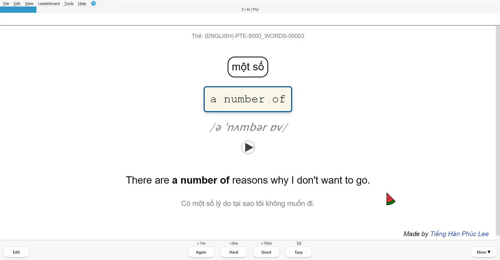


## Lưu ý khi thêm thẻ


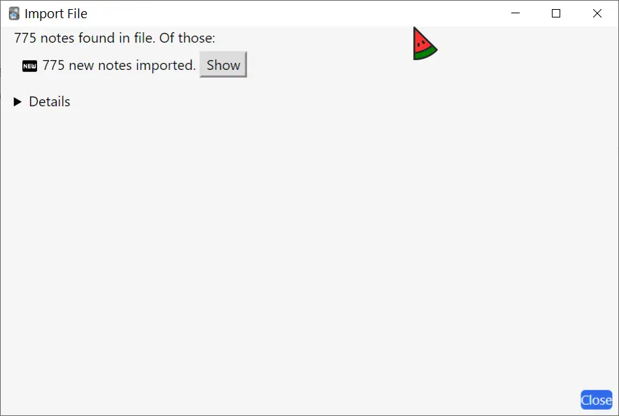

## Tải xuống

💡 **Bản 1 trong video trên là bản tải xuống chính thức.**  
🧩 **Bản 2 có âm thanh phát áo mặt trước** - Phù hợp cho những ai muốn học dễ dàng hơn bằng cách nghe trước rồi nhập đáp án. 

### 1,838 từ vựng TED-ED

<div style={{display: 'flex', justifyContent: 'left', gap: '20px'}}> 
  <a href="https://drive.google.com/file/d/11kcXbHcVzaABRrn6f_K5fFaqEn1nUFDC/view?usp=sharing"> 
    <button class="buttonPrimary" type="button">Google Drive (bản DOWNLOAD)</button> 
  </a> 
</div>

<div style={{display: 'flex', justifyContent: 'left', gap: '20px'}}> <a href="https://drive.google.com/file/d/11kMGywWeP6Wljep4bLNfCYbI8EUT5ekx/view?usp=sharing"> <button class="buttonPrimary" type="button">Google Drive (bản 2)</button> </a> </div>

### Supporting Deck

<div style={{display: 'flex', justifyContent: 'left', gap: '20px'}}> 
  <a href="https://drive.google.com/file/d/11mNwT-CfgxyyN6eq5VXQ9_sVNneTM5wP/view?usp=sharing"> 
    <button class="buttonPrimary" type="button">Google Drive (bản DOWNLOAD)</button> 
  </a> 
</div>

<div style={{display: 'flex', justifyContent: 'left', gap: '20px'}}> <a href="https://drive.google.com/file/d/11lo5znwa4XiYTmEfdRK01O4klDHxulWW/view?usp=sharing"> <button class="buttonPrimary" type="button">Google Drive (bản 2)</button> </a> </div>


---
### 2023-09-09-close-up-word-list-a1-c2-version-trieu-minh.md
---

---
title: "📚 Close-up Word List: Bộ Deck Từ Vựng Đỉnh Cao (A1 đến C2)"
slug: close-up-word-list-a1-c2-version-trieu-minh
date: 2023-09-09
description: Bộ deck từ vựng Close-up Word List, dựa trên tài liệu từ National Geographic Learning, hỗ trợ học từ A1+ đến C2 với hơn 11,000 từ.
category: Tiếng Anh
domain: ankivn.com
keywords:
  - close-up
  - vocabulary
  - english
tags:
  - deck
  - english
---


<!--truncate-->

## 📌 Nguồn bộ thẻ: 
- [Triệu Minh](https://www.facebook.com/groups/ankivocabulary/posts/1322289601864027/)

---

## 🧾 Nội dung

Tôi đã remake bộ deck **Close-up, Second Edition by National Geographic Learning** của Bro Nickolay Nonard:  
[Close-up Word List (A1+, A2, B1, B1+, B2, C1, C2)](https://ankiweb.net/shared/info/2120146162)

### 📋 Chi tiết từng cấp độ:
- **A1+**: 1623 notes
- **A2**: 1516 notes
- **B1**: 1649 notes
- **B1+**: 1801 notes
- **B2**: 1752 notes
- **C1**: 1741 notes
- **C2**: 1611 notes

**Tổng cộng**: **11,693 notes** 💯

---

## 🧩 Tính năng đặc biệt:
- **Audio**: Click vào văn bản để phát âm thanh.
- **Từ điển tích hợp**: Lạc Việt.
- **Nghĩa tiếng Việt**: Sử dụng Google Translate.
- **Hint nguyên âm**: `popular => p _ p _ l _ r`

Nếu bạn thích hint kiểu `popular => p _ _ _ _ _ r`, hãy chỉnh sửa theo hướng dẫn sau:

### 🛠 Hướng dẫn chỉnh sửa:
#### Bước 1: Xóa dòng này ở **Front Template**:
```
<div class = "sugg">{{Suggestion}}</div>

```

#### Bước 2: Thay bằng đoạn sau:

```
<div class='sent_hint'><hint>{{Word}}</hint></div>
```


#### Bước 3: Thêm đoạn script:

```
<script>
var clozes = document.querySelector('.sent_hint').querySelectorAll("hint")
for (const cloze of clozes) {
    cloze.innerHTML = cloze.textContent.replace(/\[\[([^\]]*)\]\]/g, '$1');
    cloze.innerHTML = cloze.textContent.replace(/\B\w(?=.*\s)/g, '_');
    cloze.innerHTML = cloze.textContent.replace(/(?<=\s.*)\B\w/g, '_');
    cloze.innerHTML = cloze.textContent.replace(/(?<=^[\w-]*)\B\w\B(?=[\w-]*$)/g, ' _ ');
    cloze.innerHTML = cloze.textContent.replace(/([_ ]*)/g, '<span style="color:gray">$1</span>');
}
</script>
```

## 📥 Tải xuống

### 📗 Link gốc (Mediafire)

<div style={{display: 'flex', justifyContent: 'left', gap: '20px'}}> <a href="https://www.mediafire.com/folder/3qho7e3qq7lt1/Close-up_Word_List?fbclid=IwAR3dy-wdWqJVYlu-3bW1v2FoNSsnfQDkR-kDfm5YZHowN-VnLikKjBOumlQ" target="_blank"> <button class="buttonPrimary" type="button">Mediafire</button> </a> </div>

### 📗 Ankivn 

<div style={{display: 'flex', justifyContent: 'left', gap: '20px'}}> <a href="https://drive.google.com/drive/folders/1OWl_Qd6a3q4qbmf-Trxjw27T42VdNW4w"> <button class="buttonPrimary" type="button">Google Drive</button> </a> </div>

## 📸 Preview


---

## 💬 Lời kết

Bộ deck này dành cho các bạn muốn cải thiện từ vựng qua các cấp độ từ A1+ đến C2. Hãy tải về và trải nghiệm! 🌟


---
### 2023-09-16-2000-core-english-words-book-1-level-a1-plus.md
---

---
title: "2000 Core English Words Book 1 Level A1 Plus"
slug: 2000-core-english-words-book-1-level-a1-plus
date: 2023-09-16
description: "Bộ thẻ 2000 Core English Words Book 1 Level A1 Plus với 1000 từ vựng cơ bản, hỗ trợ hình ảnh và âm thanh."
category: "Tiếng Anh"
keywords: 
  - vocabulary
  - "core words"
  - deck
tags:
  - english
  - vocabulary
---


<!--truncate-->

## Nguồn: [Anki Việt Nam](https://www.facebook.com/groups/ankivocabulary)

## Nội dung

Bộ thẻ **2000 Core English Words Book 1 Level A1 Plus** gồm **1000 từ vựng cơ bản**, được thiết kế đặc biệt cho người mới bắt đầu học tiếng Anh.

### **Tính năng nổi bật:**

✅ **Hình ảnh minh họa** - Mỗi từ vựng đều có hình ảnh minh họa trực quan
✅ **Âm thanh** - Phát âm chuẩn cho mỗi từ vựng
✅ **Ví dụ** - Các câu ví dụ thực tế giúp hiểu cách sử dụng từ
✅ **Dịch nghĩa** - Giải thích chi tiết bằng tiếng Việt

## Preview


## Tải xuống

<div style={{display: 'flex', justifyContent: 'left', gap: '20px'}}>
  <a href="https://drive.google.com/drive/folders/1--pbnFecgjo-IbxFD2VxQwo6xOB2nRub?usp=drive_link">
    <button class="buttonPrimary" type="button">Google Drive</button>
  </a>
</div>


---
### 2023-10-03-cau-truc-tieng-anh-danh-cho-thptqg-giao-dien-moi-tong-on-ngu-phap-co-trang-anh.md
---

---
title: "Cấu trúc tiếng Anh dành cho THPTQG (giao diện mới) - Tổng ôn ngữ pháp cô Trang Anh"
slug: cau-truc-tieng-anh-danh-cho-thptqg-giao-dien-moi-tong-on-ngu-phap-co-trang-anh
date: 2023-10-03
description: "Chia sẻ bộ thẻ Tổng Ôn Ngữ Pháp dành cho ôn thi THPTQG."
category: "Tiếng Anh"
keywords: 
  - ankivn
  - grammar
  - deck
tags:
  - deck
  - english
  - grammar
---


<!--truncate-->

## Nguồn: [Tuấn Trần Thanh](https://www.facebook.com/groups/ankivocabulary/posts/1427829254643394/)

## Nội dung

Xin chào mọi người! Trong thời điểm nước rút để ôn thi THPTQG, mình chia sẻ bộ thẻ ngữ pháp dựa trên **Tổng Ôn Ngữ Pháp** của cô Trang Anh. Bộ thẻ này sẽ hỗ trợ các bạn:

- Học và ghi nhớ cấu trúc ngữ pháp quan trọng.
- Tập trung vào các chủ điểm hay xuất hiện trong các kỳ thi.

**Nguồn gốc template:** Bộ thẻ này được xây dựng dựa trên template của [**bạn Quốc Nguyễn**](https://www.facebook.com/groups/ankivocabulary/permalink/1126170504809272/) (cũng có tinh thần chia sẻ). Mình đã chỉnh sửa một chút theo thẩm mỹ cá nhân để phù hợp hơn.

Cấu trúc tiếng Anh dành cho THPT-Quốc Nguyễn

Nguồn: [Tuấn Trần Thanh](https://www.facebook.com/groups/ankivocabulary/posts/1427829254643394/)

## Preview


## 📗 Tải xuống

<div style={{display: 'flex', justifyContent: 'left', gap: '20px'}}>
  <a href="https://drive.google.com/drive/folders/1DGMI3j4hBigHlAKa69aLvT-k5m0Gxl9s?usp=sharing">
    <button class="buttonPrimary" type="button">Google Drive (ankivn)</button>
  </a>
</div>


---
### 2023-10-08-essential-idioms-in-english.md
---

---
title: "Essential Idioms in English"
slug: "essential-idioms-in-english"
date: "2023-10-08"
description: "Giới thiệu và mô tả về sách Essential Idioms in English, một tài liệu học tập hữu ích cho việc nâng cao khả năng sử dụng thành ngữ tiếng Anh."
category: Tiếng Anh
domain: ankivn.com
keywords:
  - ankivn
  - english
  - idioms
  - book
tags:
  - deck
  - english
---
  


<!--truncate-->

## Nguồn: [📖 Essential Idioms in English – AnkiWeb](https://ankiweb.net/shared/info/995462426)

## Giới thiệu

Sách **Essential Idioms in English** là một cuốn sách giáo khoa về thành ngữ tiếng Anh được viết bởi Robert James Dixson. Cuốn sách được xuất bản lần đầu tiên vào năm 1951 và đã được tái bản nhiều lần kể từ đó.

## Mô tả bộ sách

**Essential Idioms in English** bao gồm hơn 600 thành ngữ tiếng Anh, được chia thành ba cấp độ: sơ cấp, trung cấp và cao cấp. Mỗi thành ngữ được trình bày một cách chi tiết, bao gồm:

- **Định nghĩa**: Giải thích nghĩa của thành ngữ.
- **Ví dụ**: Cung cấp các ví dụ minh họa cách sử dụng thành ngữ trong câu.
- **Bài tập**: Tăng cường kỹ năng sử dụng thành ngữ thông qua các bài tập thực hành.

### **Đặc điểm nổi bật của sách**:

- “Một cuốn sách tuyệt vời cho những người muốn học thành ngữ tiếng Anh. Cuốn sách được trình bày một cách rõ ràng và dễ hiểu, với nhiều ví dụ thực tế. Tôi đã học được rất nhiều điều từ cuốn sách này.”   
  – **Trần Thị Mai**, một học viên tiếng Anh

- “Cuốn sách này đã giúp tôi hiểu được nhiều thành ngữ tiếng Anh mà tôi thường gặp trong các bài đọc và bài nghe. Tôi cảm thấy tự tin hơn khi sử dụng thành ngữ trong giao tiếp.”   
  – **Nguyễn Văn Nam**, một sinh viên đại học

- “Cuốn sách này là một tài liệu học tập tuyệt vời cho những người muốn nâng cao khả năng sử dụng thành ngữ tiếng Anh. Tôi khuyên bạn nên mua cuốn sách này nếu bạn muốn cải thiện khả năng giao tiếp tiếng Anh của mình.”   
  – **Nguyễn Thị Hà**, một giáo viên tiếng Anh


## 🔗 Tải xuống

<div style={{display: 'flex', justifyContent: 'left', gap: '20px'}}>
  <a href="https://drive.google.com/drive/folders/10IevqEV79R1cyF1W9B6d7ED5BOFwPSZQ?usp=sharing">
    <button class="buttonPrimary" type="button">Bộ thẻ & File sách</button>
  </a>
</div>


---
### 2023-10-10-1000-basic-english-words.md
---

---
title: "1000 Basic English Words"
slug: 1000-basic-english-words
date: 2023-10-10
description: "Bộ thẻ 1000 từ vựng tiếng Anh cơ bản nhất, hỗ trợ hình ảnh và âm thanh."
category: "Tiếng Anh"
keywords:
  - vocabulary
  - "basic words"
  - deck
tags:
  - english
  - vocabulary
---


<!--truncate-->

## Nguồn: [Anki Việt Nam](https://www.facebook.com/groups/ankivocabulary)

## Nội dung

Bộ thẻ **1000 Basic English Words** cung cấp 1000 từ vựng tiếng Anh cơ bản nhất, phù hợp cho người mới bắt đầu.

### **Tính năng nổi bật:**

✅ **Từ vựng cơ bản** - 1000 từ thông dụng nhất
✅ **Hình ảnh minh họa** - Giúp ghi nhớ từ vựng dễ dàng
✅ **Âm thanh** - Phát âm chuẩn cho mỗi từ
✅ **Ví dụ** - Các câu ví dụ thực tế

## Preview


## Tải xuống

<div style={{display: 'flex', justifyContent: 'left', gap: '20px'}}>
  <a href="https://drive.google.com/drive/folders/1sOqOTfqOjVKa0MIpWR_k1vXdzlGQD7Wn?usp=drive_link">
    <button class="buttonPrimary" type="button">Google Drive</button>
  </a>
</div>


---
### 2023-10-12-english-grammar-in-use-activities.md
---

---
title: "English Grammar in Use Activities"
slug: english-grammar-in-use-activities
date: 2023-10-12
description: "Bộ thẻ bài tập ngữ pháp tiếng Anh dựa trên sách English Grammar in Use."
category: "Tiếng Anh"
keywords:
  - grammar
  - activities
  - deck
tags:
  - english
  - grammar
---


<!--truncate-->

## Nguồn: [Anki Việt Nam](https://www.facebook.com/groups/ankivocabulary)

## Nội dung

Bộ thẻ **English Grammar in Use Activities** cung cấp các bài tập thực hành ngữ pháp tiếng Anh một cách hiệu quả.

### **Tính năng nổi bật:**

✅ **Bài tập đa dạng** - Nhiều dạng bài tập khác nhau
✅ **Giải thích chi tiết** - Hướng dẫn cách làm bài
✅ **Đáp án** - Kiểm tra kết quả ngay lập tức
✅ **Hình ảnh minh họa** - Giúp hiểu bài tập dễ dàng hơn

## Preview


## Tải xuống

<div style={{display: 'flex', justifyContent: 'left', gap: '20px'}}>
  <a href="https://drive.google.com/drive/folders/10DRQb7-lstcvjeWb883iv-1nWV1zACyS?usp=drive_link">
    <button class="buttonPrimary" type="button">Google Drive</button>
  </a>
</div>


---
### 2024-01-06-3000-common-english-words.md
---

---
title: "3000 Common English Words - từ vựng tiếng Anh thông dụng"
slug: 3000-common-english-words
date: "2024-01-06"
description: "Bộ thẻ Anki 3000 từ vựng tiếng Anh thông dụng, có audio và hình ảnh minh họa."
category: "Tiếng Anh"
keywords:
  - ankivn
  - english
  - vocabulary
  - flashcards
tags:
  - deck
  - english
readingTime: 5
---

<!--truncate-->

## Nguồn: [Nguyễn Nhàn - Nhóm Anki Vocabulary](https://www.facebook.com/groups/ankivocabulary/posts/1545738989519086/)

## Nội dung 

Bộ thẻ **3000 Common English Words** cung cấp 3000 từ vựng tiếng Anh thông dụng nhất, phù hợp cho người học ở mọi trình độ.

### **Tính năng nổi bật:**

✅ **Từ vựng phổ biến** - 3000 từ thông dụng nhất trong tiếng Anh
✅ **Hình ảnh minh họa** - Giúp ghi nhớ từ vựng dễ dàng hơn
✅ **Định nghĩa chi tiết** - Giải thích nghĩa và cách sử dụng
✅ **Tùy chỉnh linh hoạt** - Bạn có thể sửa đổi hình ảnh theo ý thích

### **Lưu ý:**

📌 Một số từ có thể chưa có hình ảnh minh họa
📌 Bạn có thể tùy chỉnh thêm hình ảnh theo cách giúp bạn dễ nhớ nhất
📌 Hãy chia sẻ góp ý của bạn để chúng tôi có thể cải thiện bộ thẻ tốt hơn

## Tải xuống

<div style={{display: 'flex', justifyContent: 'left', gap: '20px'}}> 
  <a href="https://drive.google.com/drive/folders/1-hVLX2divc8DQe-u3SwcG9iZEMwirb_i?usp=sharing"> 
    <button class="buttonPrimary" type="button">Google Drive (ankivn)</button> 
  </a> 
</div>


---
### 2024-03-01-200-common-english-conversation-phrases.md
---

---
title: 200 câu giao tiếp thường dùng trong tiếng Anh
slug: 200-common-english-conversation-phrases
date: 2024-03-01
description: Bộ flashcard 200 câu giao tiếp tiếng Anh thông dụng kèm ví dụ thực tế
category: Tiếng Anh
keywords:
  - ankivn
  - english
  - communication
  - flashcards
tags:
  - deck
  - english
---

<!--truncate-->

## Nguồn: [Nguyễn Nhân - Nhóm Anki Vocabulary](https://www.facebook.com/groups/ankivocabulary/posts/1577771252982526/)

## Nội dung

Sưu tầm các câu giao tiếp thường dùng trong tiếng Anh.  
Mình gửi các bạn Flashcard mình đã làm khoảng hơn 200 câu đó á!

## Tải xuống

<div style={{display: 'flex', justifyContent: 'left', gap: '20px'}}> <a href="https://drive.google.com/drive/folders/1xENe_2AqRZnWlWVvjuPLqkO0KHWiF--2?usp=sharing"> <button class="buttonPrimary" type="button">Bản gốc từ tác giả</button> </a> </div>


---
### 2024-05-20-tao-bo-the-grammar-in-use-tich-hop-ai.md
---

---
title: Tạo bộ thẻ Grammar in Use tích hợp AI
slug: tao-bo-the-grammar-in-use-tich-hop-ai
date: 2024-05-20
description: Hướng dẫn tạo bộ thẻ Grammar in Use tích hợp AI để học ngữ pháp tiếng Anh hiệu quả
category: Tiếng Anh
keywords:
  - anki
  - AI
  - grammar
  - english
tags:
  - deck
  - english
  - grammar
---

<!--truncate-->

## Nguồn:  [Nguyễn Thiện Nghĩa](https://www.facebook.com/groups/ankivocabulary/posts/1626406964785621/)


---

import VideoPlayer from '@site/src/components/VideoPlayer';

## Video Demo

<VideoPlayer src="/images/Demo-1.mp4" controls />

---

## Hướng dẫn

**Bước 1:** Vào [Groq API Keys](https://console.groq.com/keys) đăng ký tài khoản và tạo API key.

**Bước 2:** Dán API key vào template bộ thẻ.

---

## Video hướng dẫn

<VideoPlayer src="/images/Hướng-dẫn.mp4" controls />

---

## Tải xuống

<div style={{display: 'flex', justifyContent: 'left', gap: '20px'}}>
  <a href="https://drive.google.com/open?id=1InGA6nvTEergFmutBzsnnKLXcYTwoNgC&usp=drive_fs">
    <button class="buttonPrimary" type="button">Google Drive</button>
  </a>
</div>


---
### 2024-06-01-ets-toeic-2016.md
---

---
title: ETS TOEIC 2016
slug: ets-toeic-2016
date: 2024-06-01
description: Bộ Listening TOEIC ETS 2016 sưu tầm bởi Nguyễn Quốc, chia sẻ dành cho các bạn cần tài liệu ôn luyện TOEIC.
category: Tiếng Anh
keywords:
  - ankivn
  - toeic
  - ets 2016
  - listening
tags:
  - deck
  - english
  - toeic
  - listening
---


<!--truncate-->

## Nguồn: [Nguyễn Quốc](https://www.facebook.com/groups/ankivocabulary/permalink/1633297230763261/) sưu tầm

## Nội dung

Mình có bộ Listening TOEIC ETS 2016 không biết lụm ở đâu và của ai. Mình thấy trên group chưa có ai share cả nên đăng lên cho bạn nào cần học.

**Chúc các bạn thi tốt và học tốt!**

## Preview


## Tải xuống

### Google Drive (gốc)

<div style={{display: 'flex', justifyContent: 'left', gap: '20px'}}>
  <a href="https://drive.google.com/file/d/1IqSiAxD6RakoHJUT7gvEYYETB7dOzq2x/view?usp=drive_link">
    <button class="buttonPrimary" type="button">Google Drive (gốc)</button>
  </a>
</div>


---
### 2024-06-12-4600-english-vocab-anki-vietnam.md
---

---
title: 4600 English Vocab (4000 Essential & List Oxford 3500) - Anki Việt Nam
slug: 4600-english-vocab-anki-vietnam
date: 2024-06-12
description: Public bộ thẻ ~4600 English Vocab, tổng hợp từ bộ 4000 Essential và List Oxford 3500, có đầy đủ IPA, Audio, Example và Image.
category: Tiếng Anh
tags:
  - deck
  - english
---


<!--truncate-->

## Nguồn: [Đỗ Khánh](https://www.facebook.com/groups/389845498441780/user/100001523624742/) [Nhung Nguyễn](https://www.facebook.com/groups/389845498441780/user/100008421759817/)

## Nội dung

Bộ thẻ **4600 English Vocab** giúp bạn mở rộng vốn từ vựng tiếng Anh, tổng hợp từ hai nguồn uy tín:  
- **4000 Essential English Words** - Bộ từ vựng quan trọng dành cho người học tiếng Anh.  
- **Oxford 3500** - Danh sách từ vựng cốt lõi do Oxford biên soạn.  

### 📌 Điểm nổi bật của bộ thẻ:
✓ **~4600 từ vựng chọn lọc** - Bao gồm những từ phổ biến và hữu ích nhất.  
✓ **IPA chuẩn** - Giúp phát âm chính xác ngay từ đầu.  
✓ **Audio chất lượng cao** - Luyện nghe và nói theo giọng chuẩn.  
✓ **Example thực tế** - Học từ vựng qua các ví dụ rõ ràng.  
✓ **Image trực quan** - Hình ảnh minh họa giúp nhớ từ lâu hơn.  
✓ **Tag & Subdeck theo CEFR** - Dễ dàng học theo trình độ (A1 - C2).  

📹 **Cơ chế giấu nghĩa thông minh**:  
Mặt sau của thẻ có nút **Meaning**, giúp bạn đoán nghĩa trước khi xem đáp án. Điều này rèn luyện kỹ năng suy luận và ghi nhớ từ theo ngữ cảnh, tránh học vẹt.  

Bộ thẻ được làm thủ công nên có thể còn sai sót. **Rất mong nhận được góp ý từ cộng đồng để cải thiện chất lượng!**  

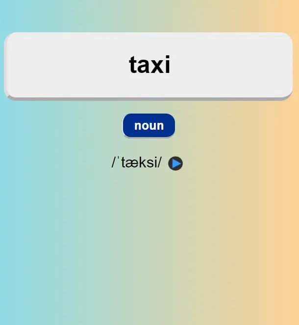
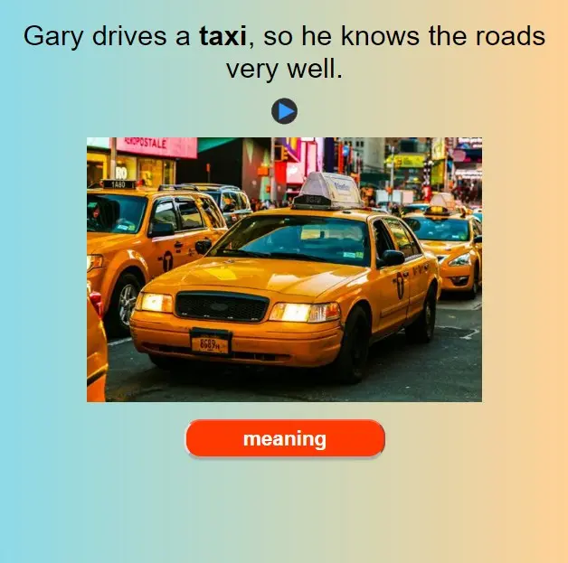
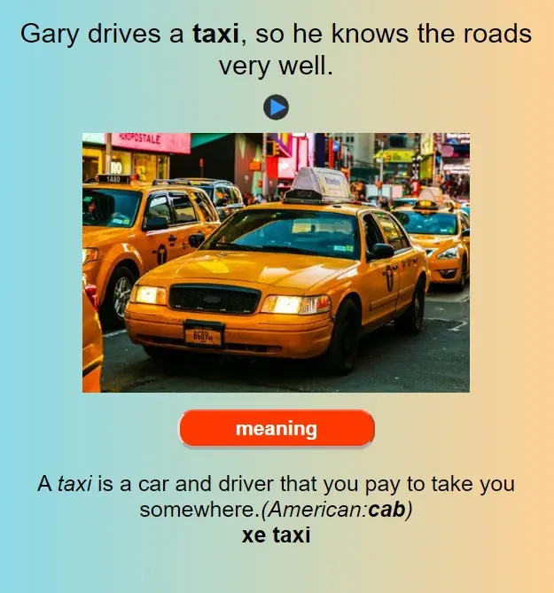

## Tải xuống

<div style={{display: 'flex', justifyContent: 'left', gap: '20px'}}> 
  <a href="https://drive.google.com/file/d/1-lK9tYRbGKV1EU81NHqZqh-ofXJXmdTI/view?usp=sharing"> 
    <button class="buttonPrimary" type="button">Google Drive (ankivn)</button> 
  </a> 
</div>


---
### 2024-06-12-destination-b1-full-version.md
---

---
title: Bộ thẻ DESTINATION B1 (bản đầy đủ hơn bộ cũ)
slug: destination-b1-full-version
date: 2024-06-12
description: Bộ flashcard Destination B1 đầy đủ nhất bao gồm từ vựng, phrasal verbs, word forms và bài tập thực hành
category: Tiếng Anh
tags:
  - deck
  - english
---


<!--truncate-->
import VideoPlayer from '@site/src/components/VideoPlayer';

<VideoPlayer src="/images/Screen-Recording%20.mov" controls />


## Nguồn: [Rosie Linh](https://www.facebook.com/groups/ankivocabulary/posts/1636510213775296/)

## Nội dung

Hi mn, đầu tiên mình cảm ơn bạn [Góc Tối](https://www.facebook.com/groups/ankivocabulary/posts/1184858722273783/) tạo ra bộ gốc, và trong quá trình sử dụng mình thấy bộ này chỉ bao gồm 2 nội dung trong giáo trình là:

- Từ vựng unit
- Phrasal verbs

Vậy nên mình đã tự biên soạn lại, để bộ deck được đầy đủ trọn vẹn theo sát giáo trình, bao gồm cả:

- **Từ vựng theo từng Unit (bao gồm cả những Unit Grammar)**
- **Phrasal verbs**
- **Word forms**
- **Prepositional Phrases**
- **WORD FORMATION**

Template học dưới dạng nhập đáp án đơn giản, dễ hiểu nhưng bao gồm đầy đủ thông tin rõ ràng, giúp các bạn **nắm trọn cuốn sách** luôn ạ.

## Cách học:

1. Đối với từ vựng theo chủ đề của từng Unit -> Nghe từ vựng, viết lại đúng chính tả rồi đoán nghĩa.
2. Đối với cách học cụm từ và phrasal verbs -> Nhìn nghĩa (tiếng việt, definition tiếng anh, câu gap-filling) -> đoán từ.
3. Đối với dạng bài word form, thì đọc kỹ câu & bản dịch, để cân nhắc rồi type đúng dạng của từ loại.

Ngoài ra, mình đang finalize bộ Destination B2 (gần xong) & Bộ C1C2 đang trong quá trình soạn data (mình tự soạn theo sách, vì hiện mình cũng đang học + dạy bộ này nên data mình tự soạn để yên tâm sử dụng & với hy vọng các bạn được **học trọn vẹn giáo trình nhất có thể**)

---

## 🔗 Tải xuống

<div style={{display: 'flex', justifyContent: 'left', gap: '20px'}}> <a href="fahttps://drive.google.com/drive/folders/1rLSdAMs6hHZ5vf7Nh0U_BLeN20v5Q5am"> <button class="buttonPrimary" type="button">Google Drive (Gốc)</button> </a> </div>

<div style={{display: 'flex', justifyContent: 'left', gap: '20px'}}> <a href="https://drive.google.com/drive/folders/1-oPvO1AeGr53aJ_c6JqyNFU2fw4adDxx?usp=sharing"> <button class="buttonPrimary" type="button">Google Drive (ankivn)</button> </a> </div>

---

Các bạn download bộ B1 này của mình trải nghiệm thử, cho mình xin feedback, và lỗi để mình cải thiện, mình sẽ sớm release bộ B2, và C1C2 trong thời gian sắp tới nhé!

À, mình biên soạn cả bộ luyện thi **CAMBRIDGE KET** **(từ cuốn 1-7)** và bộ **CAMBRIDGE** **PET** **(cuốn 1- 9)**, bạn nào có nhu cầu học, luyện theo giáo trình cambridge thì ib mình.

Nếu thấy bộ deck của mình hữu ích, và công sức đáng được trân trọng thì các bạn có thể donate qua tài khoản bên dưới. Mình sẽ tiếp tục biên soạn kỹ nhất có thể và update bộ decks tiếp theo sớm.

```
Ngân hàng: VIETCOMBANK
Chủ TK: LUONG THANH BAO
STK: 0911000052407
```


---
### 2024-07-22-bo-de-thi-toeic-ets-2023.md
---

---
title: Bộ đề thi TOEIC ETS 2023
slug: bo-de-thi-toeic-ets-2023
date: 2024-07-22
description: Bộ đề thi TOEIC ETS 2023 với đầy đủ hướng dẫn, mẹo làm bài và link tải xuống.
category: Tiếng Anh
tags:
  - deck
  - english
  - toeic
---


<!--truncate-->

## Nguồn: [Phạm Văn Lượng](https://www.facebook.com/groups/ankivocabulary/posts/1663916001034717)

## Nội dung

### **📌 Các mẹo sử dụng hiệu quả:**

🔹 **Điều chỉnh tốc độ audio để phù hợp với trình độ học**  
Bạn có thể tải thêm add-on hỗ trợ tăng/giảm tốc độ audio:  
➡ [Audio Playback Controls](https://ankiweb.net/shared/info/312734862)  

🔹 **Hiển thị phần dịch nghĩa linh hoạt**  
Trong **back** của thẻ **Part 7**, bạn chỉ cần **nhấp vào câu hỏi** để hiển thị hoặc ẩn phần dịch nghĩa.  

🔹 **Bộ đề ETS đầy đủ từ 2019 đến 2024**  
Bộ thẻ đã cập nhật đầy đủ **ETS2019 - ETS2024**. Bạn có thể học thử trong **Deck ETS2023** trước khi quyết định sử dụng toàn bộ bộ đề.  

📢 **Trải nghiệm toàn bộ bộ đề với đầy đủ tính năng chuyên sâu** (**có tính phí**):  
👉 [Đăng ký tại đây](https://forms.gle/uE55mYH8nZaHkriy7)  

## Tải xuống

<div style={{display: 'flex', justifyContent: 'left', gap: '20px'}}> 
  <a href="https://drive.google.com/file/d/10U-4jaiQslxYsH0Zo64lObCLJYf2s5ws/view"> 
    <button class="buttonPrimary" type="button">Google Drive</button> 
  </a> 
</div>


---
### 2024-09-04-1400-tu-vung-english-cho-nguoi-mat-goc.md
---

---
title: 1400 Từ Vựng English Dành Cho Người Mất Gốc
slug: 1400-tu-vung-english-cho-nguoi-mat-goc
date: 2024-09-04
description: Bộ thẻ 1400 từ vựng English âm thanh tương tự dành cho người mất gốc, có đầy đủ âm thanh, ví dụ cụ thể và dễ học.
category: Tiếng Anh
tags:
  - deck
  - english
---

<!--truncate-->

## Nội dung

❤️❤️❤️ Mình chia sẻ với mọi người bộ thẻ **1400 từ vựng English âm thanh tương tự dành cho người mất gốc** ạ!

- Bộ thẻ rất nhẹ chỉ **5MB**, có đầy đủ **âm thanh, ví dụ cụ thể**.
- Áp dụng **kỹ thuật âm thanh tương tự** được giới thiệu trong cuốn sách *Tôi tài giỏi, bạn cũng thế* của **Adam Khoo**.
- **Dành cho người muốn biết tiếng Anh nhưng lười học, trí nhớ kém**.
- **Phù hợp cho học sinh cấp 1, 2, 3**.
- **Dành cho người mới bắt đầu làm quen với tiếng Anh**.

## Tải xuống

<div style={{display: 'flex', justifyContent: 'left', gap: '20px'}}> <a href="https://ankiweb.net/shared/info/1732615076"> <button class="buttonPrimary" type="button">AnkiWeb</button> </a> </div>

<div style={{display: 'flex', justifyContent: 'left', gap: '20px'}}> 
  <a href="https://drive.google.com/file/d/1xH8lkdZ9nAbHEKbP0SYH230hC36h5-vV/view?usp=sharing"> 
    <button class="buttonPrimary" type="button">Google Drive (AnkiVN)</button> 
  </a> 
</div>


---
### 2024-09-12-4000-tu-vung-pte-collocations-vi-du.md
---

---
title: "4000 Từ Vựng PTE Collocations & Ví Dụ"
slug: 4000-tu-vung-pte-collocations-vi-du
date: 2024-09-12
description: "Bộ thẻ 4000 từ vựng PTE kèm collocations và ví dụ minh họa."
category: "Tiếng Anh"
keywords:
  - pte
  - vocabulary
  - collocations
tags:
  - english
  - vocabulary
---


<!--truncate-->

## Nguồn: [Admin Phúc](https://www.facebook.com/groups/ankivocabulary/posts/1835202733906042/)

## Nội dung

Bộ thẻ **4000 Từ Vựng PTE** được thiết kế đặc biệt cho việc học từ vựng và collocations, giúp bạn nâng cao điểm số PTE.

### **Tính năng nổi bật:**

✅ **Collocations** - Các cụm từ thông dụng trong tiếng Anh
✅ **Ví dụ thực tế** - Minh họa cách sử dụng từ trong ngữ cảnh
✅ **Phát âm** - Audio chuẩn cho mỗi từ vựng
✅ **Hình ảnh** - Minh họa trực quan giúp ghi nhớ tốt hơn

## Preview


## Tải xuống

<div style={{display: 'flex', justifyContent: 'left', gap: '20px'}}>
  <a href="https://drive.google.com/file/d/11kcXbHcVzaABRrn6f_K5fFaqEn1nUFDC/view?usp=sharing">
    <button class="buttonPrimary" type="button">3231 TỪ PTE</button>
  </a>
</div>

<div style={{display: 'flex', justifyContent: 'left', gap: '20px'}}>
  <a href="https://drive.google.com/file/d/11mNwT-CfgxyyN6eq5VXQ9_sVNneTM5wP/view?usp=sharing">
    <button class="buttonPrimary" type="button">775 COLLOCATIONS THÔNG DỤNG</button>
  </a>
</div>

---
### 2024-11-02-longman-communication-3000.md
---

---
title: "Longman Communication 3000"
slug: longman-communication-3000
date: 2024-11-02
description: "Bộ thẻ 3000 từ vựng thông dụng nhất trong giao tiếp tiếng Anh theo Longman."
category: "Tiếng Anh"
image: https://ankivn.com/images/anki_sigXngBVV1.webp
keywords:
  - longman
  - vocabulary
tags:
  - english
  - vocabulary
---


<!--truncate-->

## Nguồn: [Triệu Minh](https://www.facebook.com/groups/ankivocabulary/posts/1739018540191129/)

## Nội dung

Bộ thẻ **Longman Communication 3000** gồm **3,604 notes**, giúp bạn học từ vựng hiệu quả với hệ thống phân loại thông minh.

### **Về hình ảnh**

✅ **Tích hợp 2 liên kết Google Image & Bing Image**
➡ Tìm hình ảnh phù hợp với từ vựng hoặc ví dụ chỉ bằng một cú nhấp chuột, giúp bạn cá nhân hóa bộ thẻ theo cách học của mình.

### **Về âm thanh**

🚫 **Chưa có audio** – Nếu bạn sở hữu **Hyper TTS xịn**, hãy thêm âm thanh và chia sẻ cùng cộng đồng Anki.

**Gợi ý voice Hyper TTS:**
- 🎤 **Giọng nữ (UK)**: `English(UK), Female, en-GB-News-H (Google)` (Dùng cho Word & Example)
- 🎤 **Giọng nam (UK)**: `English(UK), Male, en-GB-Studio-B (Google)` (Dùng cho Definition)

### 📖 **Tích hợp Goldendict – Tra cứu dễ dàng hơn**

## Preview


## Tải xuống

<div style={{display: 'flex', justifyContent: 'left', gap: '20px'}}>
  <a href="https://drive.google.com/drive/folders/11eSvDE8IuER1i5acZ6mSCM4E-1gotxOp?usp=drive_link">
    <button class="buttonPrimary" type="button">Google Drive</button>
  </a>
</div>


---
### 2025-04-14-anki-speaking-hackers-ielts.md
---

---
title: Anki Speaking Hackers IELTS - Bộ thẻ luyện phản xạ Speaking
slug: anki-speaking-hackers-ielts
date: 2025-04-14
description: Bộ Anki Speaking luyện phản xạ theo giáo trình Hackers IELTS, gồm mẫu câu Anh - Việt giúp tăng sự tự tin và phản xạ trong thi nói IELTS.
category: "Tiếng Anh"
image: https://ankivn.com/images/Untitled-1744630983274.webp
tags:
  - deck
  - english
---

<!--truncate-->

## Nguồn: [Vivian Le](https://www.facebook.com/groups/389845498441780?multi_permalinks=1855821088510873)

---

## Nội dung

Tặng bộ Anki Speaking chuyên luyện IELTS từ bộ HACKERS IELTS.

Khả năng phản xạ và sự tự tin trong Speaking là một yếu tố giúp bạn giành ấn tượng với examiner ngay từ những câu đầu tiên. Anki là phần mềm giúp bạn boost cực kì nhanh hai kỹ năng đó. Bộ Anki này đã tích hợp các mẫu câu thông dụng (Anh - Việt) trong kì thi IELTS.

Mong sẽ có nhiều bạn hơn nữa sẽ đạt điểm cao trong kì thi này.

---

  


---

## 🔗 Tải xuống

<div style={{display: 'flex', justifyContent: 'left', gap: '20px'}}> 
  <a href="https://drive.google.com/drive/folders/1E037IMUaPBcUahMmAINjSiVMba8HPvNQ"> 
    <button class="buttonPrimary" type="button">Google Drive (tác giả)</button> 
  </a> 
</div>


---
### 2025-04-29-anki-cambridge-reading-120.md
---

---
title: Anki Bộ CAM 120 - Từ vựng Reading Cambridge 1–19
slug: anki-cambridge-reading-120
date: 2025-04-29
description: Anki deck hơn 9000 từ vựng chuyên sâu cho phần Reading Cambridge IELTS 1–19, giúp tối ưu hóa luyện tập từ vựng thi IELTS.
category: English
image: https://ankivn.com/images/2025-04-29-anki-cambridge-reading-120-1745934886109.webp
tags:
  - deck
  - english
---


<!--truncate-->

## Nguồn: [Đỗ Đặng Hoàng Ánh](https://www.facebook.com/groups/ankivocabulary/permalink/1859885138104468/?rdid=vDbvYGQVhGwhUg8Y#/)

## Nội dung

Bộ thẻ được tổng hợp và chia sẻ cho cộng đồng học `IELTS Reading` nhanh chóng và hiệu quả hơn.

Trang cập nhật và tải các bộ thẻ (chính chủ): [Anki Bộ CAM 01-20](https://sites.google.com/view/ankibocam120/)

---

## Chi tiết

- Hơn **9000 từ vựng** từ `Cambridge IELTS 01–19`.
- Phân chia chi tiết:
  - Theo **quyển** (r)
  - Theo **test** (t)
  - Theo **passage** (p)
- Hỗ trợ tốt cho:
  - Điện thoại 📱
  - Máy tính bảng 📲
  - Chế độ ban đêm 🌙
- Tiết kiệm thời gian học tập, tối ưu hóa hiệu quả luyện Reading.

> 📖 Bộ thẻ tập trung vào **phần Reading**, giúp bạn làm chủ từ vựng trọng điểm xuất hiện thường xuyên trong **đề thi IELTS**.

---

## Gợi ý dành cho người học

- **Mức độ phù hợp**:
  - Phù hợp với bạn nào đang ở **B1 trở lên**.
  - Đặc biệt hữu ích nếu bạn đã hoàn thành **ít nhất 4/6 quyển** `4000 Essential English Words`.
- **Chiến lược học tập**:
  - Trình độ **B2 trở lên** có thể học nhanh một lượt rồi lướt review các từ.
  - Bộ thẻ được thiết kế cho những bạn **phấn đấu mục tiêu IELTS Reading 7.0+**.
  
> 🚀 Khuyến nghị sử dụng `AnkiBoCAM120` như công cụ chính trong giai đoạn nước rút chinh phục Reading Band 7 trở lên.


---

## Hiện tại

Hiện tại bộ **AnkiBoCAM120** mới chia sẻ **Test 1 – Quyển 18** để người học làm quen với cách sử dụng.

Các phần còn lại đang được biên soạn và sẽ được cập nhật theo từng TEST.

<div style={{display: 'flex', justifyContent: 'left', gap: '20px', flexWrap: 'wrap'}}>
	  <a href="https://forms.gle/EMC6uBkZmHGcWnZr8">
	    <button class="buttonPrimary" type="button">Đăng ký nhận phần mới</button>
	  </a>
</div>

---

## Thời gian ước lượng

| Thời lượng học mỗi bài | Tổng thời gian | Thời gian hoàn thành |
|:-----------------------|:---------------|:---------------------|
| 20 phút | ~76 giờ | ~16 ngày (5 tiếng/ngày) |
| 60 phút | ~228 giờ | ~115 ngày (2 tiếng/ngày) |

> Việc sử dụng bộ thẻ có sẵn giúp rút ngắn đáng kể thời gian chuẩn bị tài liệu, tập trung tối đa vào luyện tập.

---

## 🔗 Tải xuống

<div style={{display: 'flex', justifyContent: 'left', gap: '20px', flexWrap: 'wrap'}}>
	  <a href="https://drive.google.com/open?id=1p2sk8Odi1yMnzfq6Cck4pe7U93Ir0cB6&usp=drive_fs">
	    <button class="buttonPrimary" type="button">Google Drive (ankivn)</button>
	  </a>
</div>

---

## Feedback

Nếu bạn có ý tưởng cải tiến, kinh nghiệm sử dụng tốt hơn, hoặc góp ý bổ sung bộ thẻ, hãy chia sẻ cùng cộng đồng!

Cùng nhau luyện Reading nhanh hơn, đạt mục tiêu IELTS cao hơn 🚀

---

## PDF Hướng dẫn

<div style={{display: 'flex', justifyContent: 'left', gap: '20px', flexWrap: 'wrap'}}>
	  <a href="https://www.mediafire.com/file/l55uiwloujq4qez/Gioithieu_Huongdan_v005.pdf/file">
	    <button class="buttonPrimary" type="button">PDF Hướng Dẫn</button>
	  </a>
  </div>

---

<iframe src="https://drive.google.com/file/d/1EmPiaRPyWqScJaOh9QdsUCxOu3jijAf3/preview" width="640" height="480" allow="autoplay"></iframe>

---
### 2025-05-11-bo-the-giao-tiep-anki.md
---

---
title: "Bộ Thẻ Luyện Giao Tiếp Tiếng Anh bằng Anki (AI & Shadowing)"
slug: "bo-the-giao-tiep-anki"
date: 2025-05-11
description: >-
  Bộ thẻ giao tiếp tiếng Anh tích hợp AI, shadowing và chấm điểm phát âm,
  Bộ thẻ giao tiếp tiếng Anh tích hợp AI, shadowing và chấm điểm phát âm, dựa
  trên khóa học nổi tiếng Udemy với hơn 32.000 học viên.
category: english
keywords:
  - giao tiếp tiếng anh
  - anki speaking
  - shadowing
  - luyện nói
  - anki ai
tags:
  - deck
  - english
image: http://ankivn.com/images/2025-05-11-bo-the-giao-tiep-anki-1746969737995.webp
---

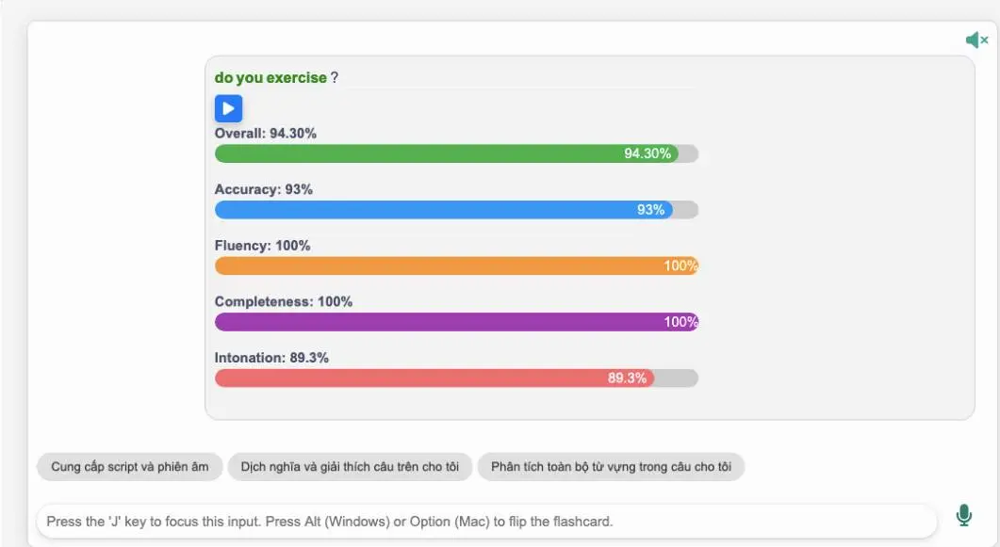

<!--truncate-->

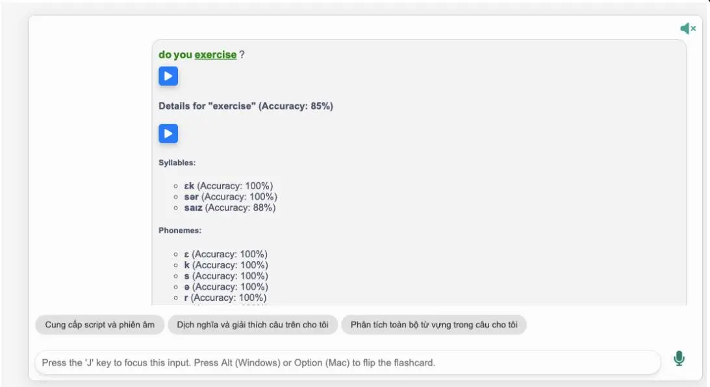
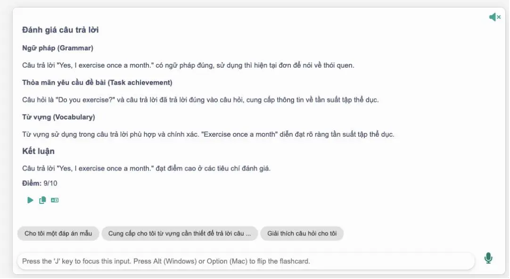
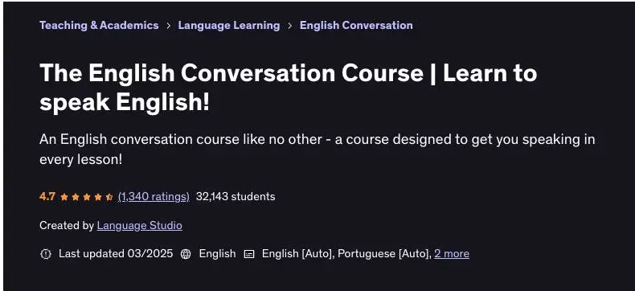

## 📝 Nguồn: 

[Nguyễn Thiện Nghĩa](https://www.facebook.com/groups/ankivocabulary/posts/1876426923116956/)

Bộ thẻ được biên soạn dựa trên khóa học giao tiếp tiếng Anh trên Udemy — **"[The English Conversation Course | Learn to speak English](https://www.udemy.com/course/the-english-conversation-course/)!"** — khóa học với **hơn 1.000 đánh giá (4.7/5)** và **hơn 32.000 học viên đăng ký**.

---

## 📚 Nội dung

**Bộ thẻ này có gì đặc biệt?**

- Tích hợp **AI và công nghệ nhận diện giọng nói**, phân tích chính xác từng âm.
- Chuyển thể từ nội dung khóa học chất lượng, phù hợp để luyện tập thực tế hàng ngày.
- Gồm **5 cấp độ** từ A1 đến C1 với **120+ chủ đề**, hiện đã hoàn thành cấp độ **Beginner**.
- Mỗi bài học có 2 phần rõ ràng:
  - **Shadowing**: luyện nghe và lặp lại theo mẫu câu.
  - **Vận dụng**: người học thực hành với AI, được chấm điểm và phản hồi.
- Người học có thể **tra hỏi AI trực tiếp** trong mỗi flashcard như đang học với giáo viên.

> ⚠️ **Lưu ý quan trọng:**
> - Cần **cài đặt addon Langki** trước khi sử dụng:  
> 👉 Mã addon: `1400986563`  
> 👉 Hoặc tải tại: [AnkiWeb - Langki Addon](https://ankiweb.net/shared/info/1400986563)
> - Bộ thẻ hoạt động trên **desktop và AnkiWeb**, chưa hỗ trợ trên ứng dụng di động.

---

## 🔗 Tải xuống

<div style={{marginBottom: "1rem"}}>
  <a class="button button--secondary" href="https://drive.google.com/file/d/1hpSeQyuaZEk3FeAcMs92kuK7dT3s1Rgu/view" target="_blank">
    Google Drive (tác giả)
  </a>
</div>

<div style={{marginBottom: "1rem"}}>
  <a class="button button--primary" href="https://drive.google.com/open?id=1kJEN2c6XOJ9Xme8CAsiWh_jZALvuKC71&usp=drive_fs" target="_blank">
    Google Drive (ankivn)
  </a>
</div>


---
### merged_files.md
---

