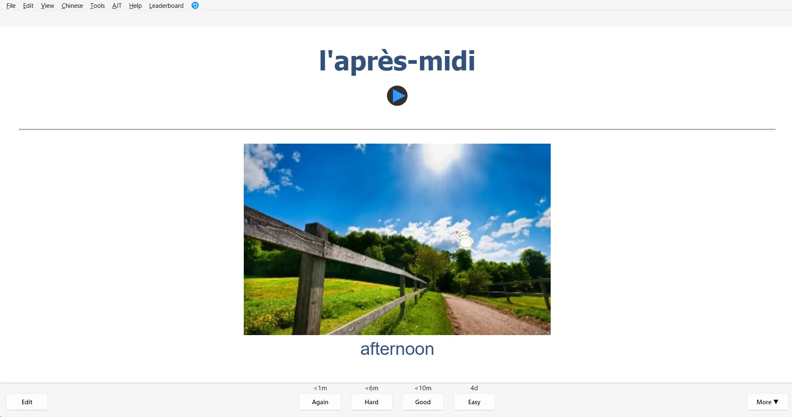
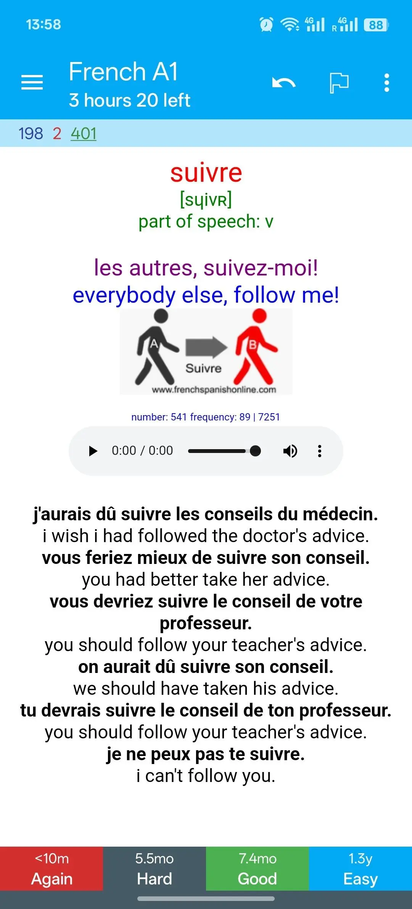

<!--truncate-->

## 📝 Nguồn:

Chia sẻ bởi **Đỗ Khánh**  
📘 Facebook: [okhanh.553672](https://www.facebook.com/okhanh.553672)  
📧 Email: donguyenkhanh96@gmail.com  

Bộ thẻ được tham khảo từ **5000 most frequently used French words** trên AnkiWeb – một trong những bộ thẻ có đánh giá cao nhất. Anh Khánh đã thêm audio, hình ảnh và chỉnh format thẻ để dễ học hơn.

---

## 📚 Nội dung

Mình đã thử qua nhiều loại thẻ khác nhau và tìm hiểu lí do đằng sau sự hiệu quả/không hiệu quả của mỗi loại. Mình rút ra như sau:

Mỗi loại thẻ có một tác dụng riêng, phù hợp với từng giai đoạn học từ vựng khác nhau:

- **Thẻ xuôi** (từ/âm thanh ở mặt trước, nghĩa/hình ảnh ở mặt sau): hiệu quả cao khi mới học để nhồi từ nhanh chóng. Giúp tăng khả năng nhận diện (recognition), từ đó hỗ trợ speaking về sau. Loại này dễ làm và tiết kiệm thời gian.

- **Thẻ ngược (cloze)**: giúp nhớ sâu và hỗ trợ speaking, phù hợp với trình độ trung cấp trở lên. Tuy nhiên, làm và học loại này khá mệt, đặc biệt với người mới bắt đầu. Phù hợp khi học từ context thực tế.

- **Thẻ câu**: khó học nhưng dễ làm. Dạng này thường là cả câu tiếng đích ở mặt trước, nghĩa ở mặt sau, có thể thêm âm thanh.

- **Thẻ typing**: hữu ích khi học ngữ pháp, nhưng tốn công làm và học cũng rất tiêu hao năng lượng.

Bộ thẻ tiếng Pháp này là **thẻ xuôi** – cực kỳ phù hợp để **nhập môn tiếng Pháp bằng Anki**. Nếu bạn có nền tảng tiếng Anh, học 20 thẻ/ngày là hoàn toàn khả thi.

⚠️ Khi học xong bộ này, KHÔNG nên tiếp tục thêm từ vựng kiểu này. Hãy **chuyển sang thẻ ngược** để tối ưu khả năng speaking và ghi nhớ sâu.

---

---

## 🔗 Tải xuống

  <a href="https://1drv.ms/u/c/e38e0d4bef38335b/EVszOO9LDY4ggOPlNgAAAAAB2aP2PMXxxZUk8ZnOGtLdNg?e=fDzN5O">
    <button class="buttonPrimary" type="button">One Drive (tác giả)</button>
  </a>

  <a href="https://drive.google.com/file/d/1D4Q3l7gxUAaNz6aqR17a2DWFccvRIUYR/view">
    <button class="buttonPrimary" type="button">Google Drive (ankivn)</button>
  </a>

 <a href="https://drive.google.com/file/d/1b2gVS56Xl5AhiOv2YDW5VbGbQvVO7MPE/view"> <button class="buttonPrimary" type="button">Google Drive (bản có thêm audio)</button> </a> 
