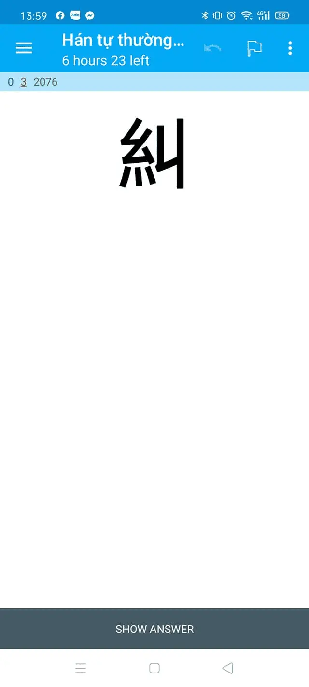

---
title: "Hán Tự Thường Dùng Kanji Mazii – Bộ thẻ 2136 Kanji thông dụng"
slug: han-tu-thuong-dung-kanji-mazii
date: 2022-07-04
description: "Bộ flashcard Anki tổng hợp 2136 Kanji thông dụng nhất trong tiếng Nhật, có đầy đủ thông tin như âm đọc, nghĩa, bộ thủ, số nét, từ ghép, ví dụ minh họa và thứ tự viết."
category: "Tiếng Nhật"
tags:
  - deck
  - japanese
---

<!--truncate-->

## 📚 **Nội dung**

**Bộ thẻ này tổng hợp 2136 Kanji thông dụng nhất** trong tiếng Nhật, được sắp xếp theo mức độ phổ biến. Mỗi thẻ bao gồm:

- **Kanji** (chữ Hán)
- **Âm đọc** (On-yomi và Kun-yomi)
- **Nghĩa tiếng Việt**
- **Bộ thủ** (radical)
- **Số nét**
- **Từ ghép** (compound words)
- **Ví dụ minh họa**
- **Thứ tự viết** (stroke order)

## 🎯 **Đặc điểm nổi bật**

- **Sắp xếp theo độ phổ biến**: Giúp bạn học những Kanji thường gặp nhất trước
- **Thông tin đầy đủ**: Cung cấp tất cả thông tin cần thiết để học và nhớ Kanji
- **Ví dụ thực tế**: Mỗi Kanji đều có từ ghép và câu ví dụ minh họa
- **Hỗ trợ âm thanh**: Có audio cho các từ ghép và ví dụ
- **Hình ảnh minh họa**: Giúp dễ nhớ hơn thông qua hình ảnh

## 🛠️ **Hướng dẫn sử dụng**

1. **Cài đặt font**: Tải font [KanjiStrokeOrders.ttf](http://www.nihilist.org.uk/) và cài vào máy
2. **Với Android**: Đặt font vào thư mục `/sdcard/AnkiDroid/fonts`
3. **Cài đặt Anki**: Tải và cài đặt [Anki](https://apps.ankiweb.net/) trên máy tính hoặc điện thoại
4. **Import deck**: Mở file .apkg đã tải về bằng Anki

## 📅 **Các bản cập nhật**

- **2022-07-04**: Phát hành bản đầu tiên
- **2022-07-10**: Thêm audio cho các từ ghép
- **2022-07-15**: Cập nhật thêm ví dụ minh họa

---

## 📥 **Tải xuống**

 <a href="https://ankiweb.net/shared/info/1234567890"> <button class="buttonPrimary" type="button">AnkiWeb</button> </a> 

 <a href="https://drive.google.com/open?id=1vxFSjWk7noPotenWhjGmum7YU2a00ltz&usp=drive_fs"> <button class="buttonPrimary" type="button">Google Drive (ankivn)</button> </a> 

---

> 💡 **Lưu ý**: Bộ thẻ này được tạo dựa trên dữ liệu từ [Mazii](https://mazii.net/), một trong những từ điển tiếng Nhật tốt nhất hiện nay.
