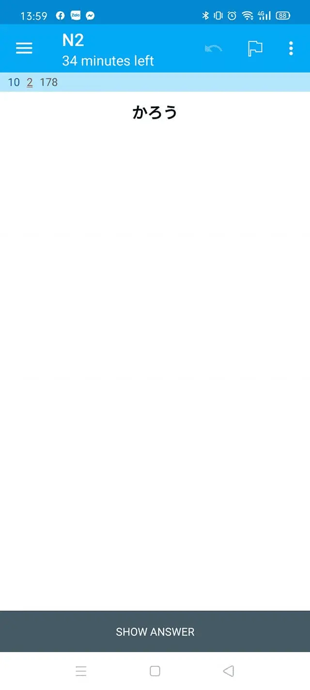
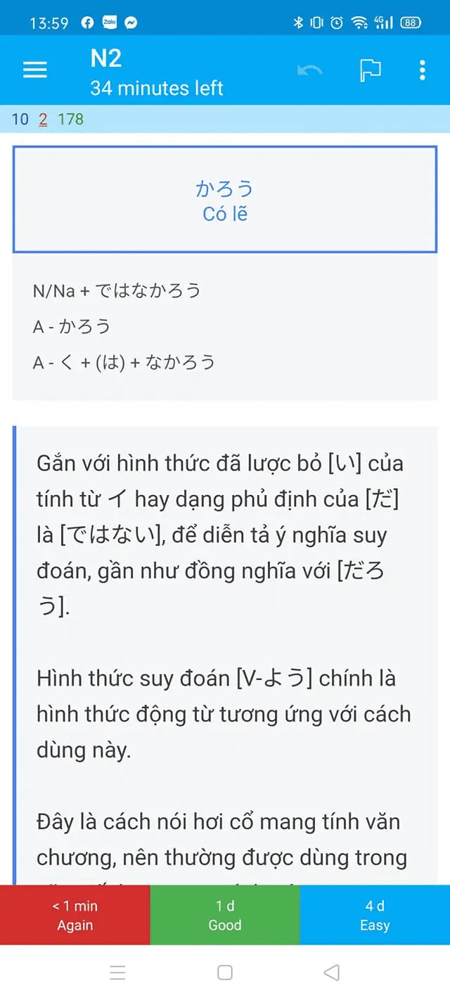

---
title: Ngữ pháp tiếng Nhật N5-N1 - Mazii
slug: ngu-phap-tieng-nhat-n5-n1-mazii
date: 2022-07-04
description: Ngữ pháp tiếng Nhật từ trình độ N5 đến N1, trích từ mazii.net, kèm hình ảnh minh họa và link tải bộ thẻ Anki
category: "Tiếng Nhật"
tags:
  - deck
  - japanese
---

<!--truncate-->

## Nguồn: [Vũ Thắng](https://www.facebook.com/groups/ankivocabulary/posts/752628205496839/?comment_id=752746578818335&reply_comment_id=994788587947465&notif_id=1629238195586186&ref=notif&notif_t=group_comment_mention)

---

## Nội dung

Ngữ pháp tiếng Nhật N5-N1, dữ liệu được lấy từ [mazii.net](http://mazii.net/).

Nếu gặp lỗi, vui lòng liên hệ **thangvm91@gmail.com**

___

## Tải xuống

 
  <a href="https://ankiweb.net/shared/info/993440660"> 
    <button class="buttonPrimary" type="button">AnkiWeb</button> 
  </a> 

 <a href="https://drive.google.com/open?id=1MoJZgvBe_6oYQcC4RmlV0SaweJvoaOvE&usp=drive_fs"> <button class="buttonPrimary" type="button">Google Drive (ankivn)</button> </a> 

