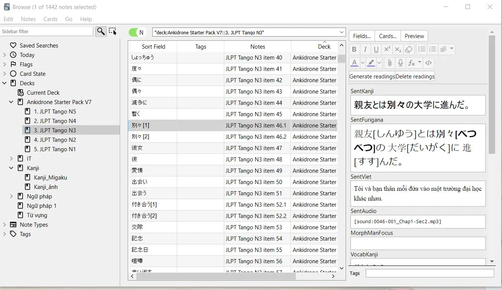
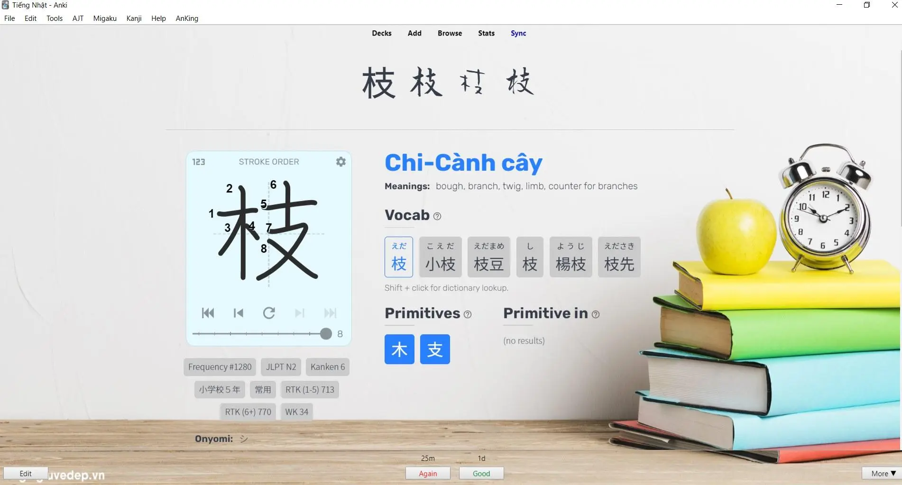
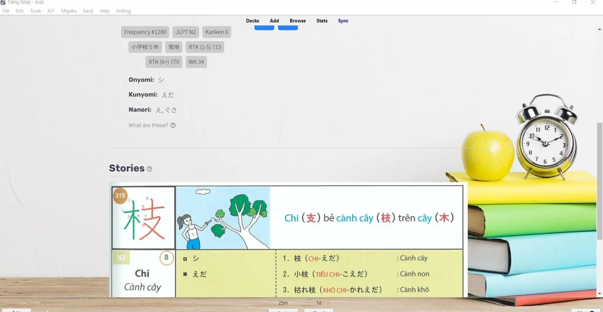
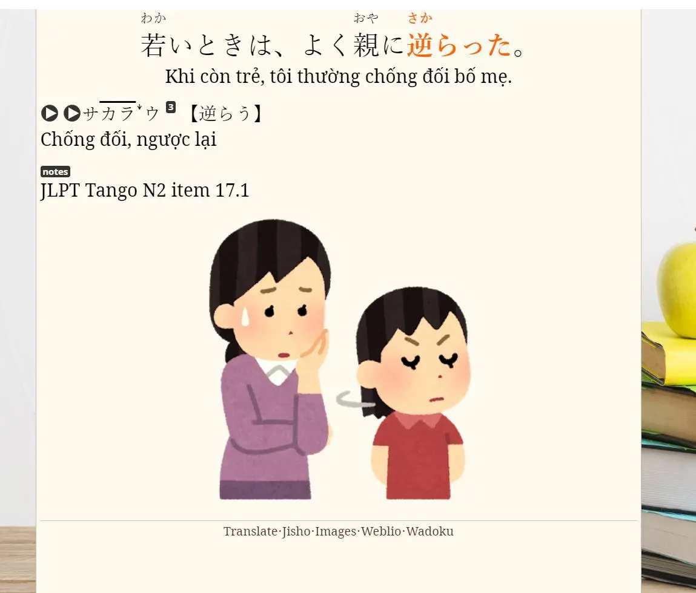

---
title: Deck Tango N3-N1 (Việt hóa)
slug: tango-n3-n2-n1-vietsub
date: 2023-06-04
description: Bộ thẻ Tango N3, N2, N1 Việt hóa - hỗ trợ học từ vựng JLPT có kèm âm thanh, dịch nghĩa tiếng Việt.
category: "Tiếng Nhật"
tags:
  - deck
  - japanese
---

<!--truncate-->

## Nguồn: [Hoàng Đức Trung - Nhóm Anki Vocabulary](https://www.facebook.com/groups/ankivocabulary/posts/1330937837665870/)

---

## Giới thiệu

Bộ thẻ **Tango N3, N2, N1 (Việt hóa)** trích từ sách *Tango N3-N1*. Thẻ có dịch nghĩa tiếng Việt và **kèm audio** minh họa.

> ⚠️ *File Tango N2 có một số audio bị lỗi, sẽ được cập nhật sau.*

Ngoài ra, đính kèm **bonus**: deck **2136 kanji tự làm** có hình minh họa cách nhớ rất trực quan.  
Bản chính của deck kanji yêu cầu cài **Migaku Addon (trả phí)**, nhưng bản demo hiện tại vẫn có thể học tốt.

---

## Tải xuống

 <a href="https://drive.google.com/open?id=1UMi0YwNArBzAKo1dZzekezLqIf-9XBku&usp=drive_fs"> <button class="buttonPrimary" type="button">Google Drive (ankivn)</button> </a> 

---

## Hình ảnh minh họa

