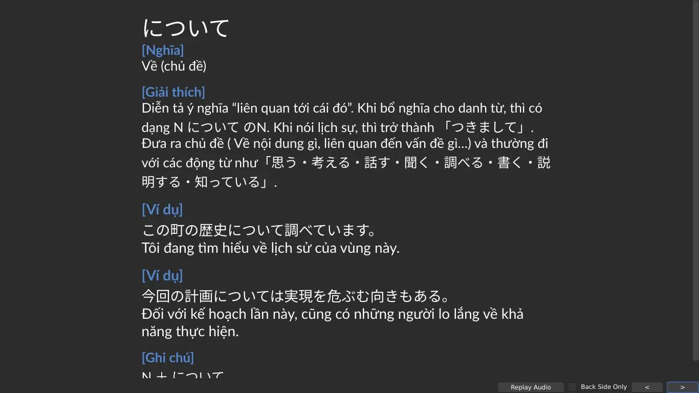

---
title: Ngữ pháp Tiếng Nhật từ N5 đến N1
slug: ngu-phap-tieng-nhat-n5-den-n1
date: 2024-08-30
description: Bộ thẻ học ngữ pháp tiếng Nhật từ N5 đến N1 dựa trên nguồn Nihongo-Kyoshi và bộ N3 khác, tổng cộng khoảng 530 thẻ.
category: "Tiếng Nhật"
image: https://ankivn.com/images/2024-08-30-ngu-phap-tieng-nhat-n5-den-n1-1743257493665.webp
tags:
  - deck
  - japanese
---

<!--truncate-->

## Nguồn: [Duy Khanh](https://www.facebook.com/groups/ankivocabulary/posts/1689858585107125)

---

## Nội dung

Bộ thẻ học ngữ pháp Tiếng Nhật từ N5 đến N1. Được tổng hợp từ bộ thẻ Tiếng Nhật gốc của Nihongo-Kyoshi (Khoảng 530 thẻ)

Đây là bộ thẻ mình xây dựng dựa trên hai bộ thẻ khác nhau (Tổng hợp ngữ pháp Tiếng Nhật của nihongo-kyoshi-net và bộ N3 khác)

Phần nghĩa câu của khá nhiều phần là mình chạy Google Dịch nên không đảm bảo nghĩa của câu đúng 100%. Mong là sẽ có ai đó hỗ trợ soát lỗi phần dịch câu. Hoặc nếu bạn có thể thiết kế mẫu thẻ trông đẹp hơn thì tuyệt :>

---

## Tải xuống

 
  <a href="https://drive.proton.me/urls/895JZ6W8WG#ivQT4yMvO7Qw"> 
    <button class="buttonPrimary" type="button">Proton (tác giả)</button> 
  </a> 

 <a href="link_google_drive_dán_vào_đây"> <button class="buttonPrimary" type="button">Google Drive (ankivn)</button> </a> 

