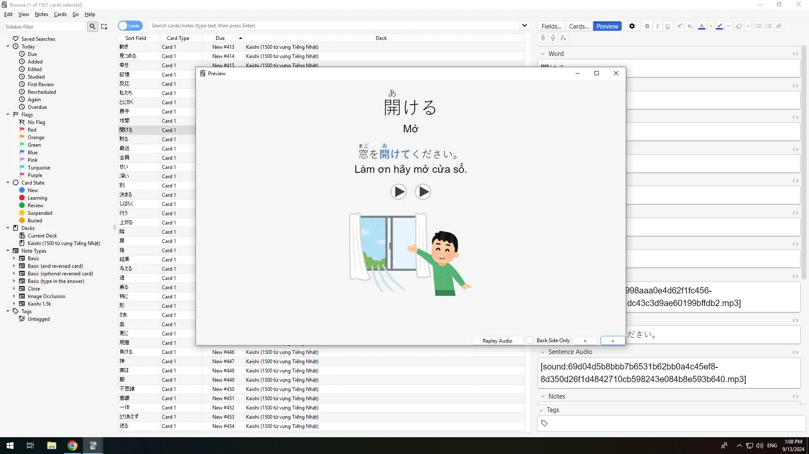
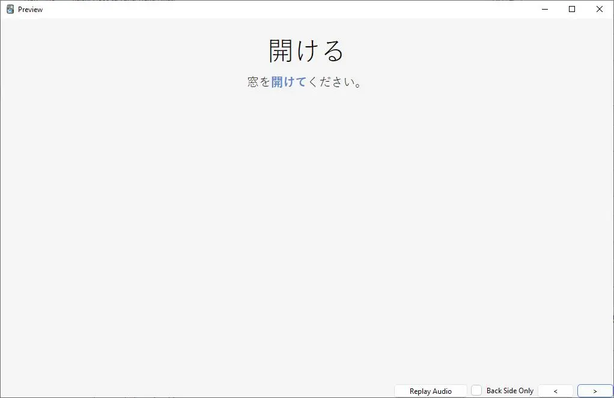

<!--truncate-->

## Nguồn: [Duy Khanh](https://www.facebook.com/groups/ankivocabulary/posts/1689858585107125)

----

## Nội dung

Bộ thẻ từ vựng Kaishi1.5k đã có Tiếng Việt!

Đây là bản dịch Tiếng Việt cho bộ thẻ Kaishi1.5k được làm bởi cộng đồng TheMoeWay, bộ thẻ này được xây dựng từ 3 bộ thẻ là Tango N5, Tango N4 và Core2k, bao gồm 1500 từ vựng phổ biến để giúp bắt đầu quá trình học Tiếng Nhật. Trên trang của AnkiVN không có bộ thẻ từ vựng mới bắt đầu nào đủ tốt và tối ưu nên :>

Bộ thẻ được làm bởi cộng đồng TheMoeWay và mình chỉ là người dịch. Để học cách học và sử dụng bộ thẻ bạn nên ghé trang của họ để đọc thêm.

Đường dẫn tới trang của TheMoeWay: [https://learnjapanese.moe/](https://learnjapanese.moe/?fbclid=IwZXh0bgNhZW0CMTAAAR0KDNN4i-eQaoR9-9sPqkx_uB1L6roHVm0ObZQgdP6Oz5cyMlxmBhl28tY_aem_dlZJBmTHxo5lj_Qm6mtSow)  
(Bản dịch Tiếng Việt cho trang của mình nếu bạn muốn đọc bằng Tiếng Việt: [https://daihocmo.github.io/tieng-nhat/](https://daihocmo.github.io/tieng-nhat/?fbclid=IwZXh0bgNhZW0CMTAAAR25iKL_so3sdg_S6dgGkokQ8DQ40jiSjW_NAGe4ZCcYgMbySus5OyszEOk_aem_eA1GfxcaY6JSa6UmPCsXog))

Chúc mọi người học tốt!!!

---

## 📥 Tải xuống

 
  <a href="https://drive.proton.me/urls/XSWAHK9K58#zIvLzYxC1V3Z"> 
    <button class="buttonPrimary" type="button">Proton</button> 
  </a> 

 <a href="https://drive.google.com/open?id=1PQBAMHIhhGTPE8QTcs9xhvQJSJe-DQOn&usp=drive_fs"> <button class="buttonPrimary" type="button">Google Drive (ankivn)</button> </a> 

