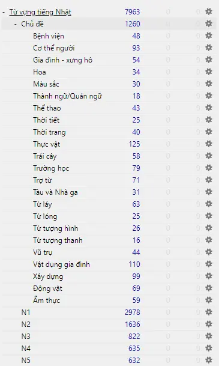
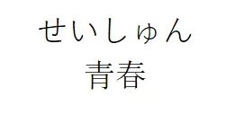
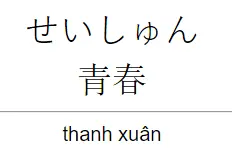

---
title: 8000 từ vựng N5-N1 (có chủ đề, hình ảnh, đảo ngược)
slug: tu-vung-n5-n1-co-chu-de-hinh-anh-dao-nguoc
date: 2025-02-20
description: Bộ thẻ Anki tiếng Nhật gồm hơn 8000 từ vựng từ N5 đến N1, có kèm từ vựng phân theo chủ đề, hình ảnh minh họa, furigana, phân loại từ loại và cập nhật thường xuyên theo quá trình học thực tế.
image: https://ankivn.com/images/2025-02-20-tu-vung-n5-n1-co-chu-de-hinh-anh-dao-nguoc-1743254159264.webp
category: "Tiếng Nhật"
tags:
  - deck
  - japanese
---

<!--truncate-->

## Nguồn: [Phạm Vũ Quang Hiếu](https://www.facebook.com/groups/ankivocabulary/posts/1004481160311541/)

## Nội dung

Bộ thẻ này bao gồm:

- Hơn **8000 từ vựng** từ trình độ N5 đến N1.
- **Các từ vựng theo chủ đề** được sưu tầm từ nhiều nguồn khác nhau trên Google.
- **Từ loại** được ghi bằng tiếng Nhật, để học hiệu quả hơn bạn nên học bộ thẻ **Chủ đề::Từ loại** trước.
- Được tích hợp **furigana**, hình ảnh minh họa, ví dụ, định nghĩa tiếng Nhật và tiếng Việt.
- Từ vựng chính được lấy từ tài liệu **Mimikara Oboeru** và được chỉnh sửa, bổ sung để phù hợp khi nhập vào Anki.

 <a href="https://docs.google.com/file/d/1gi10tUwWKE7PMwxQRx3_JnAI-pHa6cJT/edit?filetype=msexcel"> <button class="buttonPrimary" type="button">File Excel</button> </a> 

> Mọi sai sót và góp ý xin vui lòng gửi về email: `hieuqhz111@gmail.com`

## Lưu ý

Nếu bạn đã tải bộ thẻ này trước đó và muốn cập nhật theo bản mới, **có thể bạn cần xóa bộ cũ và thêm lại bộ mới**, đồng thời **phải học lại từ đầu**. Việc này có thể tốn thời gian tùy vào số lượng thẻ bạn đã học.

## Ví dụ nội dung thẻ

<table><tbody>
<tr><td><b>Meaning</b></td><td>trải rộng ra</td></tr>
<tr><td><b>Expression</b></td><td>[引[ひ]]く</td></tr>
<tr><td><b>Examples</b></td><td>カーテンを引く</td></tr>
<tr><td><b>Definition</b></td><td>張り広げる。</td></tr>
</tbody></table>

<table><tbody>
<tr><td><b>Meaning</b></td><td>tiến hành buổi thuyết trình, buổi diễn thuyết</td></tr>
<tr><td><b>Expression</b></td><td>セミナーをする</td></tr>
</tbody></table>

<table><tbody>
<tr><td><b>Meaning</b></td><td>Thời đó</td></tr>
<tr><td><b>Expression</b></td><td>[当時[とうじ]]</td></tr>
</tbody></table>

## Hướng dẫn sử dụng

Sau khi tải file, mở bằng chương trình Anki trên **máy tính** để thêm vào.  
Hiện tại không thể thêm trực tiếp vào AnkiWeb - bạn cần đồng bộ thủ công từ bản desktop nếu muốn học trên điện thoại.

## Cập nhật gần đây
