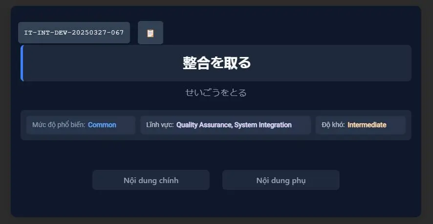
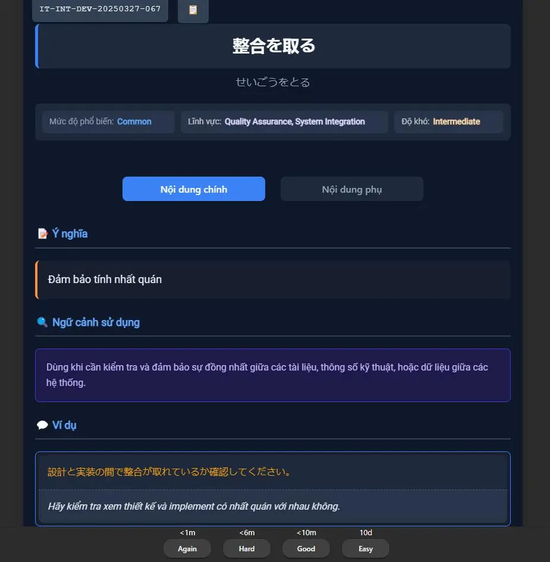
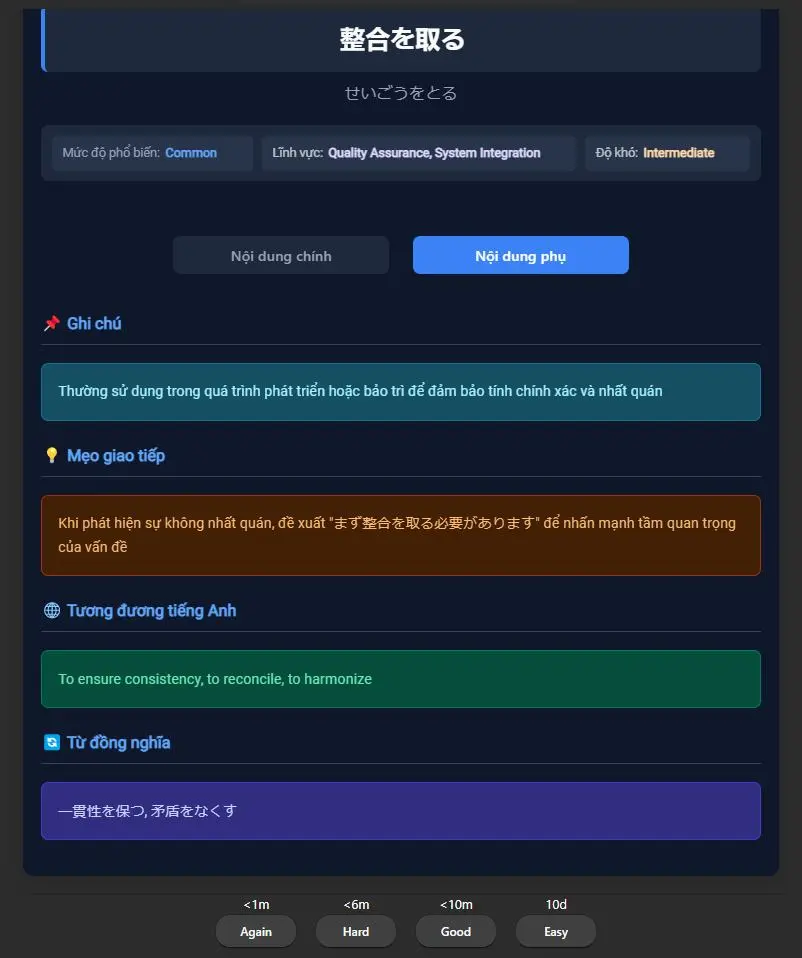

<!--truncate-->

## Nguồn: [Trần Minh](https://www.facebook.com/share/p/1AEn1sJfD5/)

Bạn đang học tiếng Nhật chuyên ngành công nghệ thông tin? Bộ **Anki từ vựng IT tiếng Nhật** này sẽ giúp bạn tăng tốc độ ghi nhớ từ vựng, cải thiện khả năng đọc tài liệu kỹ thuật, và chuẩn bị tốt hơn cho môi trường làm việc quốc tế.  

Bộ thẻ được biên soạn với ngữ cảnh thực tế, phù hợp với người học ở trình độ từ sơ trung cấp trở lên. Đây là tài nguyên quý giá nếu bạn đang theo đuổi lĩnh vực lập trình, kỹ thuật phần mềm hoặc các công việc liên quan đến IT sử dụng tiếng Nhật.

## Nội dung

**Nội dung chia sẻ từ tác giả:**

> Nhân ngày mưa ở Kyoto nên làm một bộ thẻ Anki cho loạt từ vựng chuyên ngành IT cho mọi người.  
>  
> Mình sẽ tạo thêm các bộ thẻ về Tiếng Nhật chất lượng hơn trong thời gian tới.

## Preview

  
  

## 📥 Tải xuống

 
  <a href="https://drive.google.com/file/d/1lsdGhVR3pIl-wGzQW5U-loM44xHRR6is/view?usp=sharing"> 
    <button class="buttonPrimary" type="button">Google Drive (tác giả)</button> 
  </a> 

 
  <a href="https://drive.google.com/file/d/1Wx-7HKyQLIFKtbKKxqib5C2jIzO6ZJac/view?usp=sharing"> 
    <button class="buttonPrimary" type="button">Google Drive (ankivn)</button> 
  </a> 

