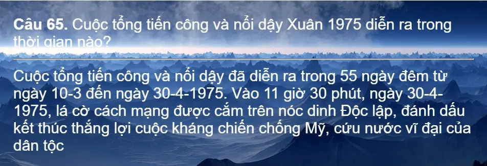
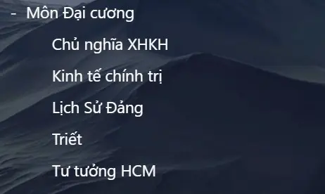

<!--truncate-->

## 📝 Nguồn:

Bài đăng trong nhóm Facebook AnkiVN:  
👉 [Xem bài viết gốc](https://www.facebook.com/groups/ankivocabulary/posts/1666565020769815/)

---

## 📚 Nội dung

Một thành viên trong cộng đồng AnkiVN đã chia sẻ bộ thẻ Anki tổng hợp các môn học Đại cương. Đây là những môn nền tảng quen thuộc với sinh viên đại học Việt Nam, thường bao gồm:

- Triết học Mác – Lênin  
- ...

Chi tiết về cách sắp xếp hoặc nội dung cụ thể của từng thẻ không được đề cập trong bài viết.

---

## 🔗 Tải xuống

 <a href="https://drive.google.com/open?id=1MnRb6gZk4BSgjFgVs7nnU3_Jzc9eRvo6&usp=drive_fs"> <button class="buttonPrimary" type="button">Google Drive (ankivn)</button> </a> 
