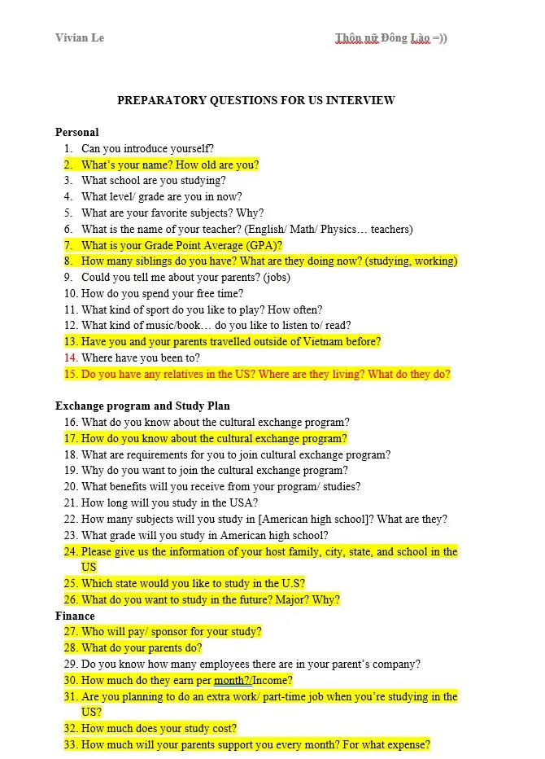
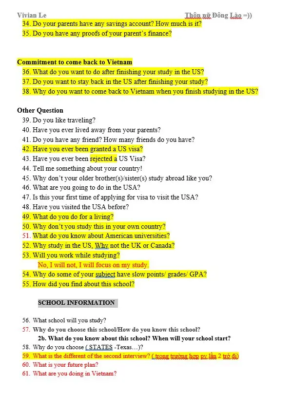

<!--truncate-->

## 📝 Nguồn:

Bộ câu hỏi phỏng vấn visa Mỹ này được mình tổng hợp kỹ lưỡng từ nhiều nguồn đáng tin cậy, dựa trên kinh nghiệm thực chiến của chính bản thân và nhiều người đã từng trượt phỏng vấn lần đầu nhưng đậu ngay ở lần thứ hai sau khi luyện tập với bộ câu hỏi này.

---

## 📚 Nội dung

Tài liệu được chia thành **6 nhóm chủ đề quan trọng** thường xuyên xuất hiện trong các buổi phỏng vấn:

- **Thông tin cá nhân (Personal)**
- **Chương trình trao đổi/ Học bổng và kế hoạch học tập (Exchange/ Scholarship Program & Study Plan)**
- **Tài chính (Finance)**
- **Cam kết quay về Việt Nam (Commitment to Return)**
- **Các câu hỏi khác (Other Questions)**
- **Thông tin về trường học tại Mỹ (School Information)**

Dù bạn đang là **nghiên cứu sinh PhD đã có học bổng** hay chỉ đơn giản muốn xin **visa du lịch Mỹ**, bộ câu hỏi này cũng sẽ là **nguồn tài liệu luyện tập cực kỳ hữu ích**, giúp bạn tự tin và chuẩn bị kỹ lưỡng cho buổi phỏng vấn.

---

## 🔗 Tải xuống

  <a class="button button--primary" href="https://drive.google.com/drive/folders/1A_OBkvIinlBlStf75ozsNtrUY7G04Jmf" target="_blank">
    Google Drive (tác giả)
  </a>

  <a class="button button--secondary" href="https://drive.google.com/file/d/1_nEsgNTZ-FPlTUrIYiUS6sdj0CTOdJEm/view?usp=sharing" target="_blank">
    Google Drive (ankivn)
  </a>

