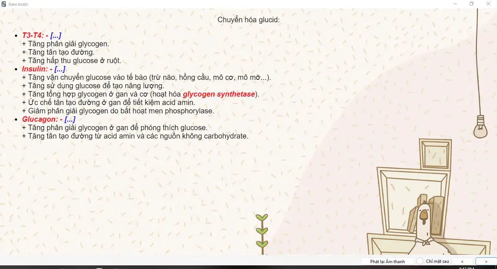
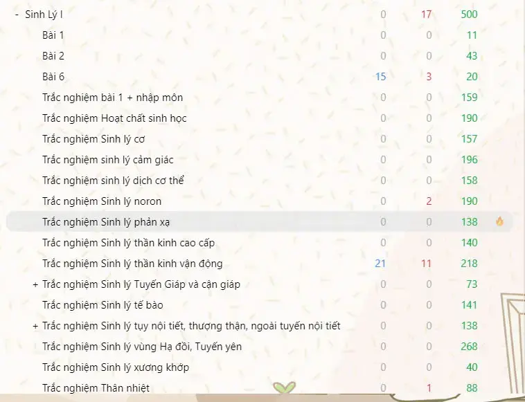
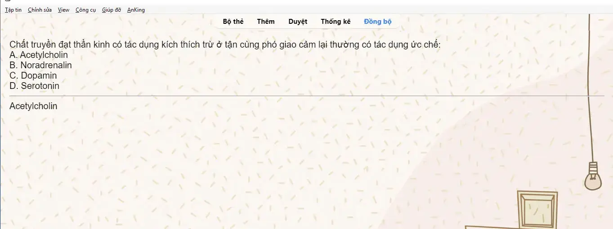

---
title: Bộ thẻ ôn tập trắc nghiệm Sinh lý 1 (3000 câu trắc nghiệm - Đại học Y dược Cần Thơ)
slug: bo-the-on-tap-trac-nghiem-sinh-ly-1-3000-cau-trac-nghiem-dai-hoc-y-duoc-can-tho
date: 2025-02-23
description: "Bộ thẻ Anki gồm 3000 câu trắc nghiệm Sinh lý 1 từ Đại học Y dược Cần Thơ, hỗ trợ ôn thi hiệu quả."
domain: ankivn.com
category: 'Y Dược'
image: http://ankivn.com/images/2025-02-23-trac-nghiem-sinh-ly-1-3000-cau-trac-nghiem-dai-hoc-y-duoc-can-tho-1743864845139.webp
keywords:
  - ankivn
  - sinh lý 1
  - trắc nghiệm sinh lý
  - đại học Y dược Cần Thơ
  - thẻ Anki Y khoa
tags:
  - deck
  - medical
---

<!--truncate-->

## Nguồn: [Sang Tran](https://www.facebook.com/groups/ankivocabulary/posts/1816493999110249)

## Giới thiệu

Mình vừa hoàn thành học phần **Sinh Lí I** và đã tổng hợp được bộ thẻ ôn tập trắc nghiệm gần **3000 câu hỏi** từ ngân hàng câu hỏi chính thức của **Đại học Y Dược Cần Thơ**. Bộ thẻ này chắc chắn sẽ giúp các bạn sinh viên dễ dàng tiếp cận, ghi nhớ kiến thức nhanh và ôn thi hiệu quả hơn.

## Nội dung bộ thẻ

- Tổng số câu hỏi: Gần **3000 câu trắc nghiệm**.
- Nguồn gốc câu hỏi: Ngân hàng đề thi của **Đại học Y Dược Cần Thơ**.
- Môn học áp dụng: **Sinh Lí I**.

## Lưu ý

Mặc dù mình đã rất cẩn thận trong quá trình tổng hợp, nhưng bộ câu hỏi khó tránh khỏi một số sai sót nhỏ. Nếu các bạn phát hiện lỗi nào, hãy giúp mình phản hồi để mình chỉnh sửa và hoàn thiện hơn nhé!

## Preview

## Yêu cầu hỗ trợ

Mình cũng đang rất cần bộ thẻ ôn thi **VSTEP**, bạn nào đang có bộ thẻ hoặc tài liệu liên quan thì chia sẻ với mình nhé! Cảm ơn các bạn rất nhiều!

Chúc các bạn học tốt và đạt kết quả cao trong kỳ thi!

## 📥 Tải xuống

 <a href="https://drive.google.com/file/d/1RG6ZwqBC8HvBHYCS5U0KiYnHZUmTgBXL/view?usp=sharing"> <button class="buttonPrimary" type="button">Google Drive (ankivn)</button> </a> 

