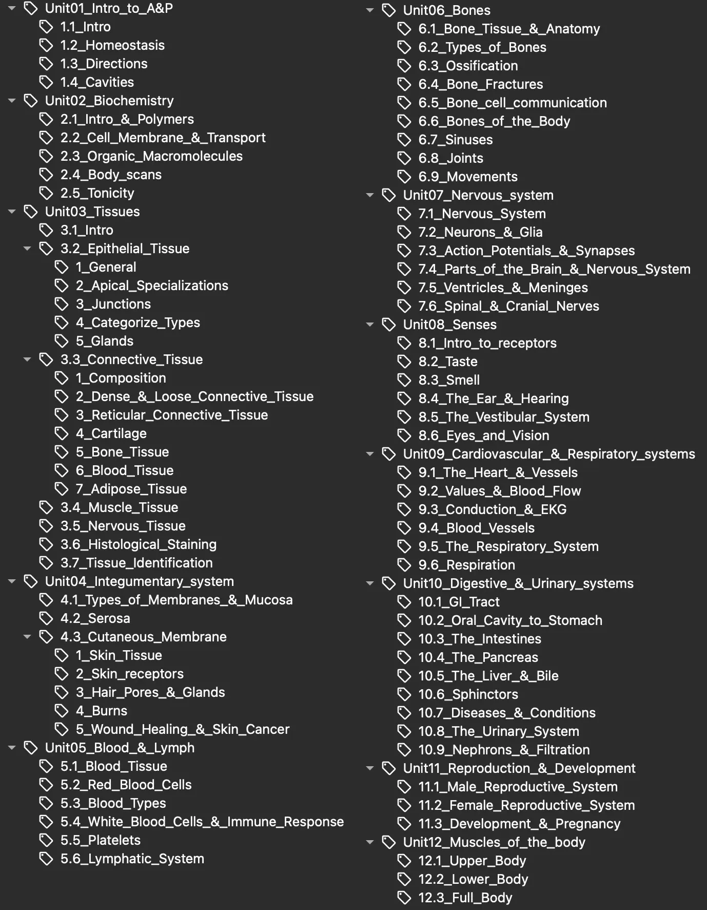

<!--truncate-->

## Nguồn: [Cherry Berry](https://ankiweb.net/shared/info/2099309714)

## Nội dung

Anki deck cho **giải phẫu và sinh lý (tiếng Anh)**.

Deck này cung cấp phần giới thiệu toàn diện về **anatomy & physiology**, phù hợp với cả những người mới bắt đầu và chưa có nền tảng trước đó.

### 📖 **Nội dung trong bộ thẻ**, được tổ chức theo _tags_:

### ⭐ Tính năng nổi bật ⭐

- Mỗi thẻ đều có **hình ảnh minh họa**  
  (Học giải phẫu mà không có hình thì thật khó hình dung 👀)
- Các thẻ được **sắp xếp theo trình tự hợp lý**, nội dung học sớm sẽ xuất hiện trước, nội dung nâng cao sẽ đến sau.
- Các thẻ được **gắn tag kỹ lưỡng** theo đơn vị và chủ đề.  
  Deck này tương thích với Addon [Clickable Tags](https://ankiweb.net/shared/info/1739176371).

### ❤️ Ủng hộ tác giả 😊

Deck này giúp bạn học tốt hơn?  
Hãy **[👍 vote ủng hộ tại đây](https://ankiweb.net/shared/review/2099309714)**!

Bạn có thể tham khảo thêm:

- Deck [AP Psychology](https://ankiweb.net/shared/info/1320299468)
- Danh sách [✨ shared decks ✨](https://tinyurl.com/cherrydecks)

## 📥 Tải xuống

 
  <a href="https://ankiweb.net/shared/info/2099309714"> 
    <button class="buttonPrimary" type="button">AnkiWeb (cherry_berry)</button> 
  </a> 

 <a href="https://drive.google.com/file/d/1wWRO_c-elWz-fqlA7PxMpGRMM8Z9F4_7/view?usp=sharing"> <button class="buttonPrimary" type="button">Google Drive (ankivn)</button> </a> 

