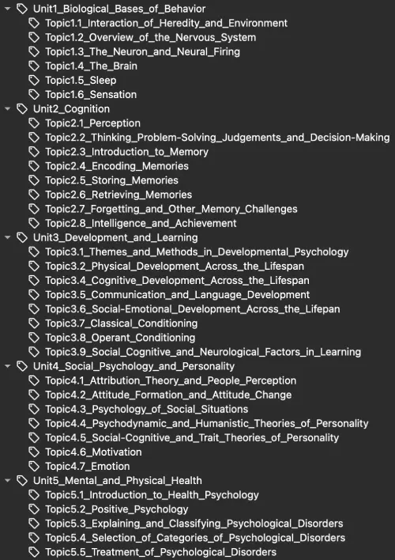

<!--truncate-->

## Nguồn: [Cherry Berry](https://ankiweb.net/shared/info/1320299468)

---

## Nội dung

Dung lượng: **80.05MB**, gồm **686 ảnh**, **không có audio**.  
Cập nhật lần cuối: **2025-03-23**.

Deck này bao gồm **gần như toàn bộ nội dung chương trình AP Psychology**, là một trong những bộ thẻ **toàn diện nhất** cho tâm lý học đại cương.

Deck được xây dựng dựa trên:

- Khung chương trình chính thức của AP Psychology:  
  [2020](https://dvhs.srvusd.net/documents/Academics/Advanced-Placement/ap-psychology-course-and-exam-description.pdf) và [2024](https://apcentral.collegeboard.org/media/pdf/ap-psychology-course-and-exam-description-effective-fall-2024.pdf)
- Sách tham khảo: [Barron's AP Psychology (2016)](https://schoolbag.info/social/ap_psychology_1/index.html)

---

### ❗ Lưu ý quan trọng ❗

Deck này **ưu tiên theo giáo trình 2024**, nhưng vẫn bao gồm nhiều nội dung từ bản 2020.  
Mỗi thẻ đều được **gắn tag theo chương trình & đơn vị**, vì vậy bạn có thể lọc nhanh:

```
tag:AP_Psychology::2020 -tag:AP_Psychology::2024
```


=> Sau đó nhấn `Ctrl + J` để **tạm ẩn các thẻ 2020** nếu bạn chỉ học cho kỳ thi theo chương trình 2024.  
Bạn vẫn có thể mở lại sau nếu muốn học thêm kiến thức mở rộng.

---

### 📖 Nội dung theo tags (2024)



---

### ⭐ Tính năng nổi bật ⭐

- **Gần như tất cả** thẻ đều có **hình ảnh minh họa**
- **Tất cả** thẻ được **mã màu**  
  (một vài thẻ có thể hơi "lòe loẹt", bạn hoàn toàn có thể chỉnh lại theo ý thích)
- Mỗi thẻ được **gắn tag kỹ lưỡng** theo đơn vị & chủ đề, dựa trên  
  [AP Psychology Course and Exam Description – Fall 2024](https://apcentral.collegeboard.org/media/pdf/ap-psychology-course-and-exam-description-effective-fall-2024.pdf)  
  Deck tương thích với addon [Clickable Tags](https://ankiweb.net/shared/info/1739176371)

---

### ❤️ Ủng hộ tác giả 😊

Deck này giúp ích cho bạn? Hãy **[👍 vote ủng hộ tại đây](https://ankiweb.net/shared/review/1320299468)** nhé!

[](https://ankiweb.net/shared/review/1320299468)

Bạn cũng có thể khám phá thêm:

- Các [✨ shared decks khác ✨](https://ankiweb.net/shared/by-author/2099309714)

[](https://ko-fi.com/cherry_berry)

---

## 📥 Tải xuống

<div style={{display: 'flex', justifyContent: 'left', gap: '20px'}}> 
  <a href="https://ankiweb.net/shared/info/1320299468"> 
    <button class="buttonPrimary" type="button">AnkiWeb (cherry_berry)</button> 
  </a> 
</div>

<div style={{display: 'flex', justifyContent: 'left', gap: '20px'}}> <a href="https://drive.google.com/file/d/1cJeDnFU_tk6N1gSp4fOYZUeAQxpA-jzO/view?usp=sharing"> <button class="buttonPrimary" type="button">Google Drive (ankivn)</button> </a> </div>

<div style={{display: 'flex', justifyContent: 'left', gap: '20px'}}> <a href="https://drive.google.com/file/d/1eUs0czRyJpdAYLvVPlpLctmHupA4___D/view?usp=sharing"> <button class="buttonPrimary" type="button">AP® Psychology (PDF)</button> </a> </div>

