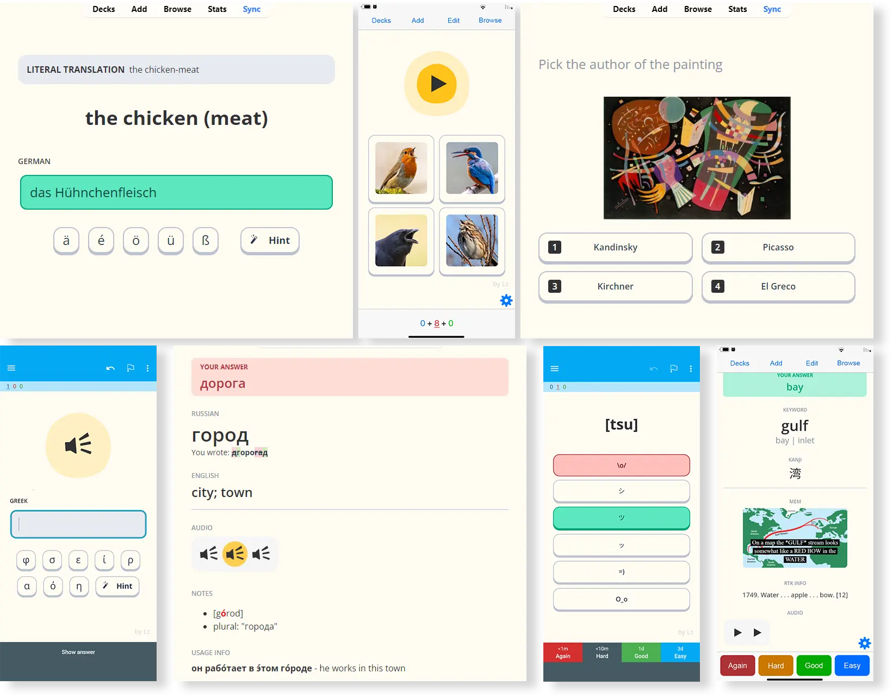
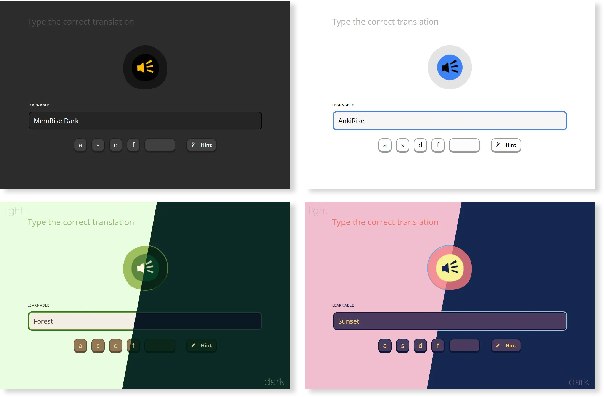
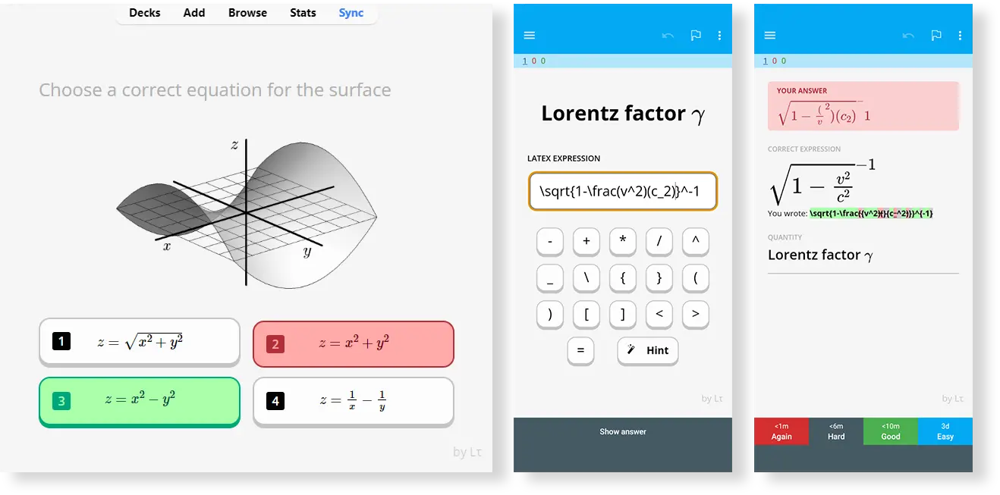

<!--truncate-->

## Nguồn: [Eltaurus](https://forums.ankiweb.net/t/memrise-card-template-support-thread/34233)

---

## Nội dung:

Template này dựa theo app học ngoại ngữ **Memrise**, mang lại trải nghiệm học tập sinh động và thân thiện hơn cho người dùng Anki - đặc biệt là những ai chuyển từ Memrise sang.

### ✔️ Tính năng nổi bật:

- Hỗ trợ **đa nền tảng**: Anki Desktop, Ankidroid, iOS (AnkiMobile)  
- Bao gồm **4 kiểu thẻ**: Trắc nghiệm, nghe, nhập liệu, và nhiều định dạng hiển thị khác  
- Giao diện đẹp mắt, mô phỏng phong cách của Memrise  
- Hỗ trợ audio, hình ảnh, GIF động, phương trình toán học (LaTeX)  
- Tự động chấm điểm câu trả lời, hiển thị chi tiết sau khi làm bài  
- Tùy chỉnh **theme sáng/tối**, đổi màu sắc dễ dàng  
- Có bàn phím ảo và nút gợi ý trên thẻ

### 🎯 Dành cho ai?

- Người dùng muốn học tương tác hơn trên Anki  
- Người từng học trên Memrise nhưng chuyển sang Anki  
- Người học ngôn ngữ cần trắc nghiệm, nhập từ, nghe - tất cả trong một template

## 📧 Hướng dẫn nhanh

1. **Cài đặt Template**  
   Link: [AnkiWeb - Memrise Template](https://ankiweb.net/shared/info/510199145)

2. **Dùng Preset**  
   Khi tạo thẻ mới, chọn Note Type: `Memrise (LT) Preset [...] v4.2`

3. **Kích hoạt chế độ nhập liệu trên Android**  
   Vào Cài đặt ứng dụng Anki → Advanced → Bật "Type answer into the card"

4. **Kích hoạt Trắc Nghiệm (nếu muốn)**  
   - Trên Anki Desktop, cài Add-on:  
     Vào Tools → Add-ons → Get Add-ons → Dán mã `884199977` → OK → Restart Anki  
   - Mở **Browse** → chọn nhiều thẻ → Chuột phải → `Fill Choices` → OK  
   - Sync lại để dùng trên app điện thoại

### 💬 Cần hỗ trợ?

Ai chưa cài được hoặc muốn hỏi thêm, cứ **inbox** mình hoặc để lại bình luận trên forum nhé!

---

## 📑 Tài nguyên liên quan

  <a class="button button--primary" href="https://ankiweb.net/shared/info/510199145" target="_blank">
    📑 Cài đặt Template từ AnkiWeb
  </a>
  <a class="button button--secondary" href="https://github.com/Eltaurus-Lt/Anki-Card-Templates?tab=readme-ov-file" target="_blank">
    📘 Xem chi tiết trên GitHub
  </a>

 <a href="https://drive.google.com/file/d/1zk9vvNA0Dt5uvK_qabtuuwh3p_K4mDeu/view?usp=sharing"> <button class="buttonPrimary" type="button">Google Drive (ankivn)</button> </a> 

