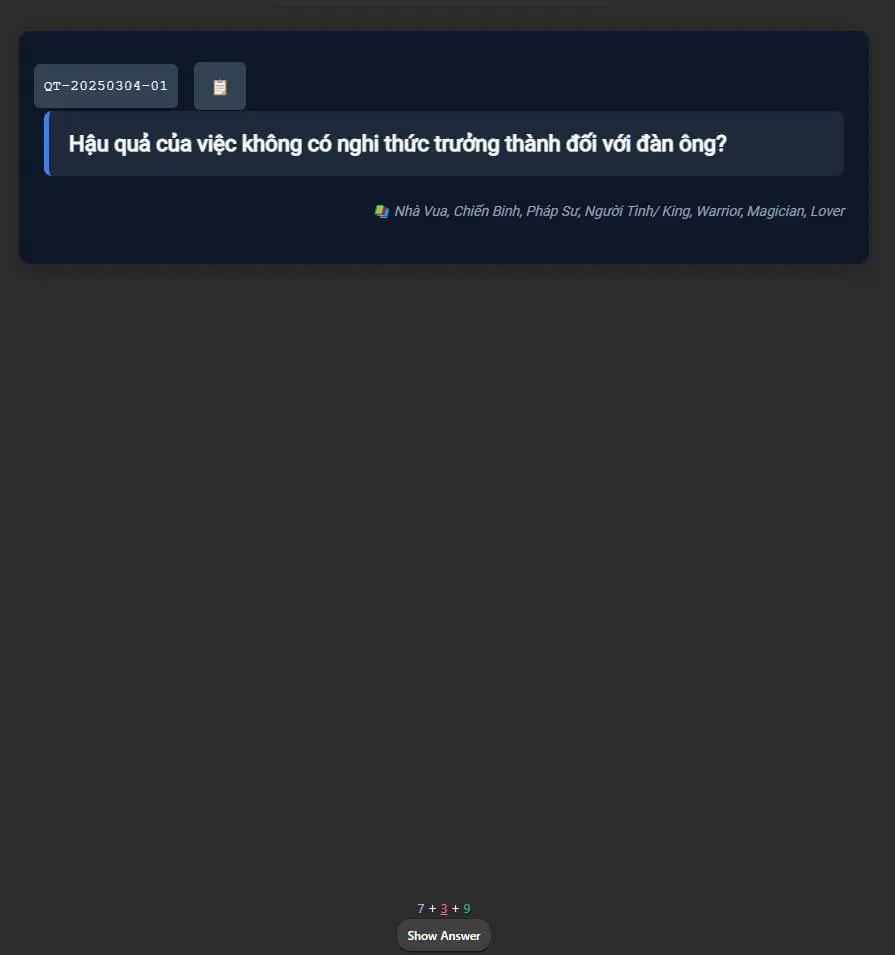
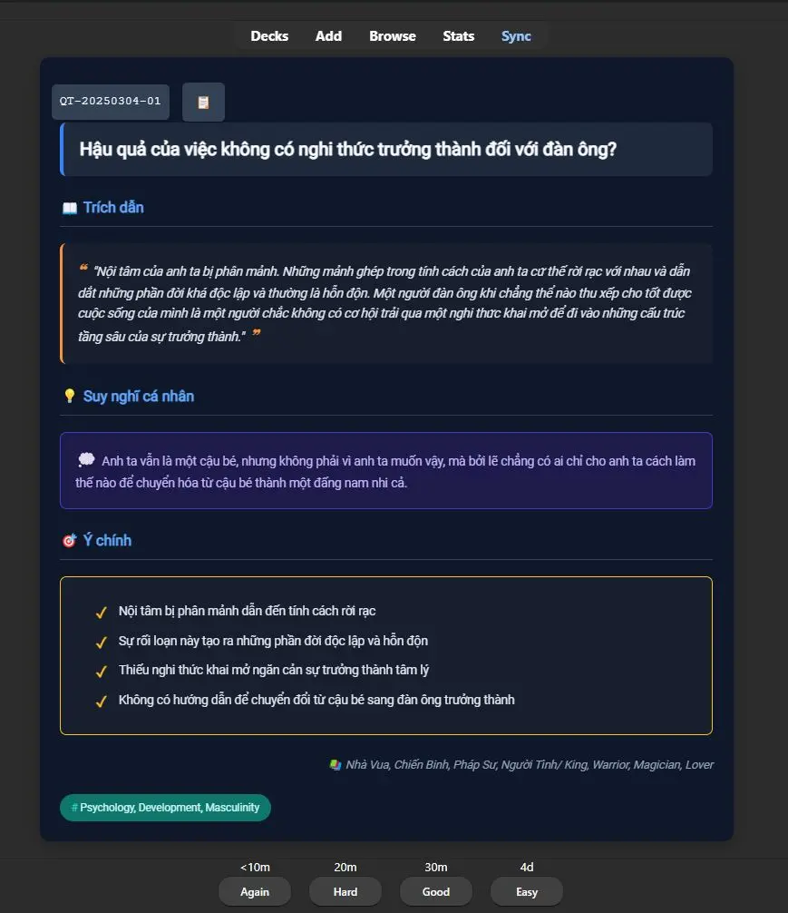

<!--truncate-->

## Nguồn: [Kero](https://www.facebook.com/share/p/19CE3Yxthz/)

## Nội dung

Một vấn đề mình gặp phải khi đọc sách là take note nhưng chẳng bao giờ có cơ hội đọc lại. Thế giới quan của chúng ta thay đổi theo những gì chúng ta tiếp xúc. Đó là một quá trình phát triển — điều từng có ý nghĩa trong quá khứ có thể không còn hợp lý khi thế giới quan của bạn thay đổi.

Ví dụ: Khi 18 tuổi, bạn đọc một nội dung trong sách và cảm thấy tâm đắc. Nhưng đến khi 21 tuổi, với nhiều kinh nghiệm hơn, bạn đọc lại thì nội dung đó có thể chỉ là kiến thức bình thường, hoặc bạn nhìn nhận nó theo cách hoàn toàn khác.

Đây là một quá trình mình đúc rút khi đọc nhiều mà chẳng thấm được bao nhiêu. Nỗ lực ở thời đại này thôi mình nghĩ là chưa đủ. Những người dùng Anki để học mình nghĩ đều có ý thức về việc "học". Nhưng chúng ta cần nhìn nhận lại cách tiêu thụ một cách có chọn lọc hơn hoặc tối ưu hóa các vòng lặp mang lại nhiều giá trị và tính cá nhân hóa thay vì chỉ lướt qua.

Mình nghĩ Anki đang bị giới hạn chỉ ở việc học ngoại ngữ là quá phí. Nếu bạn cắt nhỏ những thông tin ra học thì sẽ có nhiều thứ thú vị hơn trong Anki. Mình coi Anki như một "đầu ra" thay vì chỉ đơn giản là học. Nếu nó được cá nhân hóa theo chủ sở hữu thì việc tạo ra những thẻ đầu ra chất lượng sẽ khiến bạn hứng thú với việc học hơn rất nhiều.

### Template take note sách với Anki

Mình đã tạo riêng một template để take note sách trong Anki với hai trường quan trọng nhất:

- **Trích dẫn**: Nội dung trực tiếp từ sách  
- **Suy nghĩ cá nhân**: Cảm nhận, liên kết và suy ngẫm của bạn về nội dung đó  

Sau khi đọc xong, bạn có thể biên soạn lại các note thành một subdeck trong bộ deck lớn (ví dụ: deck "Book"). Cách này giúp các kiến thức về cùng chủ đề (như kỹ năng) từ nhiều cuốn sách khác nhau có thể "gặp nhau". Điều này mang đến cái nhìn mới về những điều bạn đã học trong quá khứ.

Quan trọng nhất, phần *"suy nghĩ cá nhân"* luôn có thể được cập nhật để "gửi" đến bạn trong tương lai. Đây chính là quá trình phát triển bản thân liên tục.

### Lời khuyên khi sử dụng

Nên giới hạn số lượng thẻ này ở mức vài thẻ một ngày. Nội dung từ sách cần được xử lý sâu hơn và suy ngẫm nhiều khía cạnh. Mình nghĩ nên để khoảng thời gian ôn tập xa hơn so với các loại thẻ khác để có thời gian tiêu hóa kiến thức.

Tóm lại, đây không chỉ là cách ghi nhớ, mà là một hành trình phát triển bản thân thông qua việc đối thoại với chính mình qua thời gian.

## 📗 Tải xuống

 
  <a href="https://drive.google.com/drive/folders/1yco5huGZBpjf86dECBV825lJsQGEky15?usp=drive_link"> 
    <button class="buttonPrimary" type="button">Google Drive (tác giả)</button> 
  </a> 

 
  <a href="https://drive.google.com/file/d/1lxVA586Xgp4AZ2TvEMrmg68n3gz8NVDK/view?usp=sharing"> 
    <button class="buttonPrimary" type="button">Google Drive (ankivn)</button> 
  </a> 

