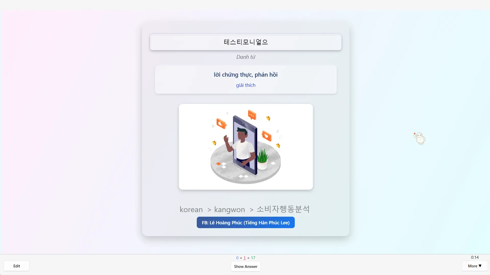
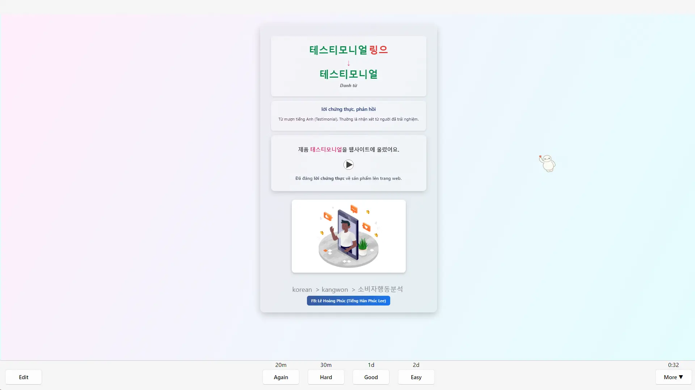
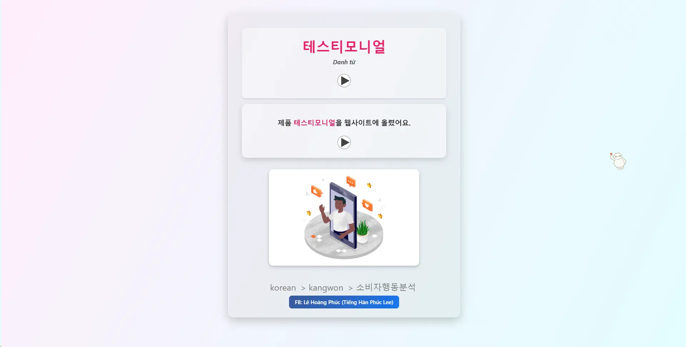
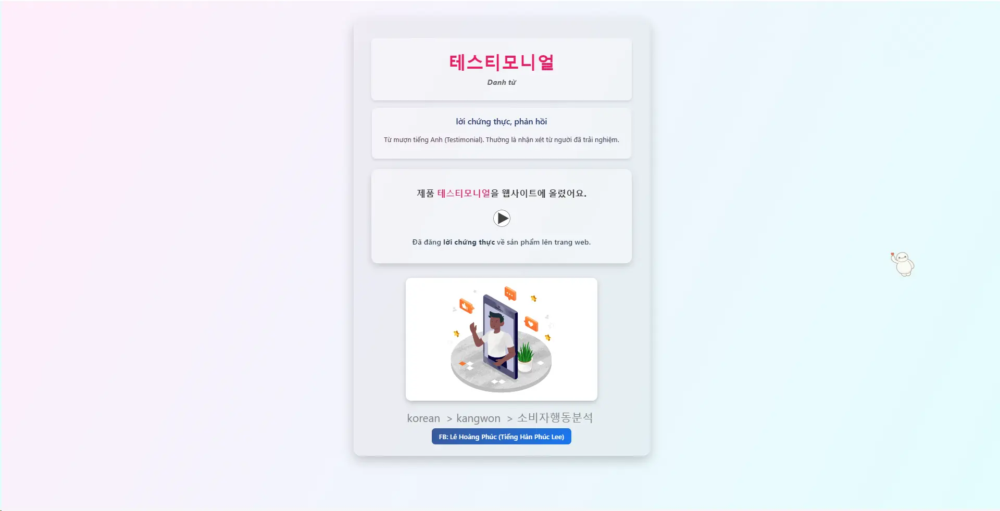

<!--truncate-->

## 📝 Nguồn:
---
Mặc dù là mẫu thẻ tiếng Hàn nhưng mọi người cũng có thể sử dụng cho bất kỳ ngôn ngữ nào được nhé.

## 📚 Nội dung
---
### Kiểu thẻ 1 (Điền từ)

### Kiểu thẻ 2 (Review)

## 🔗 Tải xuống
---

  <a href="YOUR_GOOGLE_DRIVE_LINK" target="_blank" style={{
    padding: "10px 20px",
    background: "linear-gradient(to right, #00c6ff, #0072ff)",
    color: "white",
    borderRadius: "8px",
    textDecoration: "none",
    fontWeight: "bold"
  }}>
    Google Drive (ankivn)
  </a>

