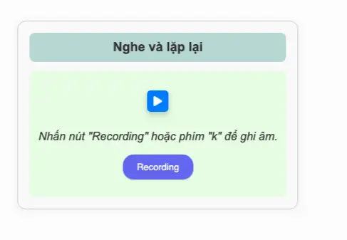
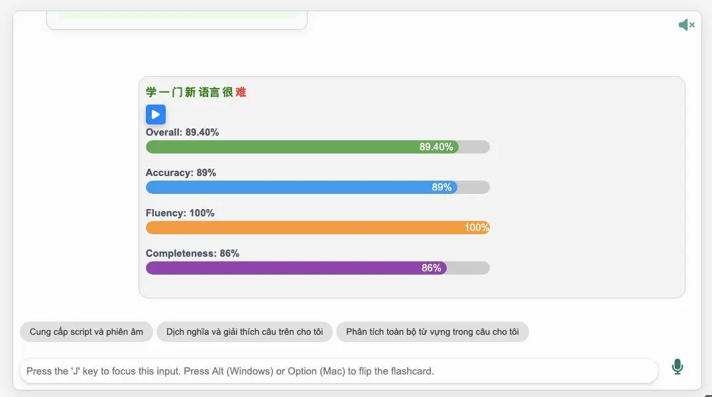
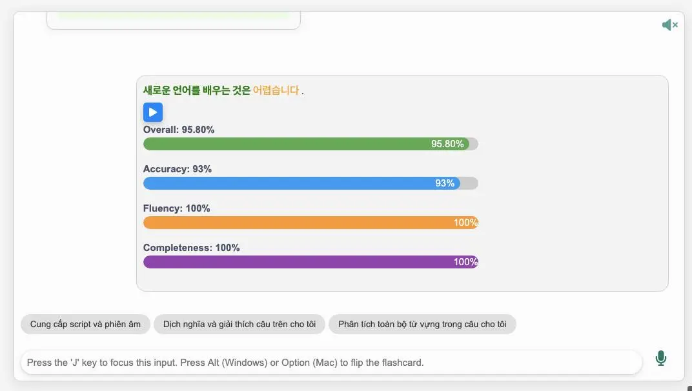

<!--truncate-->

## 📝 Nguồn:

[Nguyễn Thiện Nghĩa](https://www.facebook.com/groups/ankivocabulary/posts/1877792019647113/)

---

## 📚 Nội dung

Shadowing là một kỹ thuật học ngôn ngữ đã được nhiều người áp dụng thành công. Thay vì học từ riêng lẻ bằng flashcard, kỹ thuật này giúp bạn ghi nhớ từ vựng và cấu trúc câu trong ngữ cảnh thực tế thông qua việc lặp lại đồng thời với người bản ngữ.

Điểm nổi bật của shadowing:
- Rèn luyện đồng thời **nghe, nói, phát âm, phản xạ**
- **Tăng tốc độ tiếp thu** và khả năng sử dụng ngôn ngữ linh hoạt
- Mô phỏng cảm giác sống trong môi trường ngôn ngữ
- Đặc biệt phù hợp với người học **giao tiếp**

Bộ thẻ này hỗ trợ **4 ngôn ngữ**: tiếng **Anh, Trung, Nhật và Hàn**, rất thích hợp cho những ai đang theo học đa ngoại ngữ hoặc yêu thích thử thách.

---

## 🔗 Tải xuống

 <a href="https://langki-hub-vn.netlify.app/mau-the/shadowing/"> <button class="buttonPrimary" type="button">Truy cập nguồn & tải thẻ</button> </a> 
