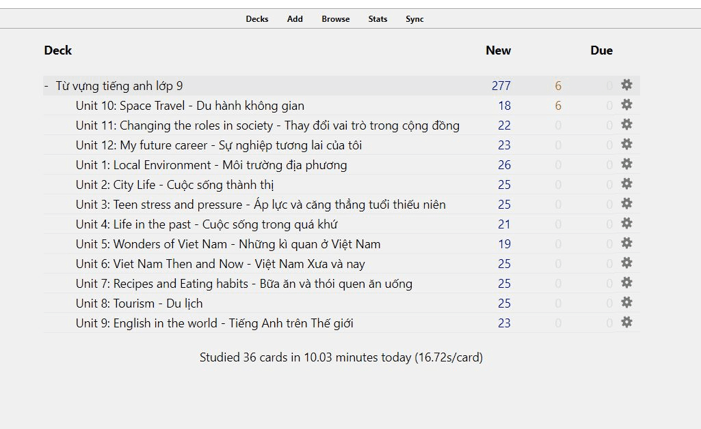
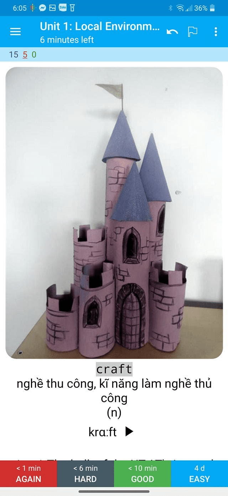
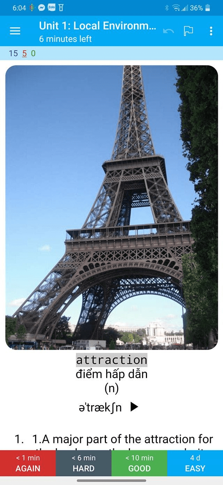

<!--truncate-->

## Nguồn: [Võ Văn](https://www.facebook.com/groups/ankivocabulary/posts/1090783198348003/)

## Nội dung

Mình vừa làm ra bộ thẻ học tiếng anh theo bộ từ vựng trong sách giáo khoa lớp 9, đây cũng là bộ thẻ đầu tiên mình chia sẻ công khai.

Mong điều này có giúp ích cho các bạn, nhất là học sinh trung học cơ sở.

## Preview

## 📗 Tải xuống

### [⬇ Google Drive (ankivn)](https://drive.google.com/file/d/1CTIWSW2fL-EOOUAoikLYVEg3Q1tNgTFD/view?usp=sharing)
