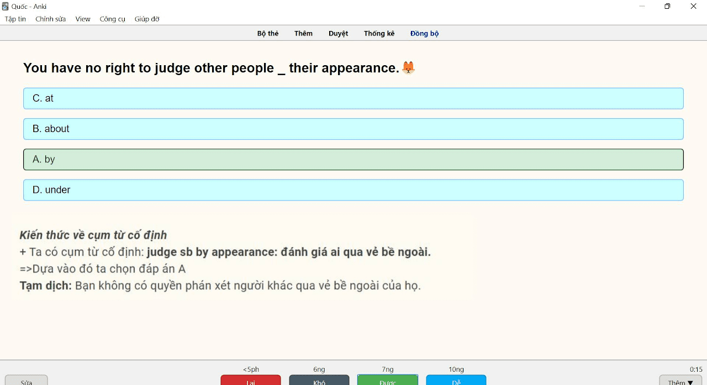

<!--truncate-->

## Nguồn: [Nguyễn Quốc](https://www.facebook.com/groups/ankivocabulary/posts/1126170504809272/)

## Nội dung

Chào cả nhà, hôm nay mình share các bạn thi THPTQG về chủ điểm cấu trúc, tất cả tài liệu đều được mình lấy từ khóa cấu trúc cô Trang Anh (bao gồm: giới từ, danh động từ và động từ nguyên mẫu, phrasal verb, cụm từ cố định, collo,...) tất cả đều được chia cụ thể theo từng tuần và dưới dạng trắc nghiệm.

Tiện thể thì mình cũng share bộ từ vựng tiếng anh mà mình đã học trong 100 challenge 3 luôn nè (mọi người có thể tham khảo hoặc lấy mẫu thẻ nha).

## 📗 Tải xuống

### [⬇ Cấu trúc tiếng anh THPTQG](https://drive.google.com/file/d/1BpR9JhiLlSDlsU4IISsZR9GMr-taOhWV/view?usp=sharing)

### [⬇ Từ vựng tiếng anh](https://drive.google.com/file/d/1BtHT-MiSOifwDaSNM5AZkky82_66FIfA/view?usp=sharing)
