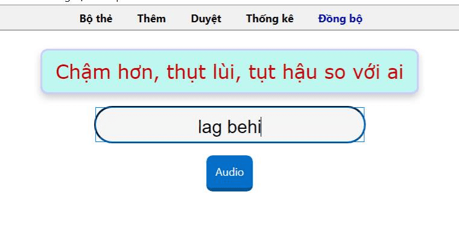
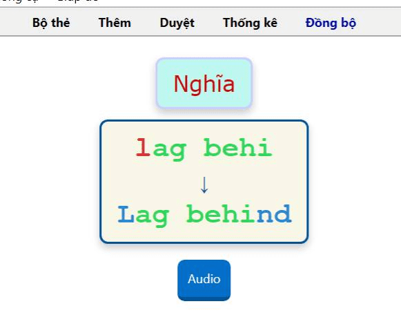

---
title: Tiếng Anh THPT (nâng cấp)
slug: Tieng-Anh-THPT-nang-cap
date: 2022-07-17
description: ""
domain: ankivn.com
keywords:
  - ankivn
tags:
  - deck
  - english
  - thpt
---

<!--truncate-->

## Nguồn: [Kiều Trinh](https://www.facebook.com/groups/ankivocabulary/posts/1116902972402692/)

## Nội dung

Chào mọi người, mình vừa chỉnh lại code của bộ này cho dễ học hơn (đối với mình ^^), tiện thể nên chia sẻ cho mọi người luôn. Nội dung thì mình tách từ deck Full tiếng Anh ra ạ

## 📗 Tải xuống

### [⬇ Ankiweb (chính chủ)](https://ankiweb.net/shared/info/420177967)

### [⬇ Google Drive (ankivn)](https://drive.google.com/file/d/1GS9_53KMya4mhZvtirkuR_gCX9mdFcvc/view?usp=sharing)
