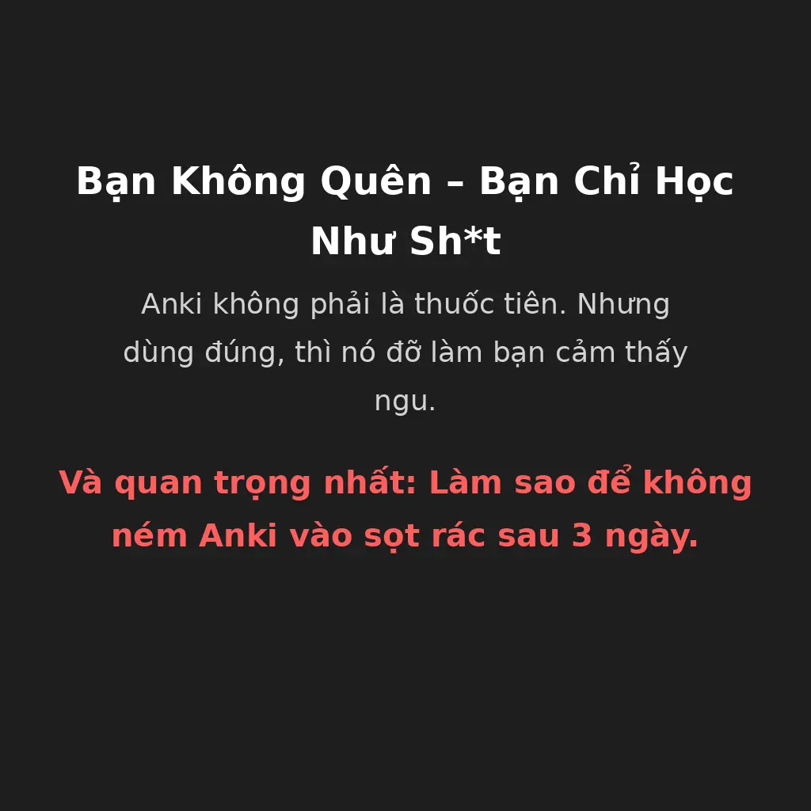
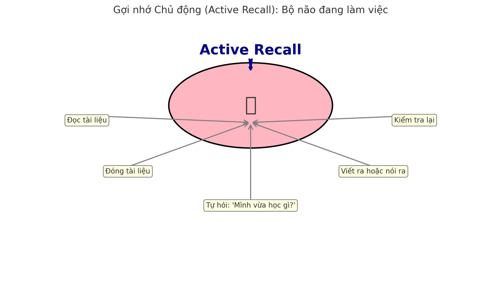
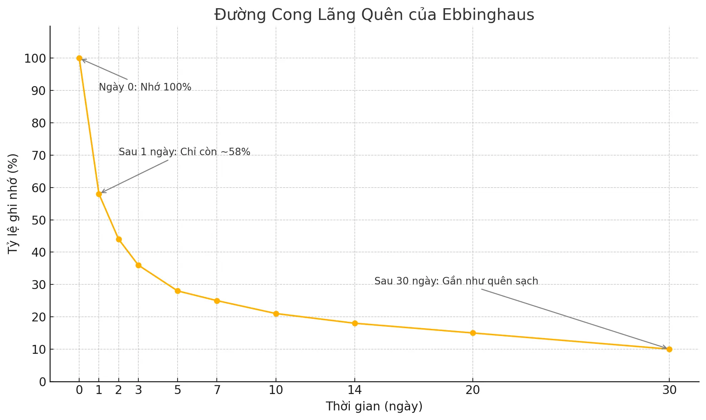
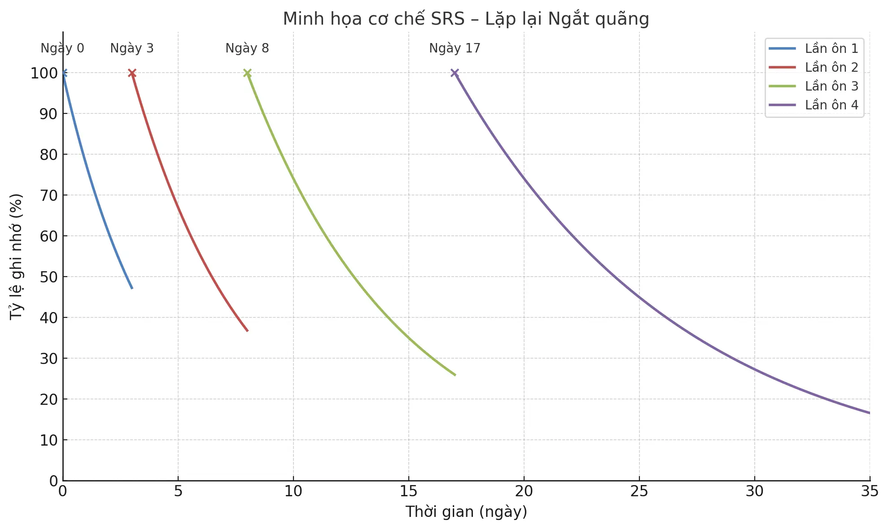

# Khai Phá Sức Mạnh Não Bộ: Hướng Dẫn Toàn Diện về Gợi Nhớ Chủ Động, Lặp Lại Ngắt Quãng và Ứng Dụng Anki cho Người Mới Bắt Đầu

**Ngại đọc vì dài? Mệt não?**  
Ừ, biết rồi, khổ lắm, nói mãi.  
Thế thì bấm nghe podcast tóm tắt đi cho nhanh :)))

import YouTubeEmbed from '@site/src/components/YouTubeEmbed';

<YouTubeEmbed videoId="SGtCKYjrc44" />

**Còn ai đủ kiên nhẫn, có não và biết chữ**  
thì mời kéo xuống đọc bài viết đã được tui vặt sạch mấy chỗ lan man và nhồi thêm tí chất xám vào rồi nè.

---

## I. Mở Khóa Việc Học: Mấy Cái Kỹ Thuật Học Đáng Để Quan Tâm (Cuối Cùng!)

Bạn học cả buổi mà đầu óc vẫn như cái ổ cứng lỗi? Đọc hoài, quên sạch? Ừ, không phải mình bạn đâu. Hầu hết chúng ta học theo kiểu... hy vọng não tự thấm. Nhưng tin buồn: **nó không thấm đâu**.

Tin vui? Khoa học học tập đã chỉ ra vài cách **không ngu ngốc** để học thông minh hơn, nhớ lâu hơn và khỏi tốn công lặp lại **7749 lần**.

Trong bài này, ta sẽ lôi ra ánh sáng hai kỹ thuật nghe có vẻ sexy – nhưng thực ra lại cực kỳ hiệu quả:

- **Gợi nhớ chủ động (Active Recall)** – kiểu học mà não bạn bị ép phải vận động thay vì ngồi ăn sẵn.
- **Lặp lại ngắt quãng (Spaced Repetition)** – lặp lại đúng lúc, đúng chỗ, khỏi phải ôn cả đống vô ích.

Và để tất cả không chỉ là lý thuyết suông, ta sẽ xài một công cụ gọi là **Anki** – như một con robot giúp bạn "nhồi" kiến thức vào đầu mà không đau đớn như học vẹt hồi cấp 3.

Giờ thì đừng đổ lỗi cho “thiếu thời gian” nữa. Vấn đề không phải là bạn lười (mà cũng có thể là lười thật), mà là bạn đang học sai cách. Đọc đi đọc lại như tụng kinh không giúp bạn nhớ lâu đâu. Thay vào đó, hãy học kiểu khiến não phải “làm việc” – và bất ngờ chưa, **nó sẽ nhớ lâu hơn**.

Học không nhất thiết phải khổ, nhưng nó cũng không phải một trò chơi dễ dãi. Áp dụng đúng cách, bạn không chỉ học nhanh hơn – mà còn bớt thấy mình như một thằng ngốc đang vật lộn với đống kiến thức vô nghĩa.

Let’s go, học như một thằng khôn lần đầu tiên trong đời.

---

## II. Gợi Nhớ Chủ Động: Ép Não Làm Việc Thay Vì Ngồi Chết Trân

### 1. Gợi Nhớ Chủ Động Là Cái Quái Gì?

Nghe cái tên **Gợi nhớ chủ động (Active Recall)** tưởng phức tạp lắm, chứ thực ra đơn giản vãi. Bạn không cần bằng tiến sĩ để hiểu cái này.

Nó đơn giản là: **thay vì nhồi nhét kiến thức vào đầu, bạn bắt não *lôi* nó ra.** Nghe ngược đời nhưng lại cực kỳ hiệu quả.

**Ví dụ:** thay vì đọc lại sách như một con robot vô hồn, bạn tự hỏi:  
“Cái quái gì mình vừa học xong ở chương này?”  
...và cố gắng trả lời mà **không được nhìn lại**.

Cái mẹo là ở đây: *khi bạn ép não tự nhớ lại, nó thực sự bắt đầu ghi nhớ sâu hơn*. Còn nếu bạn cứ đọc đi đọc lại như cái máy in lỗi font thì... xin lỗi, bạn đang tự lừa mình đấy.

### 2. Tại Sao Cái Này Hiệu Quả?

Bởi vì **não là một con lười**. Nếu bạn không bắt nó vận động, nó sẽ ngồi chơi xơi nước và vứt sạch thông tin vào sọt rác.

**Active Recall** khiến bạn phải *tương tác* với kiến thức. Bạn không còn là người **“nghe giảng”** nữa, bạn đang **“hỏi cung”** chính mình.

Nó giống như tập gym cho trí nhớ – và như bất kỳ bài tập nào, lúc đầu sẽ thấy nản, thấy ngu, thấy bí. Nhưng kiên trì một chút, bạn sẽ thấy não bắt đầu hoạt động như một cái máy mới tra dầu.

**Tóm gọn**: Đừng đọc lại. Đừng tô màu highlight như làm đẹp profile Tinder.  
**Hãy hỏi. Hãy trả lời. Hãy vắt não.**

Và nhớ – đừng gian lận nhìn tài liệu. Mỗi lần bạn liếc xuống sách, là một lần trí nhớ của bạn mất cơ hội được nâng cấp.

### 3. 3. Làm Sao Để Ép Não Gợi Nhớ? Đây, Cầm Lấy!

Có cả đống cách để đưa Gợi nhớ Chủ động vào đời sống học hành của bạn – và không, không cần làm nghi thức triệu hồi thần học.

- **Flashcards (Thẻ ghi nhớ):** Cổ điển mà vẫn bá đạo. Một mặt là câu hỏi, mặt kia là câu trả lời. Xài Anki – công cụ flashcard số một – để não bạn khỏi bị tra tấn bởi mấy đống giấy lộn.

- **Câu hỏi tự chế / Đề thi cũ:** Tự biên tự diễn. Lôi mớ ghi chú của bạn ra và biến nó thành đề thi mini. Mục tiêu: khiến bạn căng não ngay cả khi chưa ngồi trong phòng thi. Một mẹo nhỏ là hãy tự đặt câu hỏi từ chính những ghi chú của bạn.

- **Dạy lại cho ai đó (hoặc cái gì đó):** Còn gọi là Kỹ thuật Feynman. Nếu bạn giải thích được thứ mình học cho người khác (hoặc... một con vịt cao su), thì bạn thực sự hiểu nó. Nếu không? Bạn đang tự lừa mình đấy.

- **Tóm tắt nhanh / "Blurting":** Học xong? Đóng sách lại. Viết ra hết những gì nhớ được như thể đang nôn kiến thức ra giấy. Không đẹp đẽ, nhưng cực kỳ hiệu quả.

- **Viết giải thích chi tiết:** Bạn lười nói chuyện? Vậy thì viết. Giải thích lại bằng chữ như thể bạn đang viết bài cho một thằng bạn học ngu – để chính bạn hiểu lại lần nữa.

---

**Tóm lại:** Gợi nhớ Chủ động không phải là mẹo vặt mùa thi. Nó là kỹ năng sinh tồn cho người muốn học thứ gì đó *thật sự nhớ được*. Nếu bạn vẫn học kiểu “đọc đi đọc lại rồi cầu nguyện”, thì chúc bạn may mắn… vì bạn chắc chắn sẽ cần nó.

---

## III. Lặp Lại Ngắt Quãng: Cách Để Không Quên M* Nó Mọi Thứ Sau Một Tuần

### 1. Não Bạn Quên Nhanh Hơn Bạn Nghĩ

Tin buồn: **bộ não bạn là một cỗ máy lãng quên**. Một ông triết gia người Đức tên Ebbinghaus (nghe như tên boss cuối trong game) đã phát hiện ra cái gọi là **"đường cong lãng quên"** – kiểu như biểu đồ cho thấy bạn sẽ quên sạch 80% những gì vừa học sau vài ngày nếu không ôn lại.

Và không, đó không phải do bạn ngu. Đó là do não bạn được lập trình để quên những thứ nó nghĩ là không quan trọng. Nhưng bạn có thể **đánh lừa nó**. Đó là lúc **Lặp lại Ngắt quãng (Spaced Repetition)** bước vào sàn diễn.

### 2. SRS – Cách Dạy Não Bạn Ghi Nhớ Như Một Con Quái Vật

SRS là viết tắt của “Spaced Repetition System”, dịch nôm na là: **ôn lại đúng lúc trước khi quên**.

Đây là cách nó hoạt động:
- Bạn học cái gì đó.
- Trước khi quên, bạn ôn lại nó.
- Lần sau? Bạn nhớ lâu hơn → nên khoảng thời gian ôn tiếp theo sẽ dài hơn.
- Cứ thế, kiến thức được đắp dày mà bạn không cần nhồi nhét kiểu zombie.

Nó giống như bạn tiêm một liều thuốc tăng cường trí nhớ mỗi lần ôn bài. Và quan trọng hơn hết: **nó chống lại đường cong lãng quên như một vị thần trí nhớ**.

SRS khác hoàn toàn với việc học dồn. Bạn biết cái kiểu thức tới 3h sáng trước ngày thi? Ừ đấy, **đừng làm thế nữa**. Nó chỉ giúp bạn sống sót tạm thời, rồi quên sạch sau 3 ngày.

### 3. Tại Sao Bạn Nên Dùng SRS Nếu Không Muốn Tái Sinh Làm Con Cá Vàng

- **Tăng cường trí nhớ dài hạn:** Cải thiện đáng kể khả năng duy trì và truy xuất thông tin trong thời gian dài. Điều này giúp xây dựng các kết nối bền vững trong não bộ – nền tảng của việc học thực sự. Phương pháp này thậm chí còn được chứng minh là hiệu quả đối với những người mắc chứng mất trí nhớ trong việc ghi nhớ thông tin.
- **Học ít hơn, nhớ nhiều hơn** – Bạn học đúng lúc, đúng chỗ. Não không bị spam thông tin vô dụng.
- **Đỡ stress hơn** – Học kiểu đều đặn, không hoảng loạn last-minute.
- **Khoa học ủng hộ chuyện này** – Các nghiên cứu từ hồi 1939 (vâng, không đùa đâu) đã chứng minh SRS làm bạn nhớ tốt hơn nhiều lần so với học nhồi.

**Một ví dụ đơn giản:** học xong 1 bài → ôn lại sau 2 ngày → rồi 3 ngày → rồi 5 → rồi 7... Cái này gọi là “phương pháp 2357”. Càng nhớ tốt, bạn càng cần ôn ít. Hợp lý không? Quá hợp lý.

### 4. Cặp Bài Trùng: Gợi Nhớ Chủ Động + SRS = Não Bạn Nâng Cấp Full Power

Bạn muốn chơi lớn? **Kết hợp Active Recall với SRS.**  
Nghĩa là: mỗi lần đến lịch ôn theo SRS, **đừng đọc lại như con Robot** – thay vào đó, **tự hỏi bản thân**, “mình còn nhớ cái này không?”, “định nghĩa nó là gì?”, “ứng dụng ra sao?”

Sự kết hợp này là kiểu như cà phê espresso pha thêm Red Bull: **đậm, mạnh, và cực kỳ tỉnh táo**.

---

**Tóm gọn:**  
Não bạn không phải máy ảnh – nó là con mèo hoang. Bạn phải dụ nó bằng chiến thuật.  
Gợi nhớ chủ động là cái roi. SRS là cái lịch.  
Gộp lại? Bạn biến việc học từ tra tấn thành... ờ, ít nhất là hiệu quả vãi chưởng.

---

## IV. Anki: Trợ Lý Học Tập Không Than Phiền, Không Lương, Làm Việc Mỗi Ngày

### 1. Anki Là Gì?

**Anki** là một phần mềm flashcard miễn phí, mã nguồn mở, được thiết kế để giúp bạn học thông minh hơn bằng cách kết hợp Gợi nhớ Chủ động và Lặp lại Ngắt quãng. Tên gọi “Anki” trong tiếng Nhật nghĩa là “ghi nhớ” – và đúng như cái tên, nó sinh ra chỉ để làm đúng một việc: **giúp bạn nhớ dai như đỉa.**

Không phải app làm đẹp, không có UX sang chảnh. Nhưng nó hoạt động cực kỳ hiệu quả – và đó mới là thứ bạn nên quan tâm.

### 2. Gợi Nhớ Chủ Động Trong Anki – Và Cái Sự Khó Hiểu Giữa “Note” và “Card”

Đây là phần mà **90% người mới dùng Anki sẽ hiểu sai**. Cứ tưởng mỗi cái flashcard là tự bạn tạo một cái riêng. Sai. Sai toàn tập.

Trong Anki, có hai khái niệm bạn *phải* phân biệt cho rõ:

- **Note** (ghi chú): là nơi bạn nhập thông tin đầy đủ. Kiểu như gốc rễ của kiến thức.
- **Card** (thẻ): là những câu hỏi được Anki *tự động* tạo ra từ cái note đó.

> Hiểu nôm na:  
> - *Note là nguyên liệu.*  
> - *Card là món ăn được nấu từ nguyên liệu đó.*
> - **Bạn có thể nấu được ty tỷ món ăn (nếu bạn biết nấu :)** 

Ví dụ cho dễ hiểu nhé:

Bạn muốn học từ “photosynthesis” (quang hợp).

- Bạn tạo **1 cái note** như sau:
  - Mặt trước (Front): "Photosynthesis là gì?"
  - Mặt sau (Back): "Là quá trình cây xanh chuyển hóa ánh sáng thành năng lượng."

Anki sẽ tạo ra **1 cái card** hỏi bạn câu đó.  
Nếu bạn chọn mẫu "hỏi 2 chiều" thì nó sẽ tạo thêm 1 card nữa kiểu ngược lại.

==> Vẫn là **1 note**, nhưng ra **2 card** khác nhau. Đỡ phải gõ lặp lại từng câu một như thời còn ôn thi đại học bằng giấy A4.

---

Một kiểu card rất mạnh trong Anki là **cloze deletion** – hay còn gọi là “điền vào chỗ trống”.

Thay vì hỏi thẳng, bạn che một phần câu, bắt não phải tự nhớ:

> "Photosynthesis là quá trình `{{c1::cây xanh}}` chuyển hóa `{{c2::ánh sáng}}` thành `{{c3::năng lượng}}`."

Anki sẽ tạo 3 thẻ – mỗi thẻ là một **“lỗ trống”** bạn phải nhớ lấp vào.  
Học kiểu này dễ đau não lúc đầu, nhưng càng dùng thì càng dính lâu.

---

**Cảnh báo quan trọng:**  
Người mới thường mắc lỗi *mỗi note = 1 card = 1 kiến thức bé tẹo* → học một lúc thì mệt mà không hiệu quả.  
**Đừng làm thế.** Học cách gom thông tin thông minh vào 1 note → để Anki lo phần còn lại cho bạn.

Bạn học tốt không phải vì bạn làm nhiều, mà vì bạn làm đúng cách.

### 3. Anki Tự Động Hóa Lặp Lại Ngắt Quãng Như Thế Nào?

Anki không bắt bạn tự lên lịch ôn – **nó làm luôn phần đó cho bạn.** Dựa vào cách bạn đánh giá mỗi lần nhớ lại (quên sạch, khó nhớ, bình thường, dễ òm), Anki sẽ tính toán thời điểm bạn nên xem lại – ngay trước khi não bạn đá văng thông tin đó đi.

Phiên bản mới của Anki dùng **FSRS – một thuật toán cá nhân hóa việc lặp lại cực kỳ chính xác**. Bạn không cần hiểu nó hoạt động ra sao. Bạn chỉ cần biết là: nó sẽ khiến bạn học ít hơn, nhớ lâu hơn, và không phải động đến giấy bút dán chi chít deadline nữa.

Tại Sao Anki Thực Sự Hiệu Quả?

### 4. Tại Sao Anki Thực Sự Hiệu Quả?

Không phải ai cũng có thời gian để ngồi nghiên cứu hết các lý thuyết học tập hay mày mò lịch ôn thủ công. Anki **lo hết phần lên lịch cho bạn**, để bạn chỉ cần làm đúng một việc: ==mở app và học==.

Dù bạn đang học y, học tiếng Anh, chuẩn bị thi AI EO, Tô Ích, hay Tô Píc,... hay chỉ đơn giản là muốn nhớ tên mấy ông triết gia chết cách đây 300 năm, Anki đều xài được.

---

**Tóm gọn:** Anki là công cụ giúp biến mấy chiến thuật học tập “nghe thì hay nhưng khó duy trì” thành **thói quen dễ thở, hiệu quả thật**. Không drama, không quảng cáo, không phí ngu. Chỉ là bạn – với một đống thẻ – và một cái app quyết tâm giúp bạn bớt ngu đi từng ngày.

---

## V. Cách Tạo Thẻ Anki Không Khiến Bạn Muốn Từ Bỏ Cuộc Đời

Bạn có thể dùng Anki, hiểu Gợi nhớ Chủ động, dùng Lặp lại Ngắt quãng... nhưng nếu bạn tạo thẻ như shit, thì... chúc bạn học vui.

Phần này chắt lọc từ **“20 Quy tắc xây dựng kiến thức”** của Piotr Wozniak (cha đẻ SuperMemo, tổ sư của SRS). Nói ngắn gọn: *đừng tạo mấy cái thẻ khiến não bạn phát khóc mỗi lần mở app.*

### 1. Vì Sao Việc Tạo Thẻ Đúng Quan Trọng Vãi Chưởng?

Cách bạn chia nhỏ và trình bày thông tin trong thẻ ảnh hưởng trực tiếp đến việc bạn học nhanh hay vật vã.

Một thẻ tốt sẽ làm bạn thấy “ồ dễ mà, nhớ liền”.  
Một thẻ tệ sẽ khiến bạn chỉ muốn đóng Anki và đi... lau nhà.

Từ năm 1999, ông Piotr Wozniak – cha đẻ của SuperMemo – đã đúc kết ra **20 quy tắc tạo thẻ thông minh**, để kiến thức không chỉ chui vào đầu bạn mà còn ở lại lâu dài. Mục tiêu là đơn giản hóa việc học, không phải làm bạn thành chuyên gia viết flashcard phức tạp.

Hiểu và áp dụng vài quy tắc cốt lõi thôi cũng đủ giúp bạn tăng gấp đôi hiệu quả học – và bớt ghét việc mở Anki mỗi ngày.

### 2. Các Nguyên Tắc Chính Từ "20 Quy Tắc" Dành Cho Người Mới Dùng Anki (Kèm Ví Dụ Cụ Thể)

Dưới đây là một số nguyên tắc cốt lõi, đặc biệt hữu ích cho những ai mới làm quen với Anki:

1. **Hiểu trước khi ghi nhớ**  
   → Đừng học vẹt. Hãy hiểu trước rồi mới đưa vào Anki.

   - *Ví dụ sai:*  
     > "Nước cứng là gì?" → (mà bạn chẳng hiểu là gì, chỉ copy từ sách)  
   - *Ví dụ đúng:*  
     > "Nước có nhiều ion Ca²⁺ và Mg²⁺ gọi là gì?" → `Nước cứng`  
     (Vì bạn đã hiểu là do hai ion này làm nước không tạo bọt xà phòng.)

2. **Một thẻ, một ý**  
   → Thẻ càng đơn giản, bạn càng học nhanh.

   - *Ví dụ sai:*  
     > "Kể tên 3 trạng thái của nước và đặc điểm của mỗi cái?"  
   - *Ví dụ đúng:*  
     > "Nước ở thể rắn có tên là gì?" → `Băng`  
     > "Thể lỏng của nước là gì?" → `Nước`  
     > "Thể khí của nước là gì?" → `Hơi nước`

3. **Dùng điền khuyết (cloze deletion)**  
   → Tạo kiểu “điền vào chỗ trống” cho dễ nhớ hơn.

   - *Ví dụ:*  
     > "1 năm có `{{c1::12}}` tháng."  
     > "Thủ đô của Việt Nam là `{{c1::Hà Nội}}`."  
     (Thẻ đơn giản mà ai cũng trả lời được – chính xác là mục tiêu.)

4. **Không nhồi danh sách**  
   → Chia nhỏ danh sách ra từng thẻ hoặc dùng điền khuyết.

   - *Ví dụ sai:*  
     > "Kể tên các giác quan của con người."  
   - *Ví dụ đúng:*  
     > "Giác quan giúp ta nhìn là gì?" → `Thị giác`  
     > "Giác quan giúp ta nghe là gì?" → `Thính giác`

5. **Cá nhân hóa và có ví dụ... càng drama càng nhớ lâu**  
→ Đừng học kiểu robot. Hãy biến kiến thức thành chuyện “có thật” trong cuộc đời bạn — càng gây sốc, càng dễ khắc não.

- *Ví dụ khô khan (sách giáo khoa):*  
  > "Phản xạ có điều kiện là gì?"  
  → `Là phản xạ hình thành do học tập, không bẩm sinh.`

- *Ví dụ drama (não nhớ ngay):*  
  > "Tại sao cứ nghe tiếng tin nhắn là tim tôi đập thình thịch, dù chỉ là Shopee giao hàng?"  
  → `Phản xạ có điều kiện. Não bạn đã bị crush/lần đau khổ trước lập trình sẵn.`

Hoặc:

- *Ví dụ khô khan:*  
  > "Tình huống nào thể hiện nguyên lý Pascal?"  
  → `Áp suất truyền đều trong chất lỏng.`

- *Ví dụ drama:*  
  > "Tại sao lúc ngồi bồn cầu mà xịt nước mạnh là nước nó văng ngược lên mông?"  
  → `Nguyên lý Pascal. Đừng hỏi vì sao nhớ hoài.`

→ Cứ cái gì khiến bạn xấu hổ, bối rối, đau đớn nhẹ, hoặc thấy “trời ơi sao ngu vậy mà mình lại nhớ” → đó là **thẻ tốt**.

6. **Thêm hình ảnh minh họa**  
   → Học bằng hình dễ vào hơn chữ.

   - *Ví dụ:*  
     Học "hệ tiêu hóa"? Chèn sơ đồ cơ thể người, rồi tạo thẻ:  
     > "Bộ phận này là gì?" → (hình cái dạ dày) → `Dạ dày`  
     > "Chức năng của dạ dày là gì?" → `Tiêu hóa protein`

### 3. Quy Tắc Tối Thượng: Nếu Nó Khiến Bạn Thấy Chán, Bạn Đang Làm Sai

Một thẻ tốt không phải là thẻ “chuẩn học thuật”. Nó là thẻ bạn **thích** học lại.  
Mỗi khi việc ôn tập bắt đầu giống như bị ép ăn sầu riêng ngâm nước mắm, thì đó là lúc bạn nên dừng lại và hỏi:  
> "Mình có đang tạo thẻ kiểu tra tấn không đấy?"

Đúng rồi.  
**Học không vui = học không bền.**

“20 Quy tắc” mà Piotr Wozniak đưa ra không phải là triết lý gì cao siêu. Chúng là **hướng dẫn sinh tồn cho bộ não** – giúp bạn tránh việc tống quá nhiều thông tin vào đầu trong một lần, làm giảm áp lực ghi nhớ, và biến việc học thành thứ bạn *có thể chịu được mỗi ngày*.

Ví dụ:  
- Bạn học một thẻ 4 dòng liền mà cứ sai → thẻ đó sai cấu trúc, không phải do bạn ngu.  
- Bạn học 5 thẻ liên tục, thấy “ồ dễ mà” → bingo, bạn đang xây dựng đúng cách.

Các thẻ tốt tạo nên **vòng lặp tích cực**:  
→ Học được → Có cảm giác “mình làm được” → Tự tin hơn → Học tiếp → Nhớ lâu hơn.  

Các thẻ tệ tạo ra **vòng lặp khốn khổ**:  
→ Học không hiểu → Trả lời sai → Nản → Không ôn lại → Quên sạch.

---

**Quy tắc vàng:**  
Nếu học với Anki khiến bạn thấy như đang dọn nhà xí, **đừng bỏ Anki – sửa lại cách tạo thẻ**.

---

Muốn tôi làm bảng tóm tắt các quy tắc kèm emoji + ví dụ dí dỏm để người mới nhìn phát hiểu ngay không?

Cuối cùng, một phép thử đơn giản và phổ quát cho một thẻ được xây dựng tốt chính là **niềm vui học tập** mà nó mang lại. Mỗi khi bạn cảm thấy niềm vui giảm sút, việc ôn tập trở nên nặng nề, hãy xem lại các quy tắc này và kiểm tra xem liệu có sự vi phạm quy tắc nào có thể là nguyên nhân gây ra sự suy giảm hứng thú đó không.

Việc tuân thủ "20 Quy tắc" không phải là tùy tiện; chúng là những nguyên tắc về "công thái học nhận thức" (cognitive ergonomics) cho trí nhớ. Tuân thủ chúng giúp giảm tải nhận thức và làm cho việc thực hành gợi nhớ vốn có trong Gợi nhớ Chủ động trở nên hiệu quả hơn và ít gây nản lòng hơn. Ví dụ, các quy tắc như "Nguyên tắc Thông tin Tối thiểu" trực tiếp giải quyết lý thuyết về tải nhận thức – não bộ của chúng ta chỉ có thể xử lý một lượng thông tin mới nhất định tại một thời điểm. Các thẻ đơn giản, "nguyên tử" dễ mã hóa và truy xuất hơn. Việc vi phạm các quy tắc này (ví dụ: thẻ phức tạp, học những điều chưa hiểu) dẫn đến khó khăn, thất vọng và làm giảm "niềm vui học tập", làm tăng khả năng từ bỏ Anki. Ngược lại, các thẻ được xây dựng tốt (tuân theo các quy tắc) sẽ giúp việc gợi nhớ dễ dàng hơn, dẫn đến các lần ôn tập thành công hơn, từ đó củng cố dấu vết ký ức và tạo ra một vòng lặp phản hồi tích cực, duy trì động lực và hiệu quả học tập. Những thẻ được xây dựng kém sẽ dẫn đến kết quả ngược lại.

Dưới đây là bảng tóm tắt một số quy tắc quan trọng nhất từ "20 Quy tắc Xây Dựng Kiến Thức" dành cho người mới bắt đầu sử dụng Anki:

### 🧠 Bảng Quy Tắc Tạo Thẻ Anki Dành Cho Người Mới (Kèm Emoji & Ví Dụ Đời Thường)

| # | Quy Tắc Ngắn Gọn | 🧾 Ý Nghĩa | 💡 Mẹo & Ví Dụ |
|---|------------------|-----------|----------------|
| 1️⃣ | **Hiểu rồi mới ghi nhớ** 🧍‍♂️ | Đừng học vẹt. Thẻ tốt bắt đầu từ sự hiểu thật sự. | 🔍 *"Nước cứng là gì?"* → Nếu không hiểu, đọc kỹ lại sách rồi viết theo cách của bạn: *"Nước chứa nhiều Ca²⁺, Mg²⁺."* |
| 2️⃣ | **Một thẻ = Một ý** 🧩 | Thẻ càng đơn giản, càng dễ nhớ. | ✂️ *Sai:* “Kể tên 3 thể của nước.”   ✅ *Đúng:* “Thể khí của nước là gì?” → `Hơi nước` |
| 3️⃣ | **Dùng điền khuyết** 🕳️ | Che phần cần nhớ để ép não móc ra. | 🧠 *"Thủ đô của Thái Lan là `{{c1::Bangkok}}`."* Thẻ ngắn, đập vào não ngay. |
| 4️⃣ | **Không nhét cả danh sách vào 1 thẻ** 📃❌ | Não ghét dài dòng. Chia nhỏ ra từng phần. | 🔪 *Sai:* “Kể tên 7 sắc cầu vồng.” ✅ *Đúng:* “Màu đầu tiên trong cầu vồng?” → `Đỏ` |
| 5️⃣ | **Cá nhân hóa = Nhớ lâu** 🎭 | Gắn kiến thức với chuyện riêng thì não mới "dính". | 🎤 *"Tại sao tôi nghe tiếng tin nhắn mà tim đập thình thịch?"* → `Phản xạ có điều kiện` |
| 6️⃣ | **Dùng hình ảnh** 🖼️ | Não yêu hình. Đừng chỉ viết chữ. | 📸 Học về dạ dày? Gắn ảnh vào thẻ: *"Cơ quan này là gì?"* → `Dạ dày` |
| 7️⃣ | **Nếu học thấy chán, sửa thẻ lại!** 😵‍💫 | Học mà nản = thẻ viết chưa ổn. | 🔁 Thẻ khó quá? Chia nhỏ ra. Không vui? Viết lại cho dễ hiểu hơn. Mục tiêu: học mà không muốn đập app. |

---

## VI. Ví Dụ Thực Tế: Chuyển Hóa Thông Tin Thành Thẻ Anki Hiệu Quả

Lý thuyết nghe có vẻ hay ho, nhưng làm sao để **từ tài liệu khô khan → ra thẻ dễ học**?  
Dưới đây là 4 ví dụ điển hình giúp bạn hiểu rõ cách *bẻ nhỏ kiến thức đúng cách*.

### 1. 📍 Ví dụ: Một sự kiện đơn giản

- **Thông tin gốc:** Trái Đất quay quanh Mặt Trời.

- ❌ *Thẻ tệ:*  
  > "Hãy mô tả chuyển động của Trái Đất."  
  → Dễ viết dài, nhớ không nổi.

- ✅ *Thẻ tốt – Hỏi & Đáp:*  
  > Trái Đất quay quanh thiên thể nào?  
  → `Mặt Trời`

- ✅ *Thẻ tốt – Điền khuyết:*  
  > Trái Đất quay quanh `{{c1::Mặt Trời}}`.

- 👉 *Tại sao?* Một mẩu info → một thẻ → nhớ nhanh, kiểm tra dễ.

---

### 2. 📘 Ví dụ: Một định nghĩa

- **Thông tin gốc:**  
  Quang hợp là quá trình thực vật dùng ánh sáng, nước và CO₂ để tạo thức ăn và thải oxy.

- ❌ *Thẻ tệ:*  
  > Quang hợp là gì?  
  → Đáp án quá dài, dễ quên từng phần.

- ✅ *Thẻ tốt – Điền khuyết:*  
  > `{{c1::Quang hợp}}` là quá trình giúp thực vật tạo thức ăn từ ánh sáng, nước và CO₂.

- ✅ *Thẻ tốt – Câu hỏi nhỏ:*  
  > Thực vật thải ra khí gì khi quang hợp?  
  → `Oxy`

  > Quang hợp giúp thực vật tạo gì?  
  → `Thức ăn`

- 👉 *Tại sao?* Tách nhỏ định nghĩa phức tạp → dễ nhớ từng phần → học không sợ quên nửa câu.

---

### 3. 💡 Ví dụ: Một khái niệm trừu tượng (Active Recall)

- **Thông tin gốc:**  
  Gợi nhớ chủ động = việc tự truy xuất thông tin giúp củng cố trí nhớ.

- ✅ *Thẻ tốt – Câu hỏi:*  
  > Gợi nhớ chủ động giúp ích gì cho não?  
  → `Củng cố các kết nối thần kinh`

- ✅ *Thẻ tốt – Điền khuyết:*  
  > Gợi nhớ chủ động là việc `{{c1::truy xuất thông tin từ bộ nhớ}}` để nhớ lâu hơn.

- 👉 *Tại sao?* Không hỏi "Gợi nhớ chủ động là gì?" mà tách phần quan trọng nhất ra để hỏi riêng.

---

### 4. 📋 Ví dụ: Danh sách ngắn – Ba quy tắc đầu từ “20 Quy tắc”

- **Thông tin gốc:**  
  - Hiểu trước khi học  
  - Một thẻ một ý  
  - Sử dụng điền khuyết

- ❌ *Thẻ tệ:*  
  > Hãy kể tên 3 quy tắc đầu của SuperMemo?  
  → Bạn nhớ được 1 cái là may.

- ✅ *Thẻ tốt – Điền khuyết:*  
  > Một trong các quy tắc của SuperMemo là: đừng học nếu bạn chưa `{{c1::hiểu}}`.

  > Quy tắc "Một thẻ – một ý" còn gọi là `{{c1::Nguyên tắc thông tin tối thiểu}}`.

- ✅ *Thẻ tốt – Hỏi & Đáp:*  
  > SuperMemo khuyên dùng kỹ thuật nào để tạo thẻ cho định nghĩa và sự kiện?  
  → `Điền khuyết / Cloze`

- 👉 *Tại sao?* Mỗi quy tắc → một câu hỏi. Danh sách dài thì chia nhỏ, vậy mới nhớ nổi.

---

### ✅ Tổng kết nhanh

- Tách nhỏ thông tin = dễ gợi nhớ hơn.
- Ưu tiên điền khuyết, thẻ đơn giản, câu hỏi rõ ràng.
- Nếu phải đọc lại thẻ 3 lần mà vẫn không hiểu mình đang học gì → xoá và viết lại.

---

## VII. Cơ Chế Lên Lịch Của Anki: Tìm Hiểu Các Thuật Toán (SM-2 và FSRS)

Anki không phải thần thánh. Nó hiệu quả vì nó có “bộ não” rất thông minh phía sau: **thuật toán lên lịch**.  
Nó giúp bạn biết **khi nào nên học lại**, thay vì tự đoán mò rồi quên sạch.

---

### 1. ⚙️ SM-2: Ông Tổ Thuật Toán Lặp Lại (Già nhưng còn xíu gân)

Đây là hệ thống mặc định của Anki từ thời “cổ đại” (1980s). Nó hoạt động dựa trên hai yếu tố:

- **Hệ số dễ (ease factor):** Thẻ càng dễ → khoảng cách ôn càng dài.
- **Cảm nhận của bạn:** Bạn chọn “Lại / Khó / Tốt / Dễ” → Anki điều chỉnh thời gian cho lần ôn tiếp theo.

✅ Đơn giản, hoạt động khá ổn.  
❌ Nhưng đôi khi thẻ khó bị “trừng phạt” nặng quá → dẫn đến “Ease Hell” (phải ôn quá nhiều, quá dày, thấy muốn xóa app).

---

### 2. 🤖 FSRS: Thuật Toán Mới, Cá Nhân Hóa Đến Mức Biết Bạn Lười Khi Nào

Bắt đầu từ bản Anki 23.10, bạn có thể bật một thuật toán mới tên là **FSRS** – kiểu như Anki có AI bên trong.

Thay vì xử lý thô kiểu **“khó thì cho ôn sớm”**, FSRS phân tích sâu hơn:

- **Độ khó (D):** Thông tin này khó hay dễ với bạn?
- **Độ ổn định (S):** Bao lâu bạn bắt đầu quên nó?
- **Khả năng nhớ (R):** Hôm nay bạn còn nhớ cái thẻ đó không?

FSRS *học cách bạn học*, rồi tự điều chỉnh lịch trình sao cho bạn phải ôn **ít hơn mà vẫn nhớ lâu**.  

### 3. 🏆 Tại Sao FSRS Tốt Hơn?

| ✅ Tính năng | 💥 Lợi ích thực tế |
|-------------|--------------------|
| 👤 Cá nhân hóa | Dựa trên cách bạn học – không ép bạn giống người khác. |
| ⏱️ Ôn tập ít hơn | Dự đoán chính xác hơn khi nào bạn sắp quên → ôn đúng lúc. |
| 🎯 Chọn tỷ lệ nhớ | Bạn muốn nhớ 80% hay 95%? FSRS chiều hết. |
| ⏳ Xử lý việc học trễ | Quên học vài ngày? Không sao, FSRS điều chỉnh mềm dẻo. |
| 😩 Né "Ease Hell" | Không trừng phạt bạn chỉ vì mới học sai vài lần. |

---

---

### 4. 🤔 Nên Dùng Cái Nào?

- Nếu bạn **mới bắt đầu**, SM-2 vẫn ổn. Đơn giản, hoạt động tốt.
- Nếu bạn **muốn học thông minh hơn**, **ít mất thời gian hơn**, và có dùng bản Anki mới → bật **FSRS** lên.  
Chơi lớn đi, đời quá ngắn để ôn flashcard sai lúc.

---

**Bảng So Sánh Nhanh: SM-2 vs FSRS**

| ⚖️ Tiêu chí             | SM-2 (Cũ)          | FSRS (Mới)               |
|--------------------------|--------------------|---------------------------|
| 🎓 Dựa trên...           | Kinh nghiệm & quy tắc | Mô hình dự đoán trí nhớ     |
| 🧠 Cá nhân hóa            | Không nhiều         | Cao (dựa vào lịch sử học của bạn) |
| 🔁 Số lần ôn              | Nhiều hơn           | Ít hơn nhưng vẫn hiệu quả |
| 🎯 Kiểm soát tỉ lệ nhớ   | Không              | Có thể đặt mục tiêu rõ ràng |
| 💥 Ease Hell             | Có thể gặp          | Giảm thiểu tối đa         |
| 🧱 Cứng nhắc khi bỏ lỡ   | Có                 | Linh hoạt, thích nghi tốt |
| 🧩 Phiên bản Anki hỗ trợ | Mọi bản            | Anki 23.10 trở lên        |

---

## VIII. Bắt Đầu Với Anki: Đừng Tự Biến Mình Thành Robot Học Vẹt

Anki là công cụ mạnh vãi. Nhưng như bất kỳ công cụ mạnh nào, nó dễ khiến bạn choáng và nản nếu xài không đúng cách.  
Dưới đây là vài lời khuyên **thực tế, thẳng thắn và không màu mè** để bạn không bỏ cuộc sau 3 ngày:

- **🥱 Đừng tạo 100 thẻ trong ngày đầu.**  
  → Bắt đầu với 5–10 thẻ/ngày thôi. Quan trọng là duy trì đều, chứ không phải “bùng nổ rồi xịt khói”.

- **🧠 Hiểu rồi mới tạo thẻ.**  
  → Học cho hiểu, không phải học cho có. Học vẹt = nhớ vẹt = quên sạch.

- **🎯 Lúc đầu thẻ nên dễ đến mức bạn cười vì quá dễ.**  
  → Đúng rồi, *dễ thấy ngượng*. Nhưng khi quay lại sau 1 tuần, bạn sẽ bất ngờ vì mình vẫn nhớ.

- **🍏 Chọn lọc nội dung, đừng nhồi nhét như bị deadline dí.**  
  → Học giống đi hái trái cây – chọn quả ngon, đừng cố ôm hết giỏ rồi rớt sạch giữa đường.

- **📅 Học mỗi ngày, dù chỉ 5 phút.**  
  → Hệ thống lặp lại ngắt quãng chỉ hoạt động nếu bạn… lặp lại. Đơn giản thế thôi.

- **🧹 Dọn dẹp thẻ thường xuyên.**  
  → Nếu thẻ làm bạn khó chịu, *đừng đổ lỗi cho bản thân* – xóa hoặc sửa nó.  
    Một thẻ rác có thể kéo mood bạn xuống cả buổi học.

- **🧪 Từ từ tìm hiểu thêm – đừng bật hết add-on trong ngày đầu.**  
  → Tạo thẻ, ôn bài, sync – chỉ cần vậy lúc mới bắt đầu. Mấy thứ nâng cao hãy để sau.

---

### 🏁 Và cuối cùng...

Thất bại phổ biến nhất không phải do thuật toán dở, mà là do **bạn dừng lại giữa chừng**.

Không ai học được cả vũ trụ trong 1 tuần. Anki không biến bạn thành thiên tài — nó chỉ giúp bạn **không quên** nếu bạn chịu quay lại mỗi ngày.

> Đây là chạy marathon, không phải đua 100m. Đừng làm màu, cứ chạy đều.

---

## IX. Kết Luận: Học Sao Cho Thông Minh, Không Bị Đau Não

Bạn vừa đi qua một hành trình dài — từ hiểu Gợi nhớ Chủ động, Lặp lại Ngắt quãng, đến cách dùng Anki sao cho không biến nó thành một cái app tra tấn.

Giờ thì bạn biết:
- Gợi nhớ chủ động = Ép não làm việc = Nhớ lâu.
- Lặp lại ngắt quãng = Học đúng lúc = Không phí công.
- Anki = Trợ lý miễn phí, không than phiền, làm việc 365 ngày/năm.

**Nhưng đừng quên**:  
Anki chỉ là công cụ. Sức mạnh thật sự đến từ *cách bạn sử dụng nó*. Một bộ bài đầy thẻ dở chỉ khiến bạn nản nhanh hơn.  
→ Thẻ đơn giản, rõ ràng, dễ nhớ = hiệu quả.  
→ Thẻ phức tạp, chép định nghĩa = xoá sớm đỡ bực.

FSRS là thuật toán mới giúp bạn học thông minh hơn, ôn ít hơn, nhớ lâu hơn.  
Nó là bước tiến từ “một công thức cho tất cả” sang “học theo đúng kiểu của bạn”. Và đó là lý do bạn nên tận dụng nó.

---

### 🎯 Vậy giờ làm gì?

1. **Đừng cố hoàn hảo. Cứ bắt đầu.**  
   Dù bạn chỉ tạo được 3 thẻ hôm nay, đó vẫn là tiến bộ.

2. **Kiên trì > thông minh.**  
   Duy trì mỗi ngày 10 phút Anki sẽ thắng ông học liều 3 tiếng mỗi Chủ Nhật.

3. **Học cách học = siêu năng lực.**  
   Bạn không chỉ nhớ kiến thức – bạn đang nâng cấp chính cách mình tiếp thu mọi thứ trong đời.

---

> “Không ai giỏi lên sau một đêm. Nhưng ai cũng có thể tiến bộ một ngày nếu chịu quay lại.”

Chúc bạn học vui, học sâu, và đừng bao giờ nói “não cá vàng” nữa — trừ khi bạn thích cá thật.